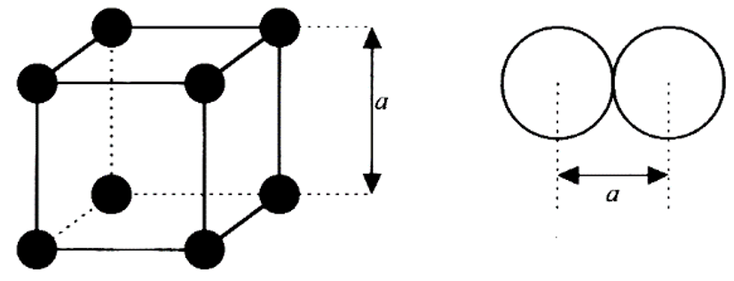
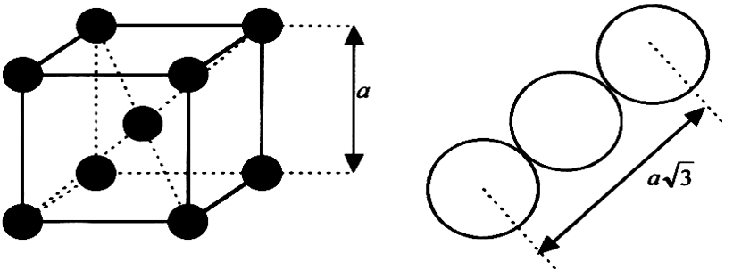
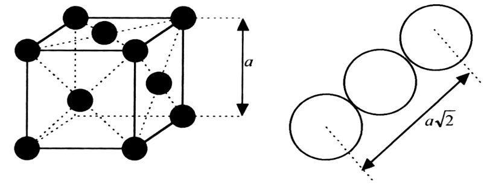
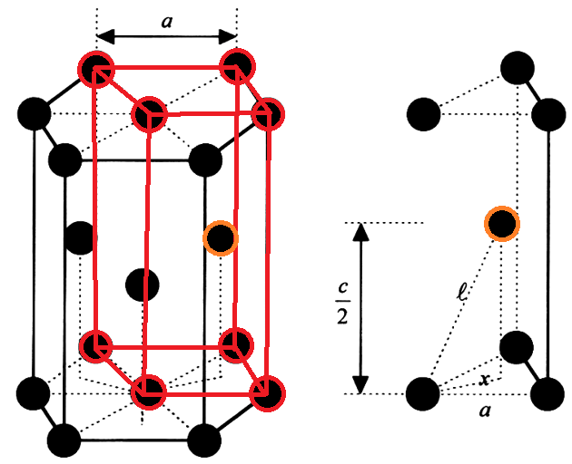
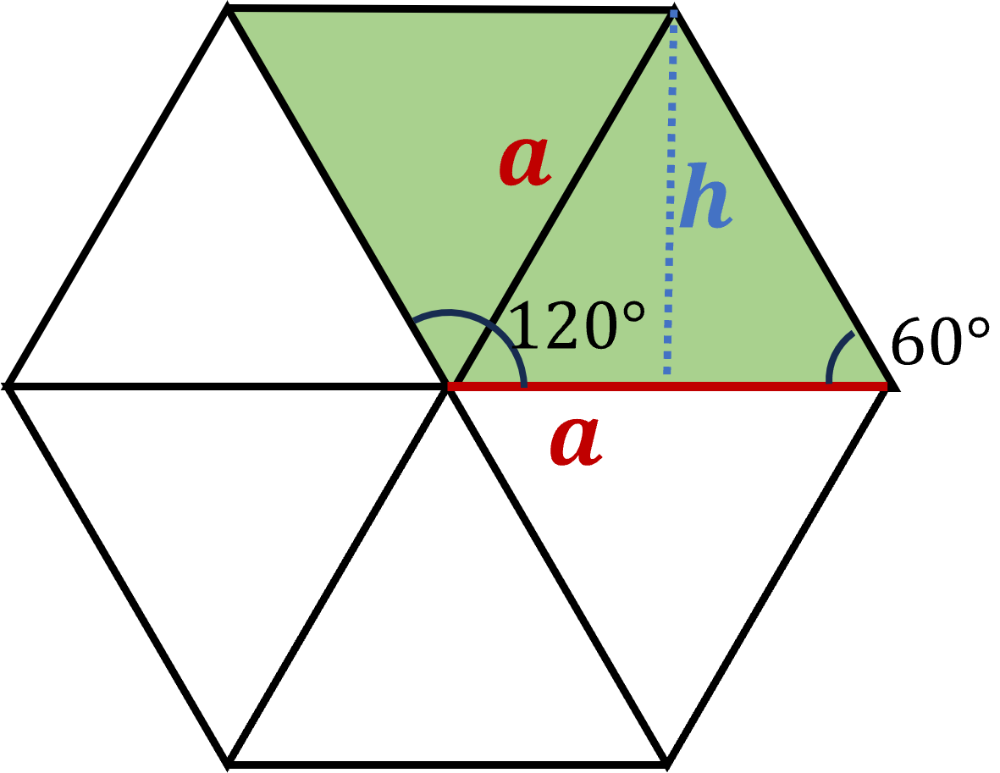
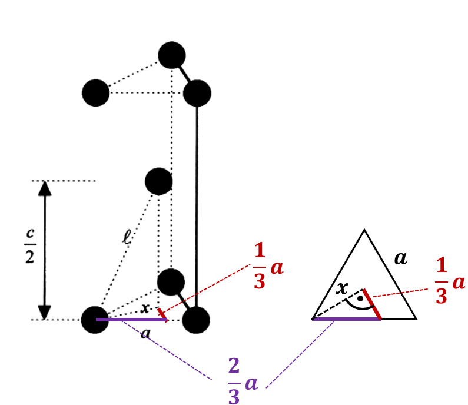

<!--
author: Claudia Funke
email: claudia.funke@physik.tu-freiberg.de
title: Lösung Übung 1 
version: 2.0
language: de
narrator: Deutsch Female
comment:  Struktur der Materie Übung 1
@style
.lia-toc__bottom {
    display: none;
}
@end

import: https://raw.githubusercontent.com/liaTemplates/KekuleJS/master/README.md

import: https://github.com/liascript/CodeRunner

import: https://raw.githubusercontent.com/LiaTemplates/Pyodide/master/README.md
-->

# Übung 1

## Aufgabe 1
> __1.__ Bitte absolvieren sie den im Opal-Kurs bei der Übung 1 hinterlegten [Test zur Vektorrechnung](https://bildungsportal.sachsen.de/opal/auth/RepositoryEntry/1013219356/CourseNode/1692325844519000012).

## Aufgabe 2

{{0}}
> __2.__ Um eine ungefähre Vorstellung von der Verteilung der Gitterbausteine zu bekommen, kann man sich die Atome auf den Gitterplätzen als starre Kugeln vorstellen, die „auf Stoß“ aneinander liegen. Daraus lässt sich der Anteil des Volumens einer Gitterzelle berechnen, der von den Atomen eingenommen wird. (Aufgabe aus A. Armbrust, H. Janetzki, „Aufgaben zur Festkörperphysik“)

> __a)__ Wie groß ist in diesem „starren Kugelmodell“ der Volumenanteil der Kugeln in einem einfachen kubischen Gitter? 

 

{{1}}
**Lösung Aufgabe 2a**

{{2}}
**Volumen der Einheitszelle:** $V_Z=a^3$

{{3}}
**Volumen der Kugel** (mit $r=\frac{a}{2}$):  $V_K=\frac{4 \pi}{3} \left( \frac{a}{2}\right)^3$

{{4}}
**Anzahl der Kugeln:** $N_K=8\cdot \frac{1}{8}$

{{5}}
$$\frac{N_K \cdot V_K}{V_Z}=\frac{1  \cdot \frac{4 \pi}{3} \left( \frac{a}{2}\right)^3}{a^3}=\frac{\pi}{6}=0,52=52 \%$$

{{6}} 
> __b)__ Wie groß ist in diesem „starren Kugelmodell“ der Volumenanteil der Kugeln in einem kubisch raumzentrierten Gitter? 

{{6}} 
 

{{7}}
**Lösung Aufgabe 2b**

{{8}}
**Volumen der Einheitszelle:** $V_Z=a^3$

{{9}}
**Volumen der Kugel** (mit $r=\frac{a\cdot \sqrt{3}}{4}$):  $V_K=\frac{4 \pi}{3} \left( \frac{a\cdot \sqrt{3}}{4}\right)^3=\frac{\pi a^3 \sqrt{3}}{4^2}$

{{10}}
**Anzahl der Kugeln:** $N_K=8\cdot \frac{1}{8}+1=2$

{{11}}
**Volumenanteil**
$$\frac{N_K \cdot V_K}{V_Z}=\frac{2}{a^3}\cdot \frac{\pi a^3 \sqrt{3}}{4^2}=\frac{\pi\sqrt{3}}{8}=0,68=68 \%$$

{{12}}
> __c)__ Wie groß ist in diesem „starren Kugelmodell“ der Volumenanteil der Kugeln in einem kubisch flächenzentrierten Gitter? 

{{12}}
 

{{13}}
**Lösung Aufgabe 2c**

{{14}}
**Volumen der Einheitszelle:** $V_Z=a^3$

{{15}}
**Volumen der Kugel** (mit $r=\frac{a\cdot \sqrt{2}}{4}$):  $V_K=\frac{4 \pi}{3} \left( \frac{a\cdot \sqrt{2}}{4}\right)^3=\frac{\pi a^3 \cdot 2 \cdot \sqrt{2}}{3 \cdot 4^2}$

{{16}}
**Anzahl der Kugeln:** $N_K=8\cdot \frac{1}{8}+6\cdot \frac{1}{2}=4$

{{17}}
**Volumenanteil**

{{17}}
$$\frac{N_K \cdot V_K}{V_Z}=\frac{4}{a^3}\cdot \frac{\pi a^3 2\sqrt{2}}{3 \cdot 4^2}=\frac{\pi}{3\cdot\sqrt{2}}=0,74=74 \%$$

{{18}}
> __d)__ Wie groß ist in diesem „starren Kugelmodell“ der Volumenanteil der Kugeln in einem hexagonalem dichtest gepacktem Gitter? 

{{18}}
 

{{19}}
**Lösung Aufgabe 2d**

{{20}}
Für Berechnung des Volumens der Einheitszelle wird erst die Grundfläche $A$ berechnet und dann mit der Höhe  $c$ der Einheitszelle multipliziert. Für die Berechnung der Grundfläche ist folgende Abbildung hilfreich, denn dort wird deutlich, dass die Grundfläche ein Parallelogramm ist.

{{21}}
**Grundfläche:** $A=a\cdot h=a\cdot \sqrt{a^2-\left( \frac{a}{2} \right)^2}=a^2 \cdot\sqrt{1-\frac{1}{4}}=\frac{a^2 \cdot \sqrt{3}}{2}$

{{21}}
 

{{22}}
Der **Zusammenhang zwischen den auf Stoß zusammensitzenden Kugeln mit dem Kugelradius $r$ und den Gitterparametern $a$ und $c$ ** des hexagonal dichtest gepackten Gitters ist etwas komplexer. Zur Herleitung wird folgende Skizze betrachtet:

{{22}}
 

{{23}}
Wenn die Kugeln dichtest gepackt sind und auf Stoß sitzen, dann gilt:
$$l=a=2\cdot r$$

{{24}}
Aus dem linken Teilbild der Abbildung gilt für das senkrecht stehende rechtwinklige Dreieck
$$\left( \frac{c}{2} \right)^2=l^2-x^2$$

{{25}}
$x$ kann durch die Gitterkonsante $a$ ausgedrückt werden, siehe rechte Teilabbildung der obigen Abbildung:
$$x^2+\left( \frac{1}{3}a \right)^2=  \left( \frac{2}{3}a \right)^2$$
$$\Rightarrow x^2= \frac{4}{9}a^2- \frac{1}{9}a^2=\frac{1}{3}a^2$$

{{26}}
Dieser Ausdruck für $x^2$ wird nun zusammen mit $l=a$ in die obige Gleichung mit $\frac{c}{2}$ eingesetzt:
$$\left( \frac{c}{2} \right)^2=l^2-\frac{1}{3}a^2=\frac{2}{3}a^2$$
Damit folgt für $c$
$$c=\sqrt{\frac{4 \cdot 2}{3}a^2}=\sqrt{\frac{8}{3}}a$$
Damit gilt für das Volumen der Einheitszelle

{{27}}
**Volumen der Einheitszelle:** $V_Z=A\cdot c=\frac{a^2 \cdot \sqrt{3}}{2} \cdot \sqrt{\frac{8}{3}}a=\sqrt{2}a^3$

{{28}}
**Volumen der Kugel** (mit $r=\frac{a}{2}$):  $V_K=\frac{4 \pi}{3} \left( \frac{a}{2}\right)^3=\frac{\pi a^3 }{6}$

{{29}}
**Anzahl der Kugeln:** 
Für die Kugeln an den Prismaecken ist das jetzt etwas diffizieler. Es gibt Prisma-Ecken mit $60°$ und Prisma-Ecken mit $120°$, siehe Abbildung "*Hexagonales Gitter*" oben. Dort ist ersichtlich, dass eine Kugel in der $60°$-Ecke nur $\frac{60°}{360°}=\frac{1}{6}$ in der Ebene einnimmt (statt $\frac{1}{4}$ im kubischen Gitter). Von diesen Ecken gibt es in dem rot eingezeichneten Prisma oben zwei und unten zwei, also insgesamt vier. 
Dann gibt es noch Kugeln in der $120°$-Ecke, die  $\frac{120°}{360°}=\frac{1}{3}$ in der Ebene einnehmen (statt $\frac{1}{4}$ im kubischen Gitter). Von diesen Ecken gibt es in dem rot eingezeichneten Prisma ebenfalls oben zwei und unten zwei, also insgesamt 4. 
Außerdem werden die Kugeln an den Ecken jeweils von dem darüberliegenden/darunterliegenden Prisma zur Hälfte beansprucht (Faktor $\frac{1}{2}$. )
Diese Kugeln zählen dann insgesamt für das rot eingezeichnete Prisma: $\frac{4\cdot \frac{1}{6}+4 \cdot \frac{1}{3}}{2}=\frac{4}{2} \cdot \frac{6}{12}=1$.
Das eentspricht der im Mittel ebenfalls richtigen Rechnung mit $8\cdot\frac{1}{8}$.
Zusätzlich kommt noch die "orangene" Kugel im kompletten Volumen hinzu. Also gilt:

 $N_K=1+1=2$

{{30}}
**Volumenanteil**
$$\frac{N_K \cdot V_K}{V_Z}=\frac{2\cdot \frac{\pi a^3 }{6}}{\sqrt{2}a^3}=\frac{\pi}{3 \cdot \sqrt{2}}=0,74=74 \%$$

## Aufgabe 3

{{1}}
> __3.__ Das Diamantgitter besteht aus zwei kubisch flächenzentrierten Gittern, wobei das Zweite um ein Viertel der Raumdiagonalen gegenüber dem Ersten verschoben ist. Die Winkel zwischen den tetraedrischen Bindungen der Diamantstruktur sind dieselben wie die Winkel zwischen den Raumdiagonalen eines Würfels, z. B. zwischen [1,1,1] und [1,-1,-1]. 

{{1}}
 

{{1}}
*Hinweis: Im SiC-Gitter sind die 2 kubisch-flächenzentrierten Untergitter durch die beiden Atomsorten C und Si besetzt. Dadurch sind die jeweiligen Untergitter besser zu erkennen*

{{1}}
> __a)__ Bestimmen Sie mit Hilfe der elementaren Vektoranalysis die Größe dieses Winkels!
> __b)__ Bestimmen Sie den Volumenanteil im Harte-Kugel-Modell für die Diamant-Kristallstruktur!

{{2}}
**Lösung Aufgabe 3a**
$$\mathrm{cos}({\varphi})=
\begin{pmatrix}1\\ 1\\ 1\\\end{pmatrix} \cdot 
\begin{pmatrix}1\\ -1\\ -1\\\end{pmatrix}=\frac{1-1-1}{\sqrt{3}\cdot \sqrt{3}}=-\frac{1}{3}$$

{{3}}
$$\Rightarrow \varphi=\mathrm{arccos(\frac{1}{3})}=109,47°  $$

{{4}}
**Lösung Aufgabe 3b**

{{5}}
Volumen der Einheitszelle: $V_\mathrm{EZ}=a^3$

{{6}}
Nun benötigen Sie einen Zusammenhang zwischen Kugelvolumen und Gitterkonstante $a$. Die dichtest benachbarten Kugel sollen Stoß auf Stoß sitzen. 
Betrachten Sie folgende Abbildung und wenden Sie den Satz von Pythagoras zweimal an:

{{6}}
 zum Erkennen der geometrischen Zusammenhänge zwischen $l$, $x$ und $\frac{a}{4}$; Quelle: A. Ambrust, H. Janetzki, Aufgaben zur Festkörperphysik*")

{{7}}
Dann folgt:
$$l^2=\left(\frac{a}{4}\right)^2+x^2$$
und

{{8}}
$$x^2=\left(\frac{a}{4}\right)^2+\left(\frac{a}{4}\right)^2 \Rightarrow x=\frac{a}{\sqrt{8}}$$

{{9}}
Die zweite Gleichung in die erste Gleichung eingesetzt ergibt
$$l^2=\left(\frac{a}{4}\right)^2+\frac{a^2}{8} \Rightarrow l=\frac{\sqrt{3}\cdot a}{4}$$

{{10}}
Diese Distanz $l$ gibt aber genau den Abstand zweier sich auf Stoß berührender Kugel-(Mittelpunkte) an. Das bedeutert $l= 2 \cdot r$ (mit $r=$ Kugelradius).

{{11}}
Also gilt für das Kugelvolumen der auf Stoß sitzenden Kugeln im Diamantgitter:
$$V_\mathrm{K}=\frac{4\pi}{3}\left(\frac{l}{2}\right)^3= \frac{4\pi}{3}\cdot \frac{3\cdot \sqrt{3} \cdot a^3}{4^3 \cdot 2^3 }=\frac{\pi \cdot \sqrt{3}\cdot a^3}{128}$$

{{12}}
Die Anzahl der Atome pro kubischer Einheitszelle des Diamantgitters ist doppelt so groß wie die im kfz-Gitter, da zu jedem Atom des kfz-Gitters noch ein weiteres um $(\frac{1}{4}, \frac{1}{4}, \frac{1}{4})$ verschobenes dazukommt. Also: $$N=(1+\frac{1}{2}\cdot 6)\cdot 2=8$$.

{{13}}
Damit ergibt sich:
$$\frac{N\cdot V_\mathrm{K}}{V_\mathrm{EZ}}=\frac{8 \cdot \frac{\pi \cdot \sqrt{3}\cdot a^3}{128}}{a^3}=\frac{8\cdot \pi \cdot \sqrt{3}}{128}=\frac{\pi \cdot \sqrt{3}}{16}=0,34$$

{{14}}
**Die Volumenausfüllung eines so dicht wie möglich gepackten Diamantgitters ist also nur 34 %.**

