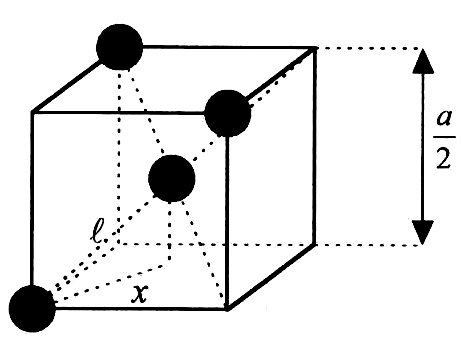

<!--
author: Claudia Funke
email: claudia.funke@physik.tu-freiberg.de
title: Lösung Übung 1 
version: 2.0
language: de
narrator: Deutsch Female
comment:  Struktur der Materie Übung 1
@style
.lia-toc__bottom {
    display: none;
}
@end

import: https://raw.githubusercontent.com/liaTemplates/KekuleJS/master/README.md

import: https://github.com/liascript/CodeRunner

import: https://raw.githubusercontent.com/LiaTemplates/Pyodide/master/README.md
-->

# Übung 1

## Aufgabe 3

> __3.__ Das Diamantgitter besteht aus zwei kubisch flächenzentrierten Gittern, wobei das Zweite um ein Viertel der Raumdiagonalen gegenüber dem Ersten verschoben ist. 
Die Winkel zwischen den tetraedrischen Bindungen der Diamantstruktur sind dieselben wie die Winkel zwischen den Raumdiagonalen eines Würfels, z. B. zwischen [1,1,1] und [1,-1,-1]. 

 

### a)
Bestimmen Sie mit Hilfe der elementaren Vektoranalysis die Größe dieses Winkels!

### b) 
 Bestimmen Sie den Volumenanteil im Harte-Kugel-Modell für die Diamant-Kristallstruktur 

**Lösung Aufgabe 3a**
$$\mathrm{cos}({\varphi})=
\begin{pmatrix}1\\ 1\\ 1\\\end{pmatrix} \cdot 
\begin{pmatrix}1\\ -1\\ -1\\\end{pmatrix}=\frac{1-1-1}{\sqrt{3}\cdot \sqrt{3}}=-\frac{1}{3}$$

$\Rightarrow \varphi=\mathrm{arccos(\frac{1}{3})}=109,47°  $

**Lösung Aufgabe 3b**

Volumen der Einheitszelle: $V_\mathrm{EZ}=a^3$

Nun benötigen Sie einen Zusammenhang zischen Kugelvolumen und Gitterkonstante $a$. Die dichtest benachbarten Kugel sollen Stoß auf Stoß sitzen. 
Betrachten Sie folgende Abbildung und wenden Sie den Satz von Pythagoras zweimal an:

*Quelle: A. Ambrust, H. Janetzki, Aufgaben zur Festkörperphysik*

Dann folgt:
$$l^2=\left(\frac{a}{4}\right)^2+x^2$$
und
$$x^2=\left(\frac{a}{4}\right)^2+\left(\frac{a}{4}\right)^2 \Rightarrow x=\frac{a}{\sqrt{8}}$$

Die zweite Gleichung in die erste Gleichung eingesetzt ergibt

$$l^2=\left(\frac{a}{4}\right)^2+\frac{a^2}{8} \Rightarrow l=\frac{\sqrt{3}\cdot a}{4}$$

Dieses Distanz $l$ gibt aber genau den Abstand zweier sich auf Stoß berührender Kugel-(Mittelpunkte) an. Das bedeutert $l= 2 \cdot r$ (mit $r=$ Kugelradius).

Also gilt für das Kugelvolumen der auf Stoß sitzenden Kugeln im Diamantgitter:
$$V_\mathrm{K}=\frac{4\pi}{3}\left(\frac{l}{2}\right)^3= \frac{4\pi}{3}\cdot \frac{3\cdot \sqrt{3} \cdot a^3}{4^3 \cdot 2^3 }=\frac{\pi \cdot \sqrt{3}\cdot a^3}{128}$$

Die Anzahl der Atome pro kubischer Einheitszelle des Diamantgitters ist doppelt so groß wie die im kfz-Gitter, da zu jedem Atom des kfz-Gitters noch ein weiteres um $(\frac{1}{4}, \frac{1}{4}, \frac{1}{4})$ verschobenes dazukommt. Also: $$N=(1+\frac{1}{2}\cdot 6)\cdot 2=8$$.

Damit ergibt sich:
$$\frac{N\cdot V_\mathrm{K}}{V_\mathrm{EZ}}=\frac{8 \cdot \frac{\pi \cdot \sqrt{3}\cdot a^3}{128}}{a^3}=\frac{8\cdot \pi \cdot \sqrt{3}}{128}=\frac{\pi \cdot \sqrt{3}}{16}=0,34$$

Die Volumenausfüllung eines so dicht wie möglich gepackten Diamantgitters ist also nur 34 %.

### a)
Die Winkel zwischen den tetraedrischen Bindungen der Diamantstruktur sind dieselben wie die Winkel zwischen den Raumdiagonalen eines Würfels, z. B. zwischen [1,1,1] und [1,-1,-1]. Bestimmen Sie mit Hilfe der elementaren Vektoranalysis die Größe dieses Winkels!
  

  <li>Bestimmen Sie den Volumenanteil im Harte-Kugel-Modell für die Diamant-Kristallstruktur</li>

-----

## Schoenflies-Symbolik:
- Auch als "kurze Kristallklassenbezeichnung" bekannt, ist die Schoenflies-Symbolik eine ältere Methode zur Darstellung von Raumgruppen.
- Sie basiert auf der Punktgruppen-Symmetrie, der höchsten Symmetrie eines Kristalls, und verwendet Buchstaben und Zahlen, um die verschiedenen Punktgruppen darzustellen.
- Diese Bezeichnung ist intuitiv und leicht zu verstehen, insbesondere für Punktgruppen, aber weniger spezifisch für Raumgruppen, da sie nicht die Translationsinformationen enthält.

[Details zu Symmetrieelementen in Schoenfließ-Symbolik](https://de.wikipedia.org/wiki/Schoenflies-Symbolik)

## Hermann-Mauguin-Notation:
- Auch als "erweiterte Hermann-Mauguin-Notation" bekannt, ist diese Methode moderner und detaillierter.
- Sie kombiniert die Information der Punktgruppe mit den Translationsinformationen und ermöglicht eine vollständige Beschreibung der Raumgruppe.
- Die Hermann-Mauguin-Notation verwendet Buchstaben, Zahlen und Symbole, um die Punktgruppen- und Translationsinformationen zu repräsentieren.

[Details zu Symmetrieelementen in Hermann-Mauguin-Symbolik](https://de.wikipedia.org/wiki/Hermann-Mauguin-Symbolik)

## Unterschied:
Der Hauptunterschied zwischen den beiden Notationen liegt in ihrer Detailtiefe und Spezifität:
- Die Schoenflies-Symbolik konzentriert sich hauptsächlich auf die Punktgruppensymmetrie und bietet eine intuitive Darstellung, ist jedoch weniger detailliert in Bezug auf die Translationsinformationen.
- Die Hermann-Mauguin-Notation hingegen bietet eine vollständige Beschreibung der Raumgruppe, einschließlich sowohl der Punktgruppen- als auch der Translationsinformationen. Sie ist spezifischer und detaillierter, aber erfordert möglicherweise mehr Kenntnisse zur Interpretation.

In der Praxis wird die Hermann-Mauguin-Notation häufiger verwendet, da sie die vollständigere und präzisere Methode zur Beschreibung von Raumgruppen ist.

## Quiz
Welche Aussagen sind richtig?

[[X]] Die Schoenflies-Symbolik konzentriert sich hauptsächlich auf die Punktgruppensymmetrie.
[[X]] Die Hermann-Mauguin-Notation bietet eine vollständige Beschreibung der Raumgruppe, einschließlich sowohl der Punktgruppen- als auch der Translationsinformationen.
[[ ]] Die Schoenflließ-Symbolik und die Herrman-Maugin-Symbolik beschreiben genau die gleichen Inhalte.
[[X]] Die Hermann-Mauguin-Notation ist die vollständigere und präzisere Methode zur Beschreibung von Raumgruppen.
[[?]] You can choose more than one correct answer!
***

***

