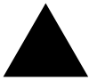
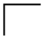
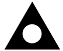
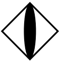
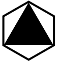
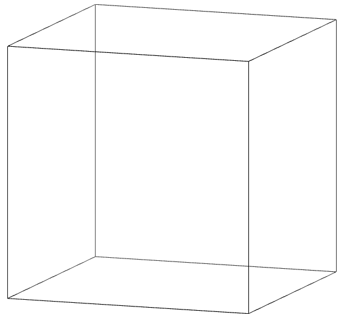
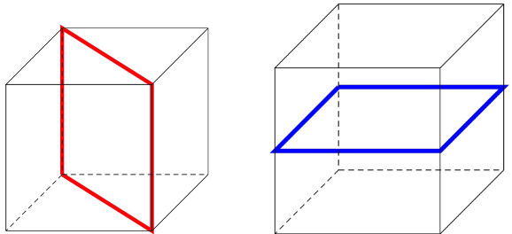
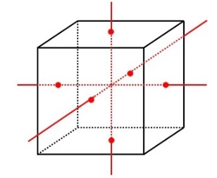
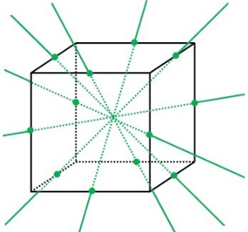
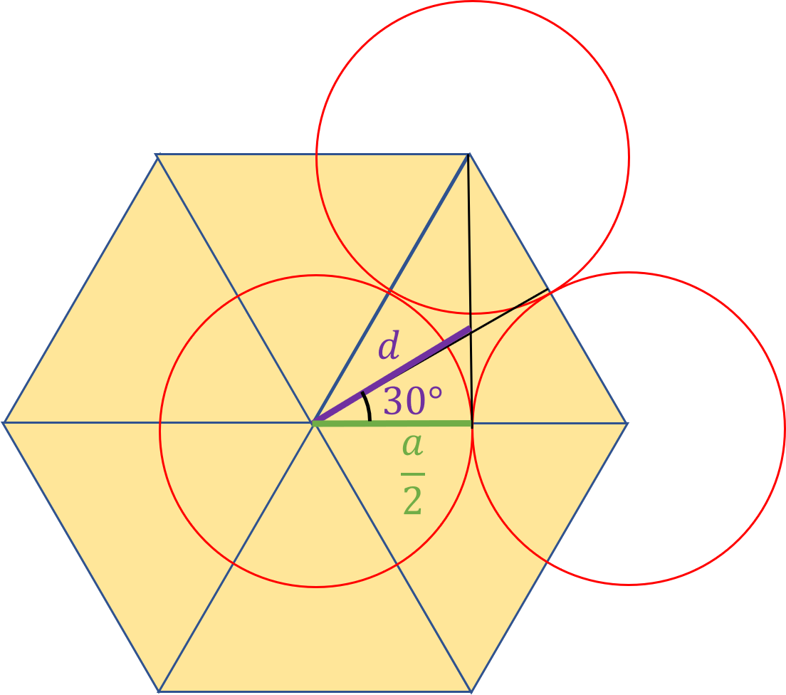

<!--
author: Claudia Funke
email: claudia.funke@physik.tu-freiberg.de
title: Übung 2 Aufgaben
version: 2.0

language: de

narrator: Deutsch Female
comment:  Struktur der Materie Übung 02

@style
.lia-toc__bottom {
    display: none;
}
@end

-->

# Übung 2 (Kristallgitter)

## Aufgabe 1
> __1.a) __Aus welchen beiden Elementen setzt sich jede Kristallstruktur zusammen? 

**Lösung Aufgabe 1a**

 Kristallstruktur = Gitter + Basis

> __1.b) __Was beschreiben Gittertranslationsvektoren?

Gittertranslationsvektoren $\vec{a_1}$, $\vec{a_2}$, $\vec{a_3}$ werden so gewählt, dass von jedem Punkt $\vec{r'}$ aus betrachtet das Gitter in jeder Hinsicht gleich aussieht wie vom Punkt $\vec{r}$ 

Es gilt
$$\vec{r'}=\vec{r}+ u_1\cdot \vec{a_1}+ u_2\cdot \vec{a_2}+u_3\cdot \vec{a_3}=\vec{r}+\vec{T}$$
mit $u_i \in  \mathbb{Z}$ und $\vec{T}$ = Translationsvektor.

> __1.c) __Wie ist die primitive Elementarzelle eines Gitters definiert?

[Parallelepiped](https://de.wiktionary.org/wiki/Parallelepiped "Bild Parallelepiped auf Wikipedia"), das durch primitive Achsen  $\vec{a_1}$, $\vec{a_2}$, $\vec{a_3}$ aufgespannt wird. eine primitive Elementarzelle ist eine Zelle mit kleinstem Volumen.

 by Niabot licensed under [CC BY 3.0 DEED](hhttps://creativecommons.org/licenses/by/3.0/deed.en *")

> __1.d) __Wie viele Gitterpunkte liegen in einer primitiven Elementarzelle?

1 Gitterpunkt pro Ecke, 8 Ecken, jede Ecke gehört zu 8 Parallelepipeden $\Rightarrow \frac{8}{8}=1$ 

> __1.e) __Wie groß ist das Volumen einer primitiven Elementarzelle, ausgedrückt durch die Gittertranslationsvektoren?

$$V=\left |\vec{a_1}\cdot \vec{a_2} \times \vec{a_3}  \right |$$ 
mit $\vec{a_1}$, $\vec{a_2}$, $\vec{a_3}$ primitive Basisvektoren (Gittervektoren)

## Aufgabe 2
> __2) __Unter der Annahme, dass im folgenden Gitter die Punkte alle identische Atome sind, zeichnen Sie bitte im Bild die Gitterpunkte ein, ebenfalls ein mögliches Paar von primitiven Achsen, eine primitive Zelle und die Basis von Atomen, die auf einem Gitterpunkt sitzt.
*")

**Lösung Aufgabe 2**

Unter der Annahme, dass im folgenden Gitter die Punkte alle identische Atome sind, zeichnen Sie bitte im Bild die Gitterpunkte ein, ebenfalls ein mögliches Paar von primitiven Achsen, eine primitive Zelle und die Basis von Atomen, die auf einem Gitterpunkt sitzt.

*")

## Aufgabe 3

> __3a) __Was ist ein Bravaisgitter? Beschreiben Sie ein Bravaisgitter mit einer Formel

**Lösung Aufgabe 3a**

Ein Bravaisgitter ist ein mathematisches Konzept in der Kristallographie, das die periodische Anordnung von Gitterpunkten in einem Kristall beschreibt. Es beschreibt die räumliche Anordnung der Gitterpunkte und gibt die geometrische Grundstruktur des Kristalls an.

Mathematisch wird ein Bravaisgitter durch die sogenannte Bravais-Gittervektorformel beschrieben:

$$\vec{r'}=\vec{r}+ u_1\cdot \vec{a_1}+ u_2\cdot \vec{a_2}+u_3\cdot \vec{a_3}=\vec{r}+\vec{T}$$

mit $u_i \in  \mathbb{Z}$ und $\vec{a_i}$ linear unabhängige Bravais-Gittervektoren

Es gibt 14 verschiedene Bravais-Gitter im 3-dimensionalem Raum, die in 7 Kristallsysteme klassifiziert sind.

> __3b) __Was beschreiben Punktgruppen?

**Lösung Aufgabe 3b**

Punktgruppen sind ein Konzept in der Kristallographie und beschreiben die symmetrischen Eigenschaften eines Kristalls. Sie repräsentieren die Gesamtheit aller möglichen räumlichen Transformationen, die den Kristall in sich selbst überführen.

Die Symmetrieoperationen sind Kombination aus Drehungen, Spiegelungen und Inversionen, die um einen gemeinsamen Punkt (Symmetriezentrum) herum wirken. 

Es gibt insgesamt 32 mögliche Punktgruppen im 3D. Sie spielen eine Rolle bei der Beschreibung von Kristallen und ihrer physikalischen Eigenschaften.

>__3c) __Was beschreiben Translationsgruppen?

**Lösung Aufgabe 3c**

Translationsgruppen beschreiben die räumlichen Verschiebungen von Gitterpunkten in einem Kristall entlang diskreter Richtungen und diskreter Beträge. 

In einer Translationsgruppe werden die Gitterpunkte um Translationsvektoren verschoben.Damit können alle Gitterpunkte eines Kristalls erzeugt werden.
Sie sind ein grundlegendes Konzept in der Kristallographie und ermöglichen die mathematische Darstellung der Kristallstruktur.

Die Kombination von Translationsgruppen mit Punktgruppen ermöglicht die Beschreibung der vollen Symmetrie eines Kristalls.

>__3d) __Was ist der Unterschied zwischen Bravaisgittern und Translationsgruppen

**Lösung Aufgabe 3d**

**Translationsgruppen** beschreiben die räumlichen Verschiebungen der Gitterpunkte in einem Kristall. So werden alle Gitterpunkte erzeugt (Achtung, hier ist noch nicht die Rede von Atomen!). 

**Bravaisgitter** beschreiben die geometrische Grundstruktur des Kristalls durch Basisvektoren, definierter Symmetrie und Periodizität.

Der Fokus ist also der Unterschied

>__3e) __Was beschreibt eine Raumgruppe

**Lösung Aufgabe 3e**

Eine Raumgruppe ist ein mathematisches Konzept in der Kristallographie, das die gesamte Symmetrien in einem Kristall beschreibt. Sie umfasst sowohl die Punktgruppen (Symmetrie um einen einzigen Punkt) als auch die Translationssymmetrie (räumliche Verschiebungen) der Gitterpunkte.

$\Rightarrow$ Gesamtheit aller möglichen räumlichen Transformationen

$\Rightarrow$ 230 Raumgruppen

## Aufgabe 4
> __5) __Listen Sie alle 10 möglichen Symmetrieoperationen in einer Tabelle auf und notieren Sie dazu das internationale Symbol und das grafische Symbol!

**Lösung Aufgabe 4**

<!-- data-type="none" --> 
| int. Symbol     |       grafisches Symbol       |  Symmetrieoperation |
| :------------- |:----------------:| :-------:|
|1| - | Identität|
|2|<!--width="10%"-->| Drehung um 180°|
|3|<!--width="20%"--> | Drehung um 120°|
|4|<!--width="20%"--> | Drehung um 90°|
|6| <!--width="20%"-->| Drehung um 60°|
|$\bar{1}$|  <!--width="10%"--> | Inversionszentrum|
|$\bar{2}=m$|<!--width="20%"--> oder <!--width="20%"-->  |zweizählige Drehinversionsachse bzw. Spiegelebene senkrecht zur Zeichenebene (oben) oder in der Zeichenebene (unten) |
|$\bar{3}=3+\bar{1}$|<!--width="20%"-->|Drehung um 120° gefolgt von Inversion|
|$\bar{4}$|<!--width="20%"-->|Drehung um 90° gefolgt von Inversion|
|$\bar{6}=3+m \perp 3$|<!--width="20%"-->|Drehung um 120° gefolgt von Inversion|

## Aufgabe 5
> __5) __Zeigt die Abbildung eines Penrose-Musters eine Translationssymmetrie? Begründen Sie Ihre Antwort

*")

**Lösung Aufgabe 5**

Nein. Ein Penrose-Muster ist ein aperiodisches Muster, es besitzt keine periodische Wiederholungseinheit. 

$\Rightarrow$ faszinierendes Beispiel für aperiodische Strukturen, benötigt mindestens 2 verschiedene Baueinheiten (Polygone): *kite* = Drachen und *dart* = Pfeile.

## Aufgabe 6
> __6) __Die Kristallsysteme wurden nach größtmöglicher Symmetrie des ausgewählten Achssystems unterschieden. 
> __a) __Wie viele verschiedene Möglichkeiten erhält man, wenn von primitiven Elementarzellen ausgeht und daraus Gitter verschiedener Symmetrie aufbaut? 
> __b) __Welche Kristallsysteme gibt es konkret, welche der Varianten (primitiv, basiszentriert, flächenzentriert, raumzentriert) kommen vor, welche Bedingungen gelten für die Winkel und Längen der Basisvektoren? Erstellen Sie bitte eine Tabelle? 

**Lösung Aufgabe 6**

Es gibt 7 Kristallsysteme

<!-- data-type="none" --> 
| Kristallsystem     |       Anzahl Gitter       |  Zentrierungen |Einschränkungen| Bild|
| :------------- |:----------------:| :-------:|:---: |:---:| 
|triklin  | 1| primitiv | $a\ne b\ne c$, $\alpha \ne \beta \ne \gamma$ | |
| monoklin | 2|   primitiv, basiszentriert |$a\ne b\ne c$, $\alpha = \gamma =90° \ne\beta$  |  |
| orthorhombisch | 4 | primitiv, basiszentriert, raumzentriert, flächenzentriert |$a\ne b\ne c$, $\alpha =\beta = \gamma =90° $|  |
| tetragonal | 2 | primitiv,  raumzentriert |$a= b\ne c$, $\alpha =\beta = \gamma =90° $|  |
| kubisch | 3 | primitiv,  raumzentriert, flächenzentriert |$a= b=c$, $\alpha =\beta = \gamma =90° $|  |
| rhomboedrisch (trigonal) | 1 | primitiv |$a= b=c$, $\alpha =\beta = \gamma \ne 90° $|  |
| hexagonal | 1 | primitiv |$a= b \ne c$, $\alpha =\beta = 90°$,$\gamma=120°$  |  |

*Bilder von [Wolfgang Below](https://www.chemieunterricht.de/dc2/kristalle/systeme.htm)*

## Aufgabe 7

> __7) __Zeichnen Sie für die folgenden Würfel die gefragten Symmetrieelemente in die Würfel ein.

<!-- data-type="none" --> 
|       |               |
| :-------------: |:----------------:|
|zwei Spiegelebenen (mindestens 2 kristallographisch verschiedene)|alle 4-zähligen Drehachsen|
| | |
|alle 3-zähligen Drehachsen|alle 2-zähligen Drehachsen (ohne die 4-zähligen)|
| | |

**Lösung Aufgabe 7**

<!-- data-type="none" --> 
|       |               |
| :-------------: |:----------------:|
|zwei Spiegelebenen (mindestens 2 kristallographisch verschiedene)|alle 4-zähligen Drehachsen|
| | |
|alle 3-zähligen Drehachsen|alle 2-zähligen Drehachsen (ohne die 4-zähligen)|
| | |

## Lösung Aufgabe 9
Betrachten Sie die Ebenen mit den Millerschen Indizes (100) und (001); das Gitter habe die fcc-Struktur und die Indizes beziehen sich auf die übliche kubische Zelle. Wie lauten die Indizes dieser Ebenen, wenn sie sich auf die primitiven Achsen der folgenden Abbildung beziehen?
Beachten Sie dabei, dass
$$\vec{a}_1=\frac{a}{2}\left(\hat{x}+\hat{y}\right), {\vec{a}}_2=\frac{a}{2}\left(\hat{y}+\hat{z}\right), {\vec{a}}_3=\frac{a}{2}\left(\hat{x}+\hat{z}\right)$$

Die (100)-Ebene normal zur kubischen x-Achse schneidet die $\vec{a_1}$-Achse bei $2\cdot \vec{a_1}$ und die  $\vec{a_3}$-Achse bei $2\cdot \vec{a_3}$. Die Ebene ist parallel zu $\vec{a_2}$. Die Indizierung der (100)-Ebene (im kubischen System) im $\vec{a_i}$-System ist also (101).

Die (001)-Ebene normal zur kubischen z-Achse schneidet die $\vec{a_2}$-Achse bei $2\cdot \vec{a_2}$ und die  $\vec{a_3}$-Achse bei $2\cdot \vec{a_3}$. Die Ebene ist parallel zu $\vec{a_1}$. Die Indizierung der (100)-Ebene (im kubischen System) im $\vec{a_i}$-System ist also (011).

## Lösung Aufgabe 10
Zeigen Sie, dass das Verhältnis c/a für eine hexagonal dichtgepackte Struktur gleich $\sqrt{8/3}$ ist.

Betrachten Sie die Stapelfolgen im hexagonal dichtgepacktesten Gitter:

*Details hexagonales Gitter; Lage des Atoms in der nächsten gestapelten Ebene. Quelle:  Claudia Funke licensed under [CC BY-NC-SA ](https://creativecommons.org/licenses/by-nc-sa/4.0/)*

Es gilt 

$$\frac{\frac{a}{2}}{d}=\mathrm{cos}(30°) \Rightarrow d=\frac{a}{2\cdot \mathrm{cos}(30°)}=\frac{a}{2\cdot \frac{1}{2}\cdot \sqrt{3}}$$

$d$ ist der auf die Grundebene projezierte Abstand der auf der Lücke plazierten (gedachten) Kugel zur zentralen Kugel, jeweils von Kugelmittelpunkt zu Kugelmittelpunkt gemessen.

Wenn die umgebenden Kugeln Kontakt haben, dann gilt:

$$ a^2=d^2+\left( \frac{c}{2} \right)^2=\frac{a^2}{3}+\left( \frac{c}{2} \right)^2$$

$$\Rightarrow \frac{2}{3}a^2=\frac{c^2}{4} $$

$$\Rightarrow\frac{c^2}{a^2}=\frac{8}{3}$$

$$\Rightarrow \frac{c}{a}=\sqrt{\frac{8}{3}}=1,633.$$

[def]: https://upload.wikimedia.org/wikipedia/commons/thumb/9/90/Parallelepiped2.svg/330px-Parallelepiped2.svg.png