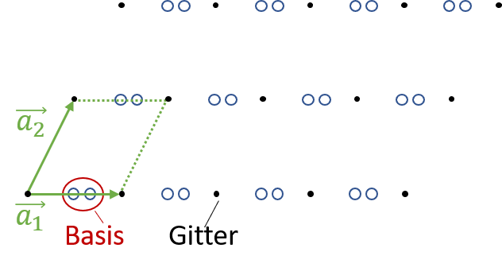

<!--
author: Claudia Funke
email: claudia.funke@physik.tu-freiberg.de
title: Übung 2 Aufgaben
version: 1.0

-->
# Kristallgitter
## Lösung Aufgabe 1
#### a) Aus welchen beiden Elementen setzt sich jede Kristallstruktur zusammen? 

 Kristallstruktur = Gitter + Basis
#### b) Was beschreiben Gittertranslationsvektoren?
Gittertranslationsvektoren $\vec{a_1}$, $\vec{a_2}$, $\vec{a_3}$ so, dass von jedem Punkt $\vec{r'}$ aus betrachtet das Gitter in jeder Hinsicht gleich aussieht wie vom Punkt $\vec{r}$ wenn gilt
$$\vec{r'}=\vec{r}+ u_1\cdot \vec{a_1}+ u_2\cdot \vec{a_2}+u_3\cdot \vec{a_3}=\vec{r}+\vec{T}$$
mit $u_i \in  \mathbb{Z}$.

#### c) Wie ist die primitive Elementarzelle eines Gitters definiert?

[Parallelepiped](https://de.wiktionary.org/wiki/Parallelepiped "Bild Parallelepiped auf Wikipedia"), das durch primitive Achsen  $\vec{a_1}$, $\vec{a_2}$, $\vec{a_3}$ aufgespannt wird. eine primitive Elementarzelle ist eine Zelle mit kleinstem Volumen.

Quelle: ["Drawing of a parallelepiped."](https://commons.wikimedia.org/wiki/File:Parallelepiped2.svg) by Niabot
licensed under [CC BY 3.0 DEED](hhttps://creativecommons.org/licenses/by/3.0/deed.en)

#### d) Wie viele Gitterpunkte liegen in einer primitiven Elementarzelle?

1 Gitterpunkt pro Ecke, 8 Ecken, jede Ecke gehört zu 8 Parallelepipeden $\Rightarrow \frac{8}{8}=1$ 

#### e) Wie groß ist das Volumen einer primitiven Elementarzelle, ausgedrückt durch die Gittertranslationsvektoren?
$$V=\left |\vec{a_1}\cdot \vec{a_2} \times \vec{a_3}  \right |$$ 
mit $\vec{a_1}$, $\vec{a_2}$, $\vec{a_3}$ primitive Basisvektoren (Gittervektoren)

## Lösung Aufgabe 2
Unter der Annahme, dass im folgenden Gitter die Punkte alle identische Atome sind, zeichnen Sie bitte im Bild die Gitterpunkte ein, ebenfalls ein mögliches Paar von primitiven Achsen, eine primitive Zelle und die Basis von Atomen, die auf einem Gitterpunkt sitzt.

## Lösung Aufgabe 3
#### a)	Was ist ein Bravaisgitter? Beschreiben Sie ein Bravaisgitter mit einer Formel
Ein Bravaisgitter ist ein mathematisches Konzept in der Kristallographie, das die periodische Anordnung von Gitterpunkten in einem Kristall beschreibt. Es beschreibt die räumliche Anordnung der Gitterpunkte und gibt die geometrische Grundstruktur des Kristalls an.

Mathematisch wird ein Bravaisgitter durch die sogenannte Bravais-Gittervektorformel beschrieben:

$$\vec{r'}=\vec{r}+ u_1\cdot \vec{a_1}+ u_2\cdot \vec{a_2}+u_3\cdot \vec{a_3}=\vec{r}+\vec{T}$$

mit $u_i \in  \mathbb{Z}$ und $\vec{a_i}$ linear unabhängige Bravais-Gittervektoren

Es gibt 14 verschiedene Bravais-Gitter im 3D-Raum, die in 7 Kristallsysteme klassifiziert sind.

#### b)	Was beschreiben Punktgruppen?

Punktgruppen sind ein Konzept in der Kristallographie und beschreiben die symmetrischen Eigenschaften eines Kristalls. Sie repräsentieren die Gesamtheit aller möglichen räumlichen Transformationen, die den Kristall in sich selbst überführen.

Die Symmetrieoperationen sind Kombination aus Drehungen, Spiegelungen und Inversionen, die um einen gemeinsamen Punkt (Symmetriezentrum) herum wirken. 

Es gibt insgesamt 32 mögliche Punktgruppen im 3D. Sie spielen eine rolle bei der Beschreibung von Kristallen und ihrer physikalischen Eigenschaften.

#### c)	Was beschreiben Translationsgruppen?
Translationsgruppen beschreiben die räumlichen Verschiebungen von Gitterpunkten in einem Kristall entlang diskreter Richtungen und diskreter Beträge. 

In einer Translationsgruppe werden die Gitterpunkte um Translationsvektoren verschoben.Damit können alle Gitterpunkte eines Kristalls erzeugt werden.
Sie sind ein grundlegendes Konzept in der Kristallographie und ermöglichen die mathematische Darstellung der Kristallstruktur.

Die Kombination von Translationsgruppen mit Punktgruppen ermöglicht die Beschreibung der vollen Symmetrie eines Kristalls.

#### d)	Was ist der Unterschied zwischen Bravaisgittern und Translationsgruppen

**Translationsgruppen** beschreiben die räumlichen Verschiebungen der Gitterpunkte in einem Kristall. So werdenalle Gitterpunkte erzeugt (Achtung, hier ist noch nicht die Rede von Atomen!). 

**Bravaisgitter** beschreiben die geometrische Grundstruktur des Kristalls durch Basisvektoren, definierter Symmetrie und Periodizität.

Der Fokus ist also der Unterschied

#### e)	Was beschreibt eine Raumgruppe
Eine Raumgruppe ist ein mathematisches Konzept in der Kristallographie, das die gesamte Symmetrien in einem Kristall beschreibt. Sie umfasst sowohl die Punktgruppen (Symmetrie um einen einzigen Punkt) als auch die Translationssymmetrie (räumliche Verschiebungen) der Gitterpunkte.

$\Rightarrow$ Gesamtheit aller möglichen räumlichen Transformationen

$\Rightarrow$ 230 Raumgruppen

