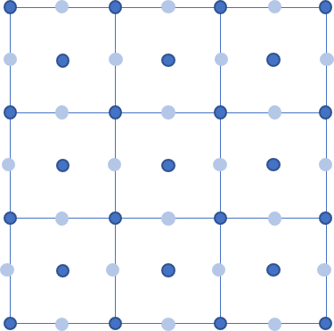
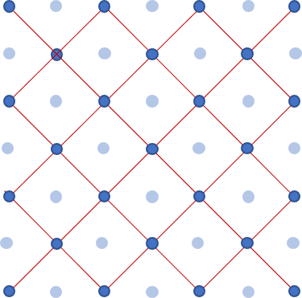
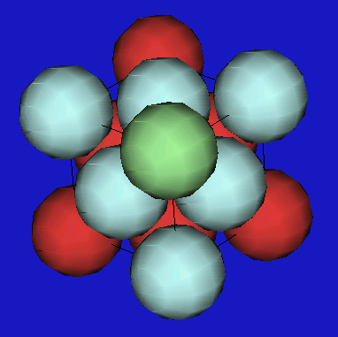

<!--
author: Claudia Funke
email: claudia.funke@physik.tu-freiberg.de
title: Übung Struktur der Materie I, Arbeitsblatt 3

-->

# Kristallgitter
## Aufgabe 1
Durch welches Bravais-Gitter lässt sich ein flächenzentriert tetragonales Gitter beschreiben. Welcher Zusammenhang besteht zwischen den Gitterkonstanten der beiden Gitter und dem Volumen der Einheitszellen?

 **Beispiel für flächenzentriertes tetragonales Gitter**
 
Quelle:  Claudia Funke licensed under [CC BY-NC-SA ](https://creativecommons.org/licenses/by-nc-sa/4.0/)

### Aufgabe 1 Lösung:
Ein flächenzentriertes tetragonales Gitter lässt sich durch eine 45° Drehung um die z-Achse in ein innenzentriertes tetragonales Gitter mit den Gitterkonstanten $a'= \frac{a}{\sqrt{2}}$ und
$c' = c$ und $V_z' =\frac{1}{2} \cdot V_z$ überführen

 **Beispiel für flächenzentriertes tetragonales Gitter**
 

 
*Quelle:  Claudia Funke licensed under [CC BY-NC-SA ](https://creativecommons.org/licenses/by-nc-sa/4.0/)*

## Aufgabe 2
Welcher Zusammenhang besteht zwischen einer ccp-Kugelpackung (cubic close packed) charakterisiert durch den Abstand $a$ der Atome und den Abstand $c$  (mit dem sich die Stapelung der dichtest gepackten Ebenen wiederholt) auf der einen Seite und einem entsprechenden fcc-Gitter (face centered cubic) mit der Gitterkonstanten $a_\mathrm{fcc}$? 

Hinweis: Der Begriff fcc wird oft als Synonym für die kubisch dicht gepackte Struktur (ccp) in Metallen verwendet. Allerdings steht fcc für ein kubisch-flächenzentriertes Bravais-Gitter, das nicht unbedingt dicht gepackt ist, wenn eine Basis auf die Gitterpunkte gesetzt wird. So sind z. B. das Diamant- und das Zinkblende-Gitter fcc, aber nicht dicht gepackt. 

*Bildquelle: CdangDerivative work: Muskid - Abwandlung von Empilement_compact.svg, [CC BY-SA 3.0](https://commons.wikimedia.org/w/index.php?curid=33976067)*

Bestimmen Sie die daraus resultierenden Beziehungen zu $a_\mathrm{ccp}$ und $c_\mathrm{ccp}$ eines ccp-Gitters.

### Lösung Aufgabe 2
Das ccp-Gitter weist in vertikaler Richtung die Reihenfolge ABCABCABC… dichtest gepackter Ebenen auf.

*Bildquelle: http://ruby.chemie.uni-freiburg.de/Vorlesung/Strukturtypen/elemente_kupfer.html*

Die Raumdiagonale der kubischen Einheitszelle entspricht der
"Gitterkonstanten" $c$  des ccp-Gitters: $c = \sqrt{3}\cdot a_\mathrm{fcc}$  und die Gitterkonstante $a$ der Hälfte der Flächendiagonalen:  $a_\mathrm{fcc} = \sqrt{2} \cdot a$. 
Daraus folgt $c = \sqrt{6} \cdot a_\mathrm{fcc}$.

## Aufgabe 3
Vergleichen Sie die Stapelfolgen der dichtest gepackten Ebenen von ccp-Kugelpackungen und hexagonal dichtest gepackten Kugelpackungen (hcp) 
Wie ist das Verhältnis von $\frac{c_\mathrm{hex}}{a_\mathrm{ccp}}$ ?

### Lösung Aufgabe 3
Das hcp-Gitter hat die Schichtfolge ABABAB…
Die Höhe der Einheitszelle beträgt nur 2/3 der Höhe einer ccp-Einheitszelle.
Daraus folgt mit dem Ergebnis von Aufgabe 2: 

$$c_\mathrm{hex} = \frac{2}{3} \cdot  \sqrt{6} \cdot  a_\mathrm{ccp}\eqsim 1,63 \cdot a_\mathrm{ccp} $$

Bemerkung: Sowohl die ccp-Kugelpackung als auch die hcp-Kugelpackung hat eine Raumausfüllung von 74 %

## Aufgabe 4
Geben Sie die Zahl der nächsten Nachbarn (Koordinationszahl) für ein fcc-, bcc- und hcp-Gitter an.
### Lösung Aufgabe 4

+ fcc: 12 NN
+ bcc: 8 NN
+ hcp: 12 NN

## Aufgabe 5
Silber hat ein fcc-Gitter. Seine Dichte beträgt $\rho_\mathrm{Ag}=10,49\,\mathrm{\frac{g}{cm^3}}$ und die molare Masse $M_\mathrm{Ag}=107,87 \mathrm{\frac{g}{Mol}}$. Bestimmen Sie die Gitterkonstante.

### Lösung Aufgabe 5
Allgemein gilt: $\rho=\frac{m}{V}$. Daraus folgt: $V=\frac{m}{\rho}$. Mit $N_\mathrm{A}=6,02214076\cdot 10^{23}\mathrm{\frac{1}{mol}} $ (Avogadro-Konstante) folgt also

$$ V_\mathrm{EZ}=a^3=\frac{\mathrm{Anzahl\, Atome\, in\ EZ}\cdot M_\mathrm{Ag}}{N_\mathrm{A}\cdot \rho_\mathrm{Ag} }$$

$$\Rightarrow a^3=\frac{4\cdot 107,87 \mathrm{\frac{g}{Mol}}}{6,02214076\cdot 10^{23}\mathrm{\frac{1}{mol}}\cdot 10,49\,\mathrm{\frac{g}{cm^3}}}=6,83025\cdot 10^{-23} \mathrm{cm^3}
$$

$$\Rightarrow a=4,09 \cdot 10^{-8} \mathrm{cm}= 4,09 \cdot 10^{-10} \mathrm{m}$$

## Aufgabe 5
Geben Sie für Steinsalz die Koordinaten der Natrium- und Clorionen in Einheiten der Gitterkonstanten a an.

## Aufgabe 6
Geben Sie den kürzesten Abstand zwischen zwei Ionen im Kristallgitter mit Zinkblendestruktur bezogen auf die Gitterkonstante an.
## Aufgabe 8
Zeichnen Sie das flächenzentrierte kubische Gitter. Markieren Sie die Lage von oktaedrisch bzw. tetraedrisch koordinierten Zwischengitterplätzen und zählen Sie die Anzahl der Gitteratome und Zwischengitterplätze ab.

[def]: /media/flaechenzentriert_tetragonal.png
[def2]: media/flaechenzentriert_tetragonal2.png