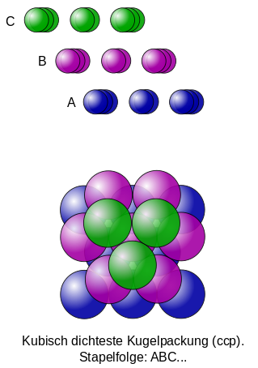

<!--
author: Claudia Funke
email: claudia.funke@physik.tu-freiberg.de
title: Übung Struktur der Materie I, Arbeitsblatt 3

-->

# Kristallgitter
## Aufgabe 1
Durch welches Bravais-Gitter lässt sich ein flächenzentriert tetragonales Gitter beschreiben. Welcher Zusammenhang besteht zwischen den Gitterkonstanten der beiden Gitter und dem Volumen der Einheitszellen?

 **Beispiel für flächenzentriertes tetragonales Gitter**
 
Quelle:  Claudia Funke licensed under [CC BY-NC-SA ](https://creativecommons.org/licenses/by-nc-sa/4.0/)

### Aufgabe 1 Lösung:
Ein flächenzentriertes tetragonales Gitter lässt sich durch eine 45° Drehung um die z-Achse in ein innenzentriertes tetragonales Gitter mit den Gitterkonstanten $a'= \frac{a}{\sqrt{2}}$ und
$c' = c$ und $V_z' =\frac{1}{2} \cdot V_z$ überführen

 **Beispiel für flächenzentriertes tetragonales Gitter**
 

 
Quelle:  Claudia Funke licensed under [CC BY-NC-SA ](https://creativecommons.org/licenses/by-nc-sa/4.0/)

## Aufgabe 2
Welcher Zusammenhang besteht zwischen einer ccp-Kugelpackung (cubic close packed) mit den Gitterkonstanten $a$ und $c$ und einem entsprechenden fcc-Gitter (face centered cubic) mit der Gitterkonstanten $a_\mathrm{fcc}$? 

Bildquelle: CdangDerivative work: Muskid - Abwandlung von Empilement_compact.svg, [CC BY-SA 3.0](https://commons.wikimedia.org/w/index.php?curid=33976067) 

Bestimmen Sie die daraus resultierenden Beziehungen zu $a_\mathrm{ccp}$ und $c_\mathrm{ccp}$ eines ccp-Gitters.

### Lösung Aufgabe 2
Das ccp-Gitter weist in vertikaler Richtung die Reihenfolge ABCABCABC… dichtest gepackter Ebenen auf.
Die Raumdiagonale der kubischen Einheitszelle entspricht der
Gitterkonstanten $c$  des ccp-Gitters: $c = \sqrt{3}\cdot a_\mathrm{fcc}$  und die Gitterkonstante $a$ der Hälfte der Flächendiagonalen:  $a = \sqrt{2} \cdot a_\mathrm{fcc}$. 
Daraus folgt $c = \sqrt{6} \cdot a$.

## Aufgabe 3
Berechnen Sie den Anteil des verfügbaren Volumens, das von gleich großen, starren Kugeln ausgefüllt werden kann, für das kubisch-raumzentrierte Gitter und das Diamantgitter.
## Aufgabe 4
Geben Sie die Zahl der nächsten Nachbarn (Koordinationszahl) für ein fcc-, bcc- und hcp-Gitter an.
## Aufgabe 5
Silber hat ein fcc-Gitter. Seine Dichte beträgt 10,49 g/cm³ und die relative Atommasse 107,87. Bestimmen Sie die Gitterkonstante.
## Aufgabe 6
Geben Sie für Steinsalz die Koordinaten der Natrium- und Clorionen in Einheiten der Gitterkonstanten a an.

## Aufgabe 7
Geben Sie den kürzesten Abstand zwischen zwei Ionen im Kristallgitter mit Zinkblendestruktur bezogen auf die Gitterkonstante an.
## Aufgabe 8
Zeichnen Sie das flächenzentrierte kubische Gitter. Markieren Sie die Lage von oktaedrisch bzw. tetraedrisch koordinierten Zwischengitterplätzen und zählen Sie die Anzahl der Gitteratome und Zwischengitterplätze ab.

[def]: /media/flaechenzentriert_tetragonal.png
[def2]: media/flaechenzentriert_tetragonal2.png