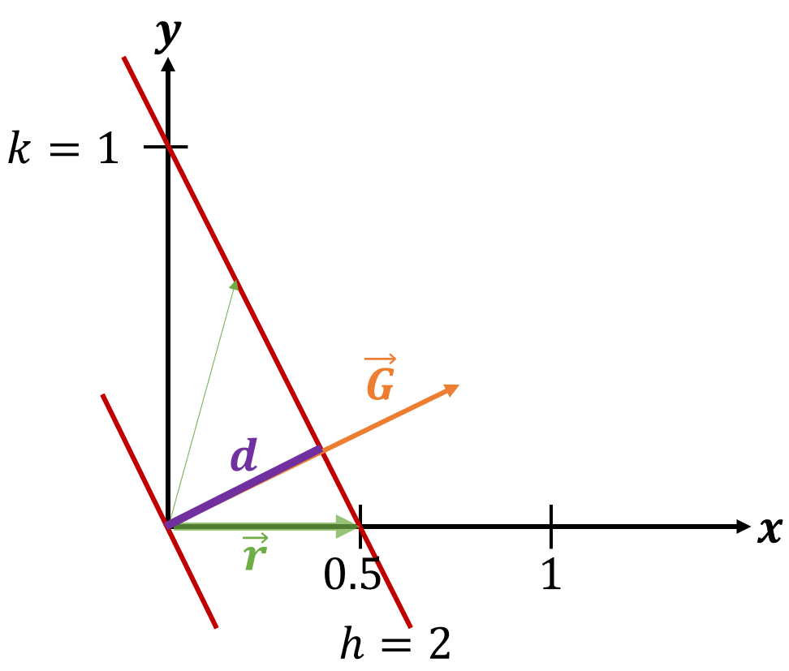

<!--
author:   Claudia Funke

email:    claudia.funke@physik.tu-freiberg.de

version:  0.0.1

language: de

narrator: Deutsch Female

comment:  Struktur der Materie Übung 4
-->

# Übung 4

## Aufgabe 1
> __1.__ 	Die Achsvektoren des reellen Gitters seien $\vec{a_1},\, \vec{a_2},\,\vec{a_3}$. Wie sind mit diesen Vektoren die reziproken Gittervektoren $\vec{b_1},\, \vec{b_2},\,\vec{b_3}$   definiert? 

**Lösung Aufgabe 1:**

Das Volumen der Einheitszelle ist 
$$V_\mathrm{EZ}=\vec{a_1}\cdot (\vec{a_2}\times \vec{a_3})$$
Die reziproken Gittervektoren sind definiert als 

$$\vec{b_1}=\frac{2\pi}{V_\mathrm{EZ}}\cdot (\vec{a_2}\times\vec{a_3})$$
$$\vec{b_2}=\frac{2\pi}{V_\mathrm{EZ}}\cdot (\vec{a_3}\times\vec{a_1})$$
$$\vec{b_3}=\frac{2\pi}{V_\mathrm{EZ}}\cdot (\vec{a_1}\times\vec{a_2})$$

Damit gilt: 
$$\vec{b_i}\cdot \vec{a_j}=2\pi\delta_{ij}$$
mit 
$\delta_{ij}=1 $ für $i=j$ und $\delta_{ij}=0 $  für $i\ne j$.

## Aufgabe 2
>__2.__ 	Die primitiven Translationsvektoren des raumzentrierten Gitters sind $\vec{a_1}=\frac{a}{2}\cdot (-\hat{x}+\hat{y}+\hat{z}) $; $\vec{a_2}=\frac{a}{2}\cdot (\hat{x}-\hat{y}+\hat{z})$; $\vec{a_3}=\frac{a}{2}\cdot (\hat{x}+\hat{y}-\hat{z})$. 
Berechnen Sie die primitiven Translationsvektoren des reziproken Gitters! Was für ein reziprokes Gitter ergibt sich?

*Quelle:  Charles Kittel, Einführung in Festkörperphysik*

**Lösung Aufgabe 2:**

Zuerst wird das Volumen der Einheitszelle im realen Gitter berechnet. Dabei wird folgende Darstellung der $\vec{a_i} $ benutzt:

$\vec{a_1}=\frac{a}{2}\left(\begin{array}{c} -1 \\ 1 \\ 1 \end{array}\right) $, $\vec{a_2}=\frac{a}{2}\left(\begin{array}{c} 1 \\ -1 \\ 1 \end{array}\right) $; $\vec{a_3}=\frac{a}{2}\left(\begin{array}{c} 1 \\ 1 \\ -1 \end{array}\right) $; 

Damit ergibt sich 

$$V_\mathrm{EZ}=\vec{a_1}\cdot (\vec{a_2}\times \vec{a_3})=\frac{a^3}{8}\left(\begin{array}{c} -1 \\ 1 \\ 1 \end{array}\right)\cdot \left [\left(\begin{array}{c} 1 \\ -1 \\ 1 \end{array}\right) \times \left(\begin{array}{c} 1 \\ 1 \\ -1 \end{array}\right) \right ]$$

$$\Rightarrow V_\mathrm{EZ}=\frac{a^3}{8}\left(\begin{array}{c} -1 \\ 1 \\ 1 \end{array}\right)\cdot \left(\begin{array}{c} 0 \\ 2 \\ 2 \end{array}\right)=\frac{1}{2}a^3$$

Laut Definition sind die reziproken Gittervektoren damit 

$$\vec{b_1}=\frac{2\pi}{V_\mathrm{EZ}}\cdot (\vec{a_2}\times\vec{a_3})=\frac{2\pi}{\frac{1}{2}a^3}\cdot \left (\frac{a}{2}\right )^2\left( \begin{array}{c} 1 \\ -1 \\ 1 \end{array} \right)\times \left(\begin{array}{c} 1 \\ 1 \\ -1 \end{array}\right)=\frac{\pi}{a}\cdot \left( \begin{array}{c} 0 \\ 2 \\ 2 \end{array} \right)=\frac{2\pi}{a}\cdot \left( \begin{array}{c} 0 \\ 1 \\ 1 \end{array} \right)  $$

$$\vec{b_2}=\frac{2\pi}{V_\mathrm{EZ}}\cdot (\vec{a_2}\times\vec{a_3})=\frac{2\pi}{\frac{1}{2}a^3}\cdot \left (\frac{a}{2}\right )^2\left( \begin{array}{c} 1 \\ 1 \\ -1 \end{array} \right)\times \left(\begin{array}{c} -1 \\ 1 \\ 1 \end{array}\right)=\frac{\pi}{a}\cdot \left( \begin{array}{c} 2 \\ 0 \\ 2 \end{array} \right)=\frac{2\pi}{a}\cdot \left( \begin{array}{c} 1 \\ 0 \\ 1 \end{array} \right)  $$

$$\vec{b_3}=\frac{2\pi}{V_\mathrm{EZ}}\cdot (\vec{a_2}\times\vec{a_3})=\frac{2\pi}{\frac{1}{2}a^3}\cdot \left (\frac{a}{2}\right )^2\left( \begin{array}{c} -1 \\ 1 \\ 1 \end{array} \right)\times \left(\begin{array}{c} 1 \\ -1 \\ 1 \end{array}\right)=\frac{\pi}{a}\cdot \left( \begin{array}{c} 2 \\ 0 \\ 2 \end{array} \right)=\frac{2\pi}{a}\cdot \left( \begin{array}{c} 1 \\ 0 \\ 1 \end{array} \right)  $$

Das reziproke Gitter von bcc ist damit ein fcc-Gitter.

## Aufgabe 3
>__3.__  Beweisen Sie, dass der Abstand zwischen zwei aufeinanderfolgenden parallelen Ebenen des Gitters gleich $d_\mathrm{hkl}=\frac{2\pi}{|\vec{G}_\mathrm{min}|}$ ist. Dabei ist $\vec{G}_\mathrm{min}$ der zur Ebenenschar $(h,k,l)$ gehörige kleinste reziproke Gittervektor. 

**Lösung Aufgabe 3:**

$\vec{n}=\frac{\vec{G}}{|\vec{G}|}$ ist der zu $\vec{G}$ gehörige Ebenennormalenvektor. Eine zu zur $(h,k,l)$ Ebene benachbarte äquivalente Ebene geht durch den Nullpunkt des Koordinatensystems.  Die Projektion eines beliebigen auf der Netzebene $\vec{G}$ gelegenen Punktes $\vec{r}$ auf $\vec{n}$ liefert den Ebenenabstand. Das gilt also auch für den Punkt  $\vec{r}=\frac{\vec{a_1}}{h} $ auf der Ebene (Schnittpunkt der Ebene mit der x-Achse): 

*Quelle:  Claudia Funke licensed under [CC BY-NC-SA ](https://creativecommons.org/licenses/by-nc-sa/4.0/)*

$$d_\mathrm{hkl}=\vec{r} \cdot \frac{\vec{G}}{|\vec{G}|}=\frac{(\vec{a_1}}{h}\cdot \frac{h\vec{b_1}+k\vec{b_2}+l\vec{b_3})}{|\vec{G}|}$$

Die Skalarprodukte $\vec{a_1}\cdot{\vec{b_2}}$ und $\vec{a_1}\cdot{\vec{b_3}}$ sind Null, da laut Definition $\vec{b_2}$ und  $\vec{b_3}$ senkrecht zu $\vec{a_1}$ sind. Also folgt:

$$d_\mathrm{hkl}=\frac{\vec{a_1}}{h}\left ( \frac{h\cdot 2\pi(\vec{a_2} \times\vec{a_3})}{ |\vec{G}|\cdot \vec{a_1}\cdot (\vec{a_2}\times \vec{a_3})} \right)=\frac{2\pi}{|\vec{G}|}$$

## Aufgabe 4
>__4.__  Zeigen Sie für ein einfach kubisches Gitter, dass $d_\mathrm{hkl}^2=\frac{a^2}{h^2+k^2+l^2} $ gilt!

**Lösung Aufgabe 4:**

Für ein einfach kubisches Gitter gilt: 

$$\vec{G}=\frac{2\pi}{a} \left ( h\cdot \vec{a_1}+k\cdot \vec{a_2}+l\cdot \vec{a_3}\right)$$

$$\Rightarrow d_\mathrm{hkl} =\frac{2\pi}{|\vec{G}|}=2\pi\cdot \frac{a}{2\pi(\sqrt{h^2+k^2+l^2})}=\frac{a}{\sqrt{h^2+k^2+l^2}}$$

## Aufgabe 5:

>__5.__ Die primitiven Translationsvektoren des hexagonalen Raumgitters können geschrieben werden als  $\vec{a_1}=\frac{\sqrt{3}a}{2}\cdot \hat{x}+ \frac{a}{2}\cdot \hat{y}$ und $\vec{a_2}=-\frac{\sqrt{3}a}{2}\cdot \hat{x}+ \frac{a}{2}\cdot \hat{y}$ und $\vec{a_3}=c\cdot \hat{z}$.

>__a.__ Zeigen Sie, dass das Volumen der Einheitszelle gleich $V_\mathrm{EZ}=\frac{\sqrt{3}\cdot a^2 \cdot c}{2}$ ist.

>__b.__ Zeigen Sie, dass   die primitiven Gittervektoren des reziproken Gitters sind, so dass das Gitter nach einer axialen Drehung zu sich selbst reziprok ist.
(c) Beschreiben und skizzieren Sie die erste Brillouin-Zone des ebenen hexagonalen Gitters!

