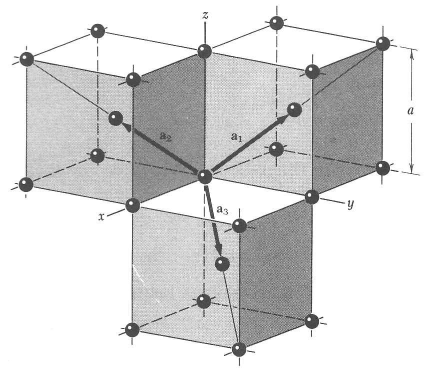

<!--
author:   Claudia Funke

email:    claudia.funke@physik.tu-freiberg.de

version:  0.0.1

language: de

narrator: Deutsch Female

comment:  Struktur der Materie Übung 4

@style
.lia-toc__bottom {
    display: none;
}
@end

-->

# Übung 4

## Aufgabe 1
> __1.__ 	Die Achsvektoren des reellen Gitters seien $\vec{a}_1,\, \vec{a}_2,\,\vec{a}_3$. Wie sind mit diesen Vektoren die reziproken Gittervektoren $\vec{b}_1,\, \vec{b}_2,\,\vec{b}_3$   definiert? 

{{1}}
**Lösung Aufgabe 1:**

{{2}}
Das Volumen der Einheitszelle ist 
$$V_\mathrm{EZ}=\vec{a}_1\cdot (\vec{a}_2\times \vec{a}_3)$$

{{3}}
Die reziproken Gittervektoren sind definiert als 
$$\vec{b}_1=\frac{2\pi}{V_\mathrm{EZ}}\cdot (\vec{a}_2\times\vec{a}_3)$$
$$\vec{b}_2=\frac{2\pi}{V_\mathrm{EZ}}\cdot (\vec{a}_3\times\vec{a}_1)$$
$$\vec{b}_3=\frac{2\pi}{V_\mathrm{EZ}}\cdot (\vec{a}_1\times\vec{a}_2)$$

{{4}}
Damit gilt: 
$$\vec{b_i}\cdot \vec{a_j}=2\pi\delta_{ij}$$
mit 
$\delta_{ij}=1 $ für $i=j$ und $\delta_{ij}=0 $  für $i\ne j$.

{{5}}
************************************
---
Der Vorfaktor $2\pi$ taucht auf, weil das reziproke Gitter so definiert wird, dass **Wellen mit Wellenvektoren aus dem reziproken Gitter** genau die **Translationssymmetrie des realen Gitters** besitzen.

Ein periodischer Kristall im realen Raum lässt sich durch Translationen des Bravais-Gitters beschreiben:

$$\vec{r} \to \vec{r} + \vec{T}, \quad \text{mit } \vec{T} = n_1 \vec{a}_1 + n_2 \vec{a}_2 + n_3 \vec{a}_3$$

Eine Wellenfunktion oder ebene Welle $e^{i \vec{k} \cdot \vec{r}} $ soll **dieselbe Periodizität** haben, d. h.:

$$
e^{i \vec{k} \cdot (\vec{r} + \vec{T})} = e^{i \vec{k} \cdot \vec{r}}
$$

Dies ist genau dann erfüllt, wenn

$$
e^{i \vec{k} \cdot \vec{T}} = 1
$$

oder anders geschrieben:

$$
\vec{k} \cdot \vec{T} = 2\pi m, \quad m \in \mathbb{Z}
$$

Damit sehen wir:
Die erlaubten Wellenvektoren $\vec{k}$ müssen so beschaffen sein,
dass ihr Skalarprodukt mit den Realraum-Vektoren Vielfache von $2\pi$ ergibt.

---
************************************

## Aufgabe 2
>__2.__ 	Die primitiven Translationsvektoren des raumzentrierten Gitters sind $\vec{a}_1=\frac{a}{2}\cdot (-\hat{x}+\hat{y}+\hat{z}) $; $\vec{a}_2=\frac{a}{2}\cdot (\hat{x}-\hat{y}+\hat{z})$; $\vec{a}_3=\frac{a}{2}\cdot (\hat{x}+\hat{y}-\hat{z})$. Berechnen Sie die primitiven Translationsvektoren des reziproken Gitters! Was für ein reziprokes Gitter ergibt sich?

{{1}}
**Lösung Aufgabe 2:**

{{2}}
Zuerst wird das Volumen der Einheitszelle im realen Gitter berechnet. Dabei wird folgende Darstellung der $\vec{a_i} $ benutzt:

{{3}}
$\vec{a}_1=\frac{a}{2}\left(\begin{array}{c} -1 \\ 1 \\ 1 \end{array}\right) $, $\vec{a}_2=\frac{a}{2}\left(\begin{array}{c} 1 \\ -1 \\ 1 \end{array}\right) $; $\vec{a}_3=\frac{a}{2}\left(\begin{array}{c} 1 \\ 1 \\ -1 \end{array}\right) $; 

{{4}}
Damit ergibt sich 
$$V_\mathrm{EZ}=\vec{a}_1\cdot (\vec{a}_2\times \vec{a}_3)=\frac{a^3}{8}\left(\begin{array}{c} -1 \\ 1 \\ 1 \end{array}\right)\cdot \left [\left(\begin{array}{c} 1 \\ -1 \\ 1 \end{array}\right) \times \left(\begin{array}{c} 1 \\ 1 \\ -1 \end{array}\right) \right ]$$

{{5}}
$$\Rightarrow V_\mathrm{EZ}=\frac{a^3}{8}\left(\begin{array}{c} -1 \\ 1 \\ 1 \end{array}\right)\cdot \left(\begin{array}{c} 0 \\ 2 \\ 2 \end{array}\right)=\frac{1}{2}a^3$$

{{6}}
Laut Definition sind die reziproken Gittervektoren damit 

{{7}}
$$\vec{b}_1=\frac{2\pi}{V_\mathrm{EZ}}\cdot (\vec{a}_2\times\vec{a}_3)=\frac{2\pi}{\frac{1}{2}a^3}\cdot \left (\frac{a}{2}\right )^2\left( \begin{array}{c} 1 \\ -1 \\ 1 \end{array} \right)\times \left(\begin{array}{c} 1 \\ 1 \\ -1 \end{array}\right)=\frac{\pi}{a}\cdot \left( \begin{array}{c} 0 \\ 2 \\ 2 \end{array} \right)=\frac{2\pi}{a}\cdot \left( \begin{array}{c} 0 \\ 1 \\ 1 \end{array} \right)  $$

{{8}}
$$\vec{b}_2=\frac{2\pi}{V_\mathrm{EZ}}\cdot (\vec{a}_2\times\vec{a}_3)=\frac{2\pi}{\frac{1}{2}a^3}\cdot \left (\frac{a}{2}\right )^2\left( \begin{array}{c} 1 \\ 1 \\ -1 \end{array} \right)\times \left(\begin{array}{c} -1 \\ 1 \\ 1 \end{array}\right)=\frac{\pi}{a}\cdot \left( \begin{array}{c} 2 \\ 0 \\ 2 \end{array} \right)=\frac{2\pi}{a}\cdot \left( \begin{array}{c} 1 \\ 0 \\ 1 \end{array} \right)  $$

{{9}}
$$\vec{b}_3=\frac{2\pi}{V_\mathrm{EZ}}\cdot (\vec{a}_2\times\vec{a}_3)=\frac{2\pi}{\frac{1}{2}a^3}\cdot \left (\frac{a}{2}\right )^2\left( \begin{array}{c} -1 \\ 1 \\ 1 \end{array} \right)\times \left(\begin{array}{c} 1 \\ -1 \\ 1 \end{array}\right)=\frac{\pi}{a}\cdot \left( \begin{array}{c} 2 \\ 2 \\ 0 \end{array} \right)=\frac{2\pi}{a}\cdot \left( \begin{array}{c} 1 \\ 1 \\ 0 \end{array} \right)  $$

{{10}}
Das reziproke Gitter von bcc ist damit ein fcc-Gitter.

## Aufgabe 3
>__3.__  Beweisen Sie, dass der Abstand zwischen zwei aufeinanderfolgenden parallelen Ebenen des Gitters gleich $d_\mathrm{hkl}=\frac{2\pi}{|\vec{G}_\mathrm{min}|}$ ist. Dabei ist $\vec{G}_\mathrm{min}$ der zur Ebenenschar $(h,k,l)$ gehörige kleinste reziproke Gittervektor. 

{{1}}
**Lösung Aufgabe 3:**

{{2}}
$\vec{n}=\frac{\vec{G}_{hkl}}{|\vec{G}_{hkl}|}$ ist der zu $\vec{G}_{hkl}$ gehörige Ebenennormalenvektor. Eine zu zur $(h,k,l)$ Ebene benachbarte äquivalente Ebene geht durch den Nullpunkt des Koordinatensystems.  Die Projektion eines beliebigen auf der Netzebene $\vec{G}$ gelegenen Punktes $\vec{r}$ auf $\vec{n}$ liefert den Ebenenabstand. Das gilt also auch für den Punkt  $\vec{r}=\frac{\vec{a}_1}{h} $ auf der Ebene (Schnittpunkt der Ebene mit der x-Achse): 

{{2}}
*")<!--width="40%"-->

{{3}}
$$d_\mathrm{hkl}=\vec{r} \cdot \frac{\vec{G}}{|\vec{G}|}=\frac{\vec{a}_1}{h}\cdot \frac{(h\vec{b}_1+k\vec{b}_2+l\vec{b}_3)}{|\vec{G}|}$$

{{4}}
Die Skalarprodukte $\vec{a}_1\cdot{\vec{b}_2}$ und $\vec{a}_1\cdot{\vec{b}_3}$ sind Null, da laut Definition $\vec{b}_2$ und  $\vec{b}_3$ senkrecht zu $\vec{a}_1$ sind. Also folgt:

{{5}}
$$d_\mathrm{hkl}=\frac{\vec{a}_1}{h}\left ( \frac{h\cdot 2\pi(\vec{a}_2 \times\vec{a}_3)}{ |\vec{G}|\cdot \vec{a}_1\cdot (\vec{a}_2\times \vec{a}_3)} \right)=\frac{2\pi}{|\vec{G}|}$$

## Aufgabe 4
>__4.__  Zeigen Sie für ein einfach kubisches Gitter, dass $d_\mathrm{hkl}^2=\frac{a^2}{h^2+k^2+l^2} $ gilt!

{{1}}
**Lösung Aufgabe 4:**

{{2}}
Für ein einfach kubisches Gitter gilt: 
$$\vec{G}= \left ( h\cdot \vec{b}_1+k\cdot \vec{b}_2+l\cdot \vec{b}_3\right)= \frac{2\pi}{a^3} \left ( h\cdot \vec{a}_2 \times \vec{a}_3 +k\cdot \vec{a}_3 \times \vec{a}_1+l\cdot \vec{a}_1 \times \vec{a}_2\right)$$

{{3}}
Für das kubische System folgt mit 

{{3}}
$\vec{a}_1=a\cdot \vec{\hat{x}}$, $\,\,\,\vec{a}_2=a\cdot \vec{\hat{y}}$  und  $\,\,\,\vec{a}_3=a\cdot \vec{\hat{z}}$,
 
  wobei  $\vec{\hat{x}}$, $\,\,\,\vec{\hat{y}}$ und $\,\,\,\vec{\hat{z}}$ orthogonales System von Einheitsvektoren: 

{{4}}
$$\vec{G}=\frac{2\pi}{a^3} \cdot (h\cdot  a^2 \cdot  \vec{\hat{y}}\times \vec{\hat{z}}  + k\cdot  a^2 \cdot \vec{\hat{z}}\times \vec{\hat{x}}+ l\cdot a^2 \cdot \vec{\hat{x}}\times \vec{\hat{y}})$$

{{5}}
Für das kubische System gilt:

{{5}}
$\vec{\hat{y}} \times \vec{\hat{z}}=\vec{\hat{x}}$, $\,\,\,\vec{\hat{z}} \times \vec{\hat{x}}=\vec{\hat{y}} $ und $\,\,\,\vec{\hat{x}} \times \vec{\hat{y}}=\vec{\hat{z}}$ .

{{6}}
$$\Rightarrow \vec{G}=\frac{2\pi a^2}{a^3} \cdot (h \vec{\hat{x}}  + k \cdot \vec{\hat{y}}+ l\cdot \vec{\hat{z}})$$

{{7}}
$$\Rightarrow |\vec{G}|=\frac{2\pi}{a} \sqrt{h^2  + k^2 + l^2} $$

{{8}}
$$\Rightarrow d_\mathrm{hkl} =\frac{2\pi}{|\vec{G}|}=2\pi\cdot \frac{a}{2\pi(\sqrt{h^2  + k^2 + l^2} }=\frac{a}{\sqrt{h^2+k^2+l^2}}$$

## Aufgabe 5

>__5.__ Die primitiven Translationsvektoren des hexagonalen Raumgitters können geschrieben werden als  $\vec{a}_1=\frac{\sqrt{3}a}{2}\cdot \hat{x}+ \frac{a}{2}\cdot \hat{y}$ und $\vec{a}_2=-\frac{\sqrt{3}a}{2}\cdot \hat{x}+ \frac{a}{2}\cdot \hat{y}$ und $\vec{a}_3=c\cdot \hat{z}$.

>__a.__ Zeigen Sie, dass das Volumen der Einheitszelle gleich $V_\mathrm{EZ}=\frac{\sqrt{3}\cdot a^2 \cdot c}{2}$ ist.

>__b.__ Zeigen Sie, dass   $\vec{b}_1=\frac{2\pi}{\sqrt{3}a}\cdot \hat{x}+ \frac{2\pi }{a}\cdot \hat{y}$ und $\vec{b}_2=-\frac{2\pi}{\sqrt{3}a}\cdot \hat{x}+ \frac{2\pi }{a}\cdot \hat{y}$ und $\vec{b}_3=\frac{2\pi}{c}\cdot \hat{z}$  die primitiven Gittervektoren des reziproken Gitters sind. Wie groß ist der Drehwinkel $\Theta$ zwischen den primitiven Translationsvektoren $\vec{a}_i$ und den Basisvektoren $\vec{b}_i$ des dazugehörigen reziproken Gitters?

*")<!--width="50%"-->

{{1}}
**Lösung Aufgabe 5a:**

{{2}}
Das Volumen $V_\mathrm{EZ}$ der Einheitszelle ist das Spatprodukt:
$$V_\mathrm{EZ}=\vec{a}_1\cdot\left (\vec{a}_2 \times \vec{a}_3 \right )$$

{{3}}
$$\Rightarrow V_\mathrm{EZ}=a^2\cdot c \cdot \left (\begin{array} {c} \ \frac{1}{2} \sqrt{3}  \\ \frac{1}{2} \\ 0 \end{array}\right ) \left [ \left (\begin{array} {c} \ -\frac{1}{2} \sqrt{3}  \\ \frac{1}{2} \\0 \end{array}\right ) \times \left (\begin{array} {c} \ 0\\0\\ 1 \end{array}\right ) \right ] $$

{{4}}
$$\Rightarrow V_\mathrm{EZ}=a^2\cdot c\left (\begin{array} {c} \ \frac{1}{2} \sqrt{3}  \\ \frac{1}{2} \\ 0 \end{array}\right )  \left (\begin{array} {c} \ \frac{1}{2}   \\ \frac{1}{2} \sqrt{3} \\0 \end{array}\right )  = \frac{\sqrt{3}\cdot a^2 \cdot c}{2}
$$

{{5}}
**Lösung Aufgabe 5b:**

{{6}}
$$\vec{b}_1=\frac{2\pi}{V_\mathrm{EZ}}\cdot a\cdot c\cdot \left (\begin{array} {c} \ -\frac{1}{2} \sqrt{3}  \\ \frac{1}{2} \\0 \end{array}\right ) \times \left (\begin{array} {c} \ 0 \\ \ 0 \\ 1 \end{array}\right )$$

{{7}}
$$\Rightarrow  \vec{b}_1=\frac{2\pi a c }{V_\mathrm{EZ}} \cdot \left (\begin{array} {c} \ \frac{1}{2} \\ \frac{1}{2} \sqrt{3}  \\0 \end{array}\right )= \frac{2\pi  }{a} \cdot \left (\begin{array} {c} \ \frac{1}{\sqrt{3}} \\ 1   \\0 \end{array}\right )$$

{{8}}
Ferner
$$\vec{b}_2=\frac{2\pi}{V_\mathrm{EZ}}\cdot a\cdot c\cdot \left (\begin{array} {c} \ 0 \\ 0 \\1 \end{array}\right ) \times \left (\begin{array} {c} \ \frac{1}{2} \sqrt{3}   \\ \frac{1}{2}  \\0 \end{array}\right )$$

{{9}}
$$\Rightarrow  \vec{b}_2=\frac{2\pi a c }{V_\mathrm{EZ}} \cdot \left (\begin{array} {c} \ -\frac{1}{2} \\ \frac{1}{2} \sqrt{3}  \\0 \end{array}\right )= \frac{2\pi  }{a} \cdot \left (\begin{array} {c} \ -\frac{1}{\sqrt{3}} \\ 1   \\0 \end{array}\right )$$

{{10}}
Und
$$\vec{b}_3=\frac{2\pi}{V_\mathrm{EZ}}\cdot a^2 \cdot \left (\begin{array} {c} \ \frac{1}{2} \sqrt{3}   \\ \frac{1}{2}  \\0 \end{array}\right ) \times \left (\begin{array} {c} \ -\frac{1}{2} \sqrt{3}   \\ \frac{1}{2}  \\0 \end{array}\right )$$

{{11}}
$$\Rightarrow  \vec{b}_3=\frac{2\pi a^2 }{V_\mathrm{EZ}} \cdot \left (\begin{array} {c} \ 0 \\ 0 \\ \frac{1}{2} \sqrt{3}  \end{array}\right )= \frac{2\pi  }{c} \cdot \left (\begin{array} {c} \ 0 \\ 0   \\1 \end{array}\right )$$

{{12}}
Das reziproke Gitter eines hexagonalen Gitters ist wieder ein hexagonales Gitter. Der Winkel zwischen $\vec{a}_1$ und  $\vec{b}_1$ beträgt:

{{13}}
$$\mathrm{cos}(\Theta_1)=\frac{\vec{a}_1\cdot\vec{b}_1}{|\vec{a}_1|\cdot|\vec{b}_1|}=\frac{2\pi}{\sqrt{\frac{4a^2}{4}}\cdot \frac{2\pi}{a}\sqrt{\frac{1}{3}+1}}=\sqrt{\frac{3}{4}}=\frac{1}{2}\sqrt{3}$$

{{14}}
$$\Rightarrow \Theta_1=30°$$

{{15}}
Der Winkel zwischen $\vec{a}_2$ und  $\vec{b}_2$ beträgt:
$$\mathrm{cos}(\Theta_2)=\frac{\vec{a}_2\cdot\vec{b}_2}{|\vec{a}_2|\cdot|\vec{b}_2|}=\frac{2\pi}{\sqrt{\frac{4a^2}{4}}\cdot \frac{2\pi}{a}\sqrt{\frac{1}{3}+1}}=\sqrt{\frac{3}{4}}=\frac{1}{2}\sqrt{3}$$

{{16}}
**Anmerkungen:**
  Durch Anwendung der Winkelfunktionen am rechtwinkligen Dreieck (bzw. des Satzes von Pythagoras) in der obigen Abbildung wird deutlich, dass 

{{17}}
$$\vec{a}_{1,x}=\cos(30°) \cdot |\vec{a}_1|=\frac{\sqrt{3}}{2}|\vec{a}_1|=\frac{\sqrt{3}}{2}a=\vec{b'}_{1,x}$$
 und 
 $$\vec{b'}_{1,y}=\vec{b'}_{1,x}\cdot \tan(60°)=\vec{a}_{1,x}\cdot \tan(60°)=\frac{\sqrt{3}}{2}a \cdot \tan(60°)=\frac{\sqrt{3}}{2}a\sqrt{3}=\frac{3}{2}a$$ 

{{18}}
Der sich daraus ergebenene Vektor 
$$ \vec{b_1'}=a\cdot \left (\begin{array} {c} \ \frac{\sqrt{3}}{2} \\ \frac{3}{2} \\ 0   \end{array}\right )=a\cdot \frac{3}{2}\cdot \left (\begin{array} {c} \ \frac{1}{\sqrt{3}} \\ 1\\ 0   \end{array}\right )$$

{{19}}
ist parallel zum oben ausgerechneten:
$$\vec{b}_1= \frac{2\pi  }{a} \cdot \left (\begin{array} {c} \ \frac{1}{\sqrt{3}} \\ 1   \\0 \end{array}\right )$$

{{20}}
$\vec{b_1}$ und $\vec{b_1}'$ zeigen also in die gleiche Richtung.
Analoges lässt sich für $\vec{b_2}$ und $\vec{b_2}'$ zeigen.

{{21}}
Die Längen im reziproken Raum können nicht direkt mit denen im realen Raum verglichen werden, die Einheiten sind zueinander reziprok....

{{22}}
Es bleibt noch anzumerken, dass die Winkel $\Theta_1$ und $\Theta_2$ zwar jeweils 30° sind. Bei genauem Betrachten wird jedoch deutlich, dass die Verdrehung zwischen $\vec{a}_1$ und $\vec{b}_1$ $\Theta_1=30°$ ist, zwischen $\vec{a}_2$ und $\vec{b}_2$ jedoch $\Theta_2=-30°$. Trotzdem wird von den $\vec{b}$-Vektoren ein hexagonales Gitter aufgespannt, welches durch eine 30°-Drehung (und Stauchung) in das ursprüngliche überführt werden kann.