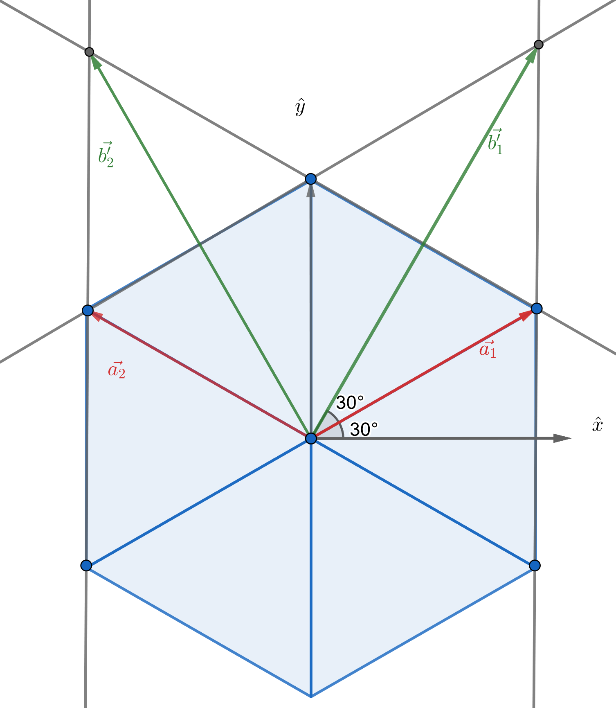

<!--
author:   Claudia Funke

email:    claudia.funke@physik.tu-freiberg.de

version:  0.0.1

language: de

narrator: Deutsch Female

comment:  Struktur der Materie Übung 5

import: https://raw.githubusercontent.com/liaTemplates/KekuleJS/master/README.md

-->

# Übung 4

## Aufgabe 1
> __1.__ 	Die Achsvektoren des reellen Gitters seien $\vec{a}_1,\, \vec{a}_2,\,\vec{a}_3$. Wie sind mit diesen Vektoren die reziproken Gittervektoren $\vec{b}_1,\, \vec{b}_2,\,\vec{b}_3$   definiert? 

**Lösung Aufgabe 1:**

Das Volumen der Einheitszelle ist 
$$V_\mathrm{EZ}=\vec{a}_1\cdot (\vec{a}_2\times \vec{a}_3)$$
Die reziproken Gittervektoren sind definiert als 

$$\vec{b}_1=\frac{2\pi}{V_\mathrm{EZ}}\cdot (\vec{a}_2\times\vec{a}_3)$$
$$\vec{b}_2=\frac{2\pi}{V_\mathrm{EZ}}\cdot (\vec{a}_3\times\vec{a}_1)$$
$$\vec{b}_3=\frac{2\pi}{V_\mathrm{EZ}}\cdot (\vec{a}_1\times\vec{a}_2)$$

Damit gilt: 
$$\vec{b_i}\cdot \vec{a_j}=2\pi\delta_{ij}$$
mit 
$\delta_{ij}=1 $ für $i=j$ und $\delta_{ij}=0 $  für $i\ne j$.

## Aufgabe 2
>__2.__ 	Die primitiven Translationsvektoren des raumzentrierten Gitters sind $\vec{a}_1=\frac{a}{2}\cdot (-\hat{x}+\hat{y}+\hat{z}) $; $\vec{a}_2=\frac{a}{2}\cdot (\hat{x}-\hat{y}+\hat{z})$; $\vec{a}_3=\frac{a}{2}\cdot (\hat{x}+\hat{y}-\hat{z})$. 
Berechnen Sie die primitiven Translationsvektoren des reziproken Gitters! Was für ein reziprokes Gitter ergibt sich?

*Quelle:  Charles Kittel, Einführung in Festkörperphysik*

**Lösung Aufgabe 2:**

Zuerst wird das Volumen der Einheitszelle im realen Gitter berechnet. Dabei wird folgende Darstellung der $\vec{a_i} $ benutzt:

$\vec{a}_1=\frac{a}{2}\left(\begin{array}{c} -1 \\ 1 \\ 1 \end{array}\right) $, $\vec{a}_2=\frac{a}{2}\left(\begin{array}{c} 1 \\ -1 \\ 1 \end{array}\right) $; $\vec{a}_3=\frac{a}{2}\left(\begin{array}{c} 1 \\ 1 \\ -1 \end{array}\right) $; 

Damit ergibt sich 

$$V_\mathrm{EZ}=\vec{a}_1\cdot (\vec{a}_2\times \vec{a}_3)=\frac{a^3}{8}\left(\begin{array}{c} -1 \\ 1 \\ 1 \end{array}\right)\cdot \left [\left(\begin{array}{c} 1 \\ -1 \\ 1 \end{array}\right) \times \left(\begin{array}{c} 1 \\ 1 \\ -1 \end{array}\right) \right ]$$

$$\Rightarrow V_\mathrm{EZ}=\frac{a^3}{8}\left(\begin{array}{c} -1 \\ 1 \\ 1 \end{array}\right)\cdot \left(\begin{array}{c} 0 \\ 2 \\ 2 \end{array}\right)=\frac{1}{2}a^3$$

Laut Definition sind die reziproken Gittervektoren damit 

$$\vec{b}_1=\frac{2\pi}{V_\mathrm{EZ}}\cdot (\vec{a}_2\times\vec{a}_3)=\frac{2\pi}{\frac{1}{2}a^3}\cdot \left (\frac{a}{2}\right )^2\left( \begin{array}{c} 1 \\ -1 \\ 1 \end{array} \right)\times \left(\begin{array}{c} 1 \\ 1 \\ -1 \end{array}\right)=\frac{\pi}{a}\cdot \left( \begin{array}{c} 0 \\ 2 \\ 2 \end{array} \right)=\frac{2\pi}{a}\cdot \left( \begin{array}{c} 0 \\ 1 \\ 1 \end{array} \right)  $$

$$\vec{b}_2=\frac{2\pi}{V_\mathrm{EZ}}\cdot (\vec{a}_2\times\vec{a}_3)=\frac{2\pi}{\frac{1}{2}a^3}\cdot \left (\frac{a}{2}\right )^2\left( \begin{array}{c} 1 \\ 1 \\ -1 \end{array} \right)\times \left(\begin{array}{c} -1 \\ 1 \\ 1 \end{array}\right)=\frac{\pi}{a}\cdot \left( \begin{array}{c} 2 \\ 0 \\ 2 \end{array} \right)=\frac{2\pi}{a}\cdot \left( \begin{array}{c} 1 \\ 0 \\ 1 \end{array} \right)  $$

$$\vec{b}_3=\frac{2\pi}{V_\mathrm{EZ}}\cdot (\vec{a}_2\times\vec{a}_3)=\frac{2\pi}{\frac{1}{2}a^3}\cdot \left (\frac{a}{2}\right )^2\left( \begin{array}{c} -1 \\ 1 \\ 1 \end{array} \right)\times \left(\begin{array}{c} 1 \\ -1 \\ 1 \end{array}\right)=\frac{\pi}{a}\cdot \left( \begin{array}{c} 2 \\ 0 \\ 2 \end{array} \right)=\frac{2\pi}{a}\cdot \left( \begin{array}{c} 1 \\ 0 \\ 1 \end{array} \right)  $$

Das reziproke Gitter von bcc ist damit ein fcc-Gitter.

## Aufgabe 3
>__3.__  Beweisen Sie, dass der Abstand zwischen zwei aufeinanderfolgenden parallelen Ebenen des Gitters gleich $d_\mathrm{hkl}=\frac{2\pi}{|\vec{G}_\mathrm{min}|}$ ist. Dabei ist $\vec{G}_\mathrm{min}$ der zur Ebenenschar $(h,k,l)$ gehörige kleinste reziproke Gittervektor. 

**Lösung Aufgabe 3:**

$\vec{n}=\frac{\vec{G}}{|\vec{G}|}$ ist der zu $\vec{G}$ gehörige Ebenennormalenvektor. Eine zu zur $(h,k,l)$ Ebene benachbarte äquivalente Ebene geht durch den Nullpunkt des Koordinatensystems.  Die Projektion eines beliebigen auf der Netzebene $\vec{G}$ gelegenen Punktes $\vec{r}$ auf $\vec{n}$ liefert den Ebenenabstand. Das gilt also auch für den Punkt  $\vec{r}=\frac{\vec{a}_1}{h} $ auf der Ebene (Schnittpunkt der Ebene mit der x-Achse): 

*Quelle:  Claudia Funke licensed under [CC BY-NC-SA ](https://creativecommons.org/licenses/by-nc-sa/4.0/)*

$$d_\mathrm{hkl}=\vec{r} \cdot \frac{\vec{G}}{|\vec{G}|}=\frac{(\vec{a}_1}{h}\cdot \frac{h\vec{b}_1+k\vec{b}_2+l\vec{b}_3)}{|\vec{G}|}$$

Die Skalarprodukte $\vec{a}_1\cdot{\vec{b}_2}$ und $\vec{a}_1\cdot{\vec{b}_3}$ sind Null, da laut Definition $\vec{b}_2$ und  $\vec{b}_3$ senkrecht zu $\vec{a}_1$ sind. Also folgt:

$$d_\mathrm{hkl}=\frac{\vec{a}_1}{h}\left ( \frac{h\cdot 2\pi(\vec{a}_2 \times\vec{a}_3)}{ |\vec{G}|\cdot \vec{a}_1\cdot (\vec{a}_2\times \vec{a}_3)} \right)=\frac{2\pi}{|\vec{G}|}$$

## Aufgabe 4
>__4.__  Zeigen Sie für ein einfach kubisches Gitter, dass $d_\mathrm{hkl}^2=\frac{a^2}{h^2+k^2+l^2} $ gilt!

**Lösung Aufgabe 4:**

Für ein einfach kubisches Gitter gilt: 

$$\vec{G}=\frac{2\pi}{a} \left ( h\cdot \vec{a}_1+k\cdot \vec{a}_2+l\cdot \vec{a}_3\right)$$

$$\Rightarrow d_\mathrm{hkl} =\frac{2\pi}{|\vec{G}|}=2\pi\cdot \frac{a}{2\pi(\sqrt{h^2+k^2+l^2})}=\frac{a}{\sqrt{h^2+k^2+l^2}}$$

## Aufgabe 5:

>__5.__ Die primitiven Translationsvektoren des hexagonalen Raumgitters können geschrieben werden als  $\vec{a}_1=\frac{\sqrt{3}a}{2}\cdot \hat{x}+ \frac{a}{2}\cdot \hat{y}$ und $\vec{a}_2=-\frac{\sqrt{3}a}{2}\cdot \hat{x}+ \frac{a}{2}\cdot \hat{y}$ und $\vec{a}_3=c\cdot \hat{z}$.

>__a.__ Zeigen Sie, dass das Volumen der Einheitszelle gleich $V_\mathrm{EZ}=\frac{\sqrt{3}\cdot a^2 \cdot c}{2}$ ist.

Das Volumen $V_\mathrm{EZ}$ der Einheitszelle ist das Spatprodukt:

$$V_\mathrm{EZ}=\vec{a}_1\cdot\left (\vec{a}_2 \times \vec{c} \right )$$

$$\Rightarrow V_\mathrm{EZ}=a^2\cdot c \cdot \left (\begin{array} {c} \ \frac{1}{2} \sqrt{3}  \\ \frac{1}{2} \\ 0 \end{array}\right ) \left [ \left (\begin{array} {c} \ -\frac{1}{2} \sqrt{3}  \\ \frac{1}{2} \\0 \end{array}\right ) \times \left (\begin{array} {c} \ 0\\0\\ 1 \end{array}\right ) \right ] $$

$$\Rightarrow V_\mathrm{EZ}=\left (\begin{array} {c} \ \frac{1}{2} \sqrt{3}  \\ \frac{1}{2} \\ 0 \end{array}\right )  \left (\begin{array} {c} \ \frac{1}{2}   \\ \frac{1}{2} \sqrt{3} \\0 \end{array}\right )  = \frac{\sqrt{3}\cdot a^2 \cdot c}{2}
$$

>__b.__ Zeigen Sie, dass   $\vec{b}_1=\frac{2\pi}{\sqrt{3}a}\cdot \hat{x}+ \frac{2\pi }{a}\cdot \hat{y}$ und $\vec{b}_2=-\frac{2\pi}{\sqrt{3}a}\cdot \hat{x}+ \frac{2\pi }{a}\cdot \hat{y}$ und $\vec{b}_3=\frac{2\pi}{c}\cdot \hat{z}$  die primitiven Gittervektoren des reziproken Gitters sind. Wie groß ist der Drehwinkel $\Theta$ zwischen den primitiven Translationsvektoren $\vec{a}_i$ und den Basisvektoren $\vec{b}_i$ des dazugehörigen reziproken Gitters?

$$\vec{b}_1=\frac{2\pi}{V_\mathrm{EZ}}\cdot a\cdot c\cdot \left (\begin{array} {c} \ -\frac{1}{2} \sqrt{3}  \\ \frac{1}{2} \\0 \end{array}\right ) \times \left (\begin{array} {c} \ 0 \\ \ 0 \\ 1 \end{array}\right )$$

$$\Rightarrow  \vec{b}_1=\frac{2\pi a c }{V_\mathrm{EZ}} \cdot \left (\begin{array} {c} \ \frac{1}{2} \\ \frac{1}{2} \sqrt{3}  \\0 \end{array}\right )= \frac{2\pi  }{a} \cdot \left (\begin{array} {c} \ \frac{1}{\sqrt{3}} \\ 1   \\0 \end{array}\right )$$

Ferner

$$\vec{b}_2=\frac{2\pi}{V_\mathrm{EZ}}\cdot a\cdot c\cdot \left (\begin{array} {c} \ 0 \\ 0 \\1 \end{array}\right ) \times \left (\begin{array} {c} \ \frac{1}{2} \sqrt{3}   \\ \frac{1}{2}  \\0 \end{array}\right )$$

$$\Rightarrow  \vec{b}_2=\frac{2\pi a c }{V_\mathrm{EZ}} \cdot \left (\begin{array} {c} \ -\frac{1}{2} \\ \frac{1}{2} \sqrt{3}  \\0 \end{array}\right )= \frac{2\pi  }{a} \cdot \left (\begin{array} {c} \ -\frac{1}{\sqrt{3}} \\ 1   \\0 \end{array}\right )$$

Und

$$\vec{b}_3=\frac{2\pi}{V_\mathrm{EZ}}\cdot a^2 \cdot \left (\begin{array} {c} \ \frac{1}{2} \sqrt{3}   \\ \frac{1}{2}  \\0 \end{array}\right ) \times \left (\begin{array} {c} \ -\frac{1}{2} \sqrt{3}   \\ \frac{1}{2}  \\0 \end{array}\right )$$

$$\Rightarrow  \vec{b}_3=\frac{2\pi a^2 }{V_\mathrm{EZ}} \cdot \left (\begin{array} {c} \ 0 \\ 0 \\ \frac{1}{2} \sqrt{3}  \end{array}\right )= \frac{2\pi  }{c} \cdot \left (\begin{array} {c} \ 0 \\ 0   \\1 \end{array}\right )$$

Das reziproke Gitter eines hexagonalen Gitters ist wieder ein hexagonales Gitter, allerdings verdreht zum ursprünglichen Gitter:

$$\mathrm{cos}(\Theta)=\frac{\vec{a}_1\cdot\vec{b}_1}{|\vec{a}_1|\cdot|\vec{b}_1|}=\frac{2\pi}{\sqrt{\frac{3a^2}{4}}\cdot \frac{2\pi}{a}\sqrt{\frac{1}{3}+1}}=\sqrt{\frac{3}{4}}=\frac{1}{2}\sqrt{3}$$

$$\Rightarrow \Theta=30°$$

*Quelle:  Claudia Funke licensed under [CC BY-NC-SA ](https://creativecommons.org/licenses/by-nc-sa/4.0/)*

Anmerkung: Durch Anwendung der Winkelfunktionen am rechtwinkligen Dreieck bzw. des Satzes von Pythagoras in der obigen Abbildung wird deutlich, dass 
$\vec{b'}_{1,x}=\frac{\sqrt{3}}{2}|\vec{a}_1|$ und $\vec{b'}_{1,y}=\frac{3}{2}|\vec{a}_1|$. Der sich daraus ergebenene Vektor 

$$ \vec{b_1'}=|\vec{a}_1|\cdot \left (\begin{array} {c} \ \frac{\sqrt{3}}{2} \\ \frac{3}{2} \\ 0   \end{array}\right )=a\cdot \frac{3}{2}\cdot \left (\begin{array} {c} \ \frac{1}{\sqrt{3}} \\ 1\\ 0   \end{array}\right )$$

ist parallel zum oben ausgerechneten:

$$\vec{b}_1= \frac{2\pi  }{a} \cdot \left (\begin{array} {c} \ \frac{1}{\sqrt{3}} \\ 1   \\0 \end{array}\right )$$

Die Längen im reziproken Raum können nicht direkt mit denen im realen Raum verglichen werden, die Einheiten sind zueinander reziprok....
