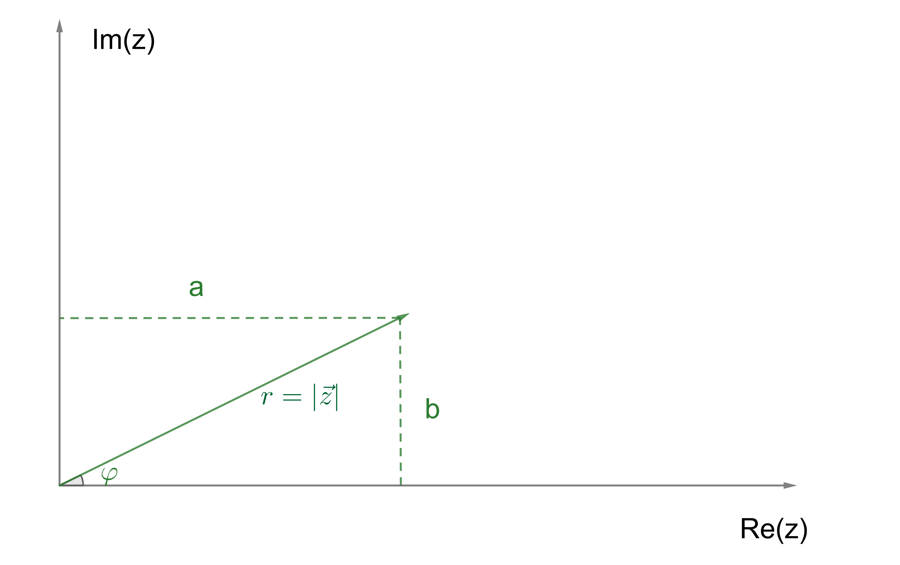

<!--
author:   Claudia Funke

email:    claudia.funke@physik.tu-freiberg.de

version:  0.0.1

language: de

narrator: Deutsch Female

comment:  Struktur der Materie Übung 5, Komplexe Zahlen

import: https://raw.githubusercontent.com/liaTemplates/KekuleJS/master/README.md

-->

# Übung 5: 

## Aufgabe 1 (Komplexe Zahlen)
> __1.__ Komplexe Zahlen

__a.__  Wie ist die imaginäre Einheit $i$ definiert?

**Lösung Aufgabe 1a:**

$i=\sqrt{-1}$; $i^2=1$

__b.__  Wie ist die konjugiert komplexe  Zahl zu $z=a+ib$ definiert?

**Lösung Aufgabe 1b:**

$\bar{z}=a-ib$ 

__c.__  Berechnen Sie $z\cdot \bar{z}$.

**Lösung Aufgabe 1c:**

$z\cdot \bar{z}=a^2+b^2=|z|^2 \ne z^2$

__d.__  Berechnen Sie $(a+ib)+(c+id)$.

**Lösung Aufgabe 1d:**

$(a+ib)+(c+id)=(a+c)+i\cdot(b+d)$

__e.__  Berechnen Sie $(a+ib)\cdot(c+id)$.

**Lösung Aufgabe 1e:**

$(a+ib)\cdot(c+id)=a\cdot c -b \cdot d +i\cdot (bc+ad)$

__f.__  Berechnen Sie $\frac{(a+ib)}{(c+id)}$

**Lösung Aufgabe 1f:**

 $$\frac{(a+ib)}{(c+id)}=\frac{(a+ib)\cdot (c-id) }{(c+id)\cdot (c-id)}=\frac{ac+bd+i(bc-ad)}{c^2+d^2}$$

__g.__  Es gelte $r=|z|=\sqrt{a^2+b^2} $. Wie kann man die komplexe Zahl $z=a+ib=r\cdot e^{i\cdot \varphi}$ anschaulich darstellen? Ist $\varphi$ eindeutig definiert?

**Lösung Aufgabe 1g:**

$$r=|z|=\sqrt{a^2+b^2}$$

$$z=a+i\cdot b=r\cdot e^{i\cdot \varphi}=r(\cos(\varphi)+i\cdot \sin(\varphi) )$$

für $\varphi$ gilt: $\varphi= \arctan  ( \frac{b}{a})$ mit $0 \le \varphi \le 2\pi$

## Aufgabe 2

> __2.__ Die Elektronendichte $n(x)$  werde durch folgende Reihe beschrieben: $n(x) =\sum_p n_p \cdot \exp(\frac{2 \pi i\cdot p\cdot x}{a}) $. Was muss für die Koeffizienten $n_p$ gelten, damit die Elektronendichte eine reelle Funktion wird? 

**Lösung Aufgabe 2:**

Vorgehen: Die Summanden für negatives und positives $p$ werden zusammengefasst. 

Annahme: Es gilt  $\frac{2\pi px}{a}=\varphi$.

Daraus folgt dann:

$$n_p \cdot e^{\frac{2\pi p ix}{a}}+n_{-p} \cdot e^{\frac{-2\pi p ix}{a}}=n_p (\cos(\varphi)+i\sin(\varphi))+n_{-p} (\cos(\varphi)-i\sin(\varphi))$$

$$=(n_p+n_{-p})\cdot \cos(\varphi)+ i \cdot (n_p-n_{-p}) \cdot \sin(\varphi)$$

Mit der Annahme  $n_p=\bar{n}_{-p}$ folgt:

$$n_p \cdot e^{\frac{2\pi p ix}{a}}+n_{-p} \cdot e^{\frac{-2\pi p ix}{a}}=2\cdot \mathrm{Re}(n_p) \cdot \cos(\varphi)+ 2i \cdot \mathrm{Im}(n_p) \cdot i \cdot\sin(\varphi)$$

$$=2\cdot \mathrm{Re}(n_p) \cdot \cos(\varphi)- 2 \cdot  \mathrm{Im}(n_p)  \cdot\sin(\varphi)$$

Beide Summanden wären also reell, und damit wäre die gesamte Elektronendichte reell. Die Voraussetzung $n_p=\bar{n}_{-p}$ führt also zu einer reellen Elektronendichte. 
Das bedeutet unter anderem,  dass mit  $n_p=a+ib$ gleichzeitig $n_{-p}=a-ib$ gelten würde. 

## Aufgabe 3
>__3.__ Leiten Sie die Bragg-Bedingung für eine Schar paralleler Netzebenen her, deren gegenseitiger Abstand gleich $d$ ist. Der Winkel zwischen Einfallsrichtung und Netzebene wird mit $\theta$ bezeichnet. 

**Lösung Aufgabe 3:**

*Quelle: [Darstellung der Braggbedingung für n=2](https://virtuelle-experimente.de/elektronenbeugung/einfuehrung/bragg-bedingung.php)*

Die Bragg-Bedingung für konstruktive Interferrenz ist:

$n\cdot \lambda =2d\cdot \sin (\theta)$.

Dann ist der Weglängenunterschied benachbarter reflektierter Strahlen ein Vielfaches von $\lambda$, und es findet keine Auslöschung sondern konstruktive Interferrenz statt.

## Aufgabe 4
>__4.__  Kann man mit sichtbarem Licht Beugungserscheinungen an Festkörpern erzeugen? Was muss für die Wellenlänge $\lambda$ in Bezug auf den Gitterabstand gelten, damit überhaupt Bragg- Reflexion auftreten kann?

**Lösung Aufgabe 4:**

Die Bragg-Bedingung für konstruktive Interferrenz ist 
$n\cdot \lambda =2d\cdot \sin (\theta)$. 

Es gilt immer 
$\sin (\theta) \le 1$. Also folgt für $n=1$ 

$$\lambda \le 2\cdot d $$

Die Wellenlänge $\lambda$ muss also kleiner sein als der doppelte Netzebenenabstand $2d$, damit mit elektromagnetischer Strahlung Beugungserscheinungen erzeugt werden. Die atomaren Abstände im Festkörper liegen im Angström-Bereich, die Wellenlängen des sichtbaren Lichtes aber im 100er nm-Bereich. Damit können mit sichtbarem Licht keine Beugungserscheinungen auftreten.

## Aufgabe 5:
>__5.__ Die Braggreflexion folgt dem periodischen Aufbau des Raumgitters. Welche Rolle spielt die Anordnung der Atome auf der Basis?

**Lösung Aufgabe 5:**

Die Anordnung der Atome in der Basis bestimmt die relativen Intensitäten der verschiedenen Ordnungen $n$ (mit $n\cdot \lambda =2d\cdot \sin (\varphi)$) an einer bestimmten Schar von parallelen Netzebenen.

## Aufgabe 6:

>__6.__ Eine der Darstellungen von Beugungsbedingungen (Bragg-Bedingungen) lautet $\Delta k=G$. Wie wird diese Bedingung anschaulich in der Ewaldkonstruktion dargestellt? Zeichnen Sie in die folgende Abbildung der reziproken Gitterpunkte die Ewaldkonstruktion für einen einfallenden Wellenvektor mit $\vec{k}=2\cdot \vec{b}_1$  . Markieren sie die reziproken Gitterpunkte, an denen die Bragg-Bedingung erfüllt ist.

*Quelle:  Claudia Funke licensed under [CC BY-NC-SA ](https://creativecommons.org/licenses/by-nc-sa/4.0/)*

**Lösung Aufgabe 6:**

*Quelle:  Claudia Funke licensed under [CC BY-NC-SA ](https://creativecommons.org/licenses/by-nc-sa/4.0/)*

