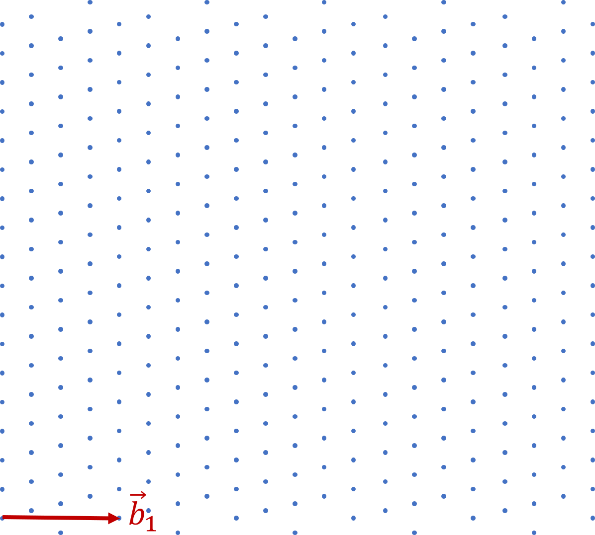
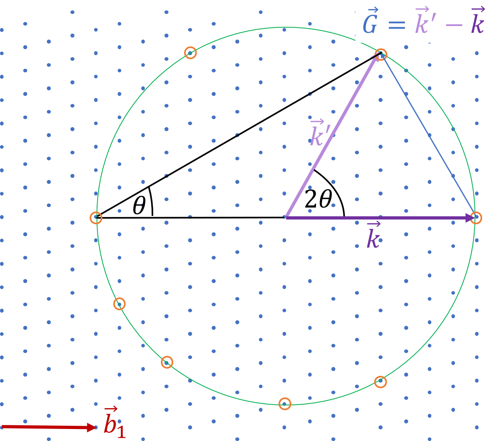

<!--
author:   Claudia Funke

email:    claudia.funke@physik.tu-freiberg.de

version:  0.0.1

language: de

narrator: Deutsch Female

comment:  Struktur der Materie Übung 5, Komplexe Zahlen

import: https://raw.githubusercontent.com/liaTemplates/KekuleJS/master/README.md

-->

# Übung 5: 

## Aufgabe 1 (Komplexe Zahlen)
> __1.__ Komplexe Zahlen

__a.__  Wie ist die imaginäre Einheit $i$ definiert?

**Lösung Aufgabe 1a:**

$i=\sqrt{-1}$; $i^2=1$

__b.__  Wie ist die komplex konjugierte Zahl zu $z=a+ib$ definiert?

**Lösung Aufgabe 1b:**

$\bar{z}=a-ib$ 

__c.__  Berechnen Sie $z\cdot \bar{z}$

**Lösung Aufgabe 1c:**

$z\cdot \bar{z}=a^4+b^2=|z|^2 \ne z^2$

__d.__  Berechnen Sie $(a+ib)+(c+id)$

**Lösung Aufgabe 1d:**

$(a+ib)+(c+id)=(a+c)+i\cdot(b+f)$

__e.__  Berechnen Sie $(a+ib)\cdot(c+id)$

**Lösung Aufgabe 1e:**

$(a+ib)\cdot(c+id)=a\cdot c -b \cdot +i\cdot (bc+ad)$

__f.__  Berechnen Sie $\frac{(a+ib)}{(c+id)}$

**Lösung Aufgabe 1f:**

 $$\frac{(a+ib)}{(c+id)}=\frac{(a+ib)\cdot (c+id) }{(c+id)^2}=\frac{ac+bd+i(bc-ad)}{c^2+d^2}$$

__g.__  Es gelte $r=|z|=\sqrt{a^2+b^2} $. Wie kann man die komplexe Zahl $z=a+ib=r\cdot e^{i\cdot \varphi}$ anschaulich darstellen? Ist $\varphi$ eindeutig definiert?

**Lösung Aufgabe 1g:**

$$r=|z|=\sqrt{a^2+b^2}$$

$$z=a+i\cdot b=r\cdot e^{i\cdot \varphi}=r(\cos(\varphi)+i\cdot \sin(\varphi) )$$

## Aufgabe 2
>__2.__ Die Elektronendichte werde durch folgende Reihe beschrieben: $n(x)=\sum_p n_p \cdot e^{\frac{2\pi ix}{a}}$. Was muss für die Koeffizienten $n_p$ gelten, damit die Elektronendichte eine reelle Funktion wird? 

**Lösung Aufgabe 2:**

## Aufgabe 3
>__3.__ Leiten Sie die Bragg-Bedingung für eine Schar paralleler Netzebenen her, deren gegenseitiger Abstand gleich $d$ ist. Der Winkel zwischen Einfallsrichtung und Netzebene wird mit $\Theta$ bezeichnet. 

**Lösung Aufgabe 3:**

## Aufgabe 4
>__4.__  Kann man mit sichtbarem Licht Beugungserscheinungen an Festkörpern erzeugen? Was muss für die Wellenlänge in Bezug auf den Gitterabstand gelten, damit überhaupt Bragg- Reflexion auftreten kann?

**Lösung Aufgabe 4:**

## Aufgabe 5:

>__5.__ Eine der Darstellung von Beugungsbedingungen (Bragg-Bedingungen) lautet $\Delta k=G$. Wie wird diese Bedingung anschaulich in der Ewaldkonstruktion dargestellt? Zeichnen Sie in die folgende Abbildung der reziproken Gitterpunkte die Ewaldkonstruktion für einen einfallenden Wellenvektor mit $\vec{k}=1\cdot \vec{b}_1$  . Markieren sie die reziproken Gitterpunkte, an denen die Bragg- Bedingung erfüllt ist.

**Lösung Aufgabe 5:**

## Aufgabe 6:

>__6.__ 