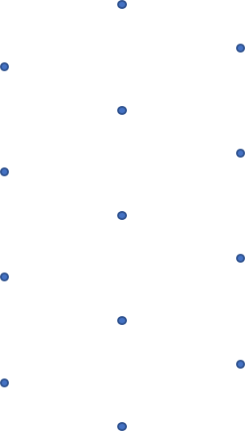
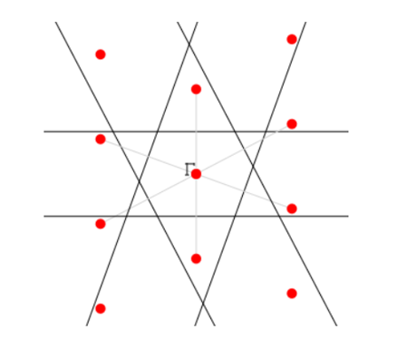
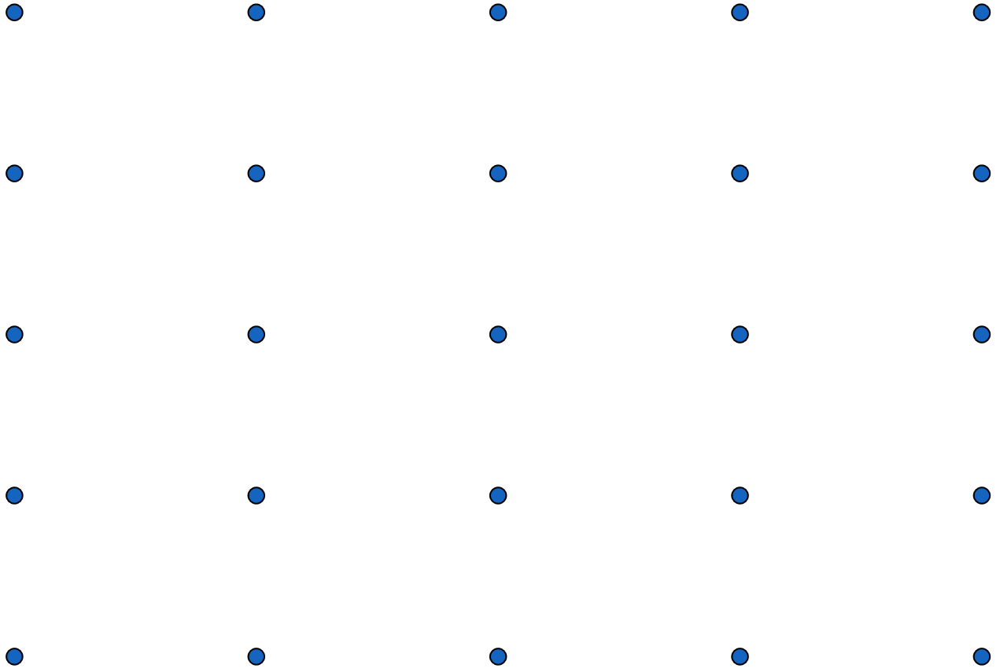
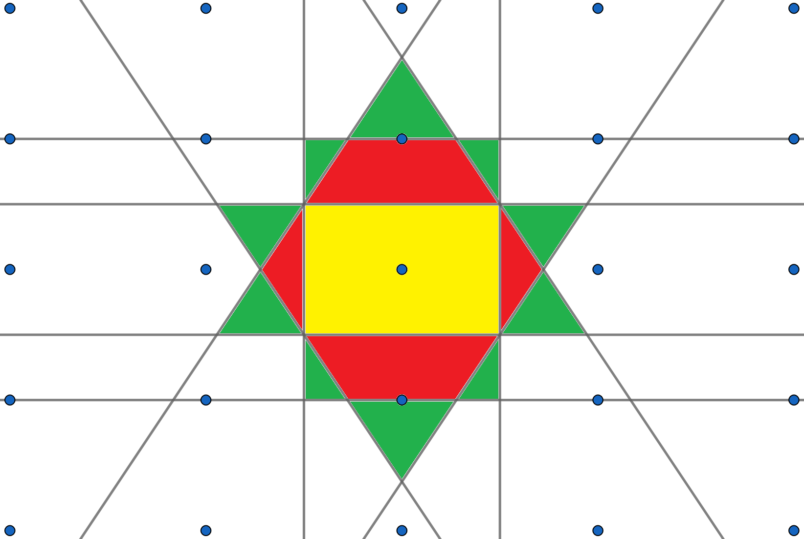

<!--
author:   Claudia Funke

email:    claudia.funke@physik.tu-freiberg.de

version:  0.0.1

language: de

narrator: Deutsch Female

comment:  Struktur der Materie Übung 6

import: https://raw.githubusercontent.com/liaTemplates/KekuleJS/master/README.md

-->

# Übung 6: 

## Aufgabe 1

> __1.__  Die primitiven Translationsvektoren des flächenzentrierten kubischen Gitters sind: $\vec{a}_1=\frac{a}{2}\cdot (\hat{y}+\hat{z}) $; $\vec{a}_2=\frac{a}{2}\cdot (\hat{x}+\hat{z})$; $\vec{a}_3=\frac{a}{2}\cdot (\hat{x}+\hat{y})$. Berechnen Sie die primitiven Translationsvektoren des reziproken Gitters! Was für ein reziprokes Gitter ergibt sich?

**Lösung Aufgabe 1:**

Zuerst wird das Volumen der Einheitszelle im realen Gitter berechnet. Dabei wird folgende Darstellung der $\vec{a_i} $ benutzt:

$\vec{a}_1=\frac{a}{2}\left(\begin{array}{c} 0 \\ 1 \\ 1 \end{array}\right) $, $\vec{a}_2=\frac{a}{2}\left(\begin{array}{c} 1 \\ 0 \\ 1 \end{array}\right) $; $\vec{a}_3=\frac{a}{2}\left(\begin{array}{c} 1 \\ 1 \\ 0 \end{array}\right) $; 

Damit ergibt sich 

$$V_\mathrm{EZ}=\vec{a}_1\cdot (\vec{a}_2\times \vec{a}_3)=\frac{a^3}{8}\left(\begin{array}{c} 0 \\ 1 \\ 1 \end{array}\right)\cdot \left [\left(\begin{array}{c} 1 \\ 0 \\ 1 \end{array}\right) \times \left(\begin{array}{c} 1 \\ 1 \\ 0 \end{array}\right) \right ]$$

$$\Rightarrow V_\mathrm{EZ}=\frac{a^3}{8}\left(\begin{array}{c} 1 \\ 1 \\ 0 \end{array}\right)\cdot \left(\begin{array}{c} 1 \\ 1 \\ -1 \end{array}\right)=\frac{1}{4}a^3$$

Laut Definition sind die reziproken Gittervektoren damit 

$$\vec{b}_1=\frac{2\pi}{V_\mathrm{EZ}}\cdot (\vec{a}_2\times\vec{a}_3)=\frac{2\pi \frac{a^2}{4}}{\frac{a^3}{4}} \left( \begin{array}{c} 1 \\ 0 \\ 1 \end{array} \right)\times \left(\begin{array}{c} 1 \\ 1 \\ 0 \end{array}\right)=\frac{2\pi}{a}\cdot \left( \begin{array}{c} -1 \\ 1 \\ 1 \end{array} \right)$$

$$\vec{b}_2=\frac{2\pi}{V_\mathrm{EZ}}\cdot (\vec{a}_2\times\vec{a}_3)=\frac{2\pi}{a}\left( \begin{array}{c} 1 \\ 1 \\ 0 \end{array} \right)\times \left(\begin{array}{c} 0 \\ 1 \\ 1 \end{array}\right)=\frac{2 \pi}{a}\cdot \left( \begin{array}{c} 1 \\ -1 \\ 1 \end{array} \right)  $$

$$\vec{b}_3=\frac{2\pi}{V_\mathrm{EZ}}\cdot (\vec{a}_2\times\vec{a}_3)=\frac{2\pi}{a}\cdot \left( \begin{array}{c} 0 \\ 1 \\ 1 \end{array} \right)\times \left(\begin{array}{c} 1 \\ 0 \\ 1 \end{array}\right)=\frac{2 \pi}{a}\cdot \left( \begin{array}{c} 1 \\ 1 \\ -1 \end{array} \right)  $$

Durch den Vergleich mit den primitiven Translationsvektoren anderer Raumgitter erkennt man, dass
es sich hierbei um ein kubisch raumzentriertes (bcc) Gitter mit Gitterkonstante $\frac{2 \pi}{a}$ handelt.

## Aufgabe 2
> __2.__ Berechnen Sie das reziproke Gitter des orthorhombischen Gitters.

**Lösung Aufgabe 2:**

Angenommen, wir haben ein orthorhombisches Gitter mit den Gittervektoren:

$$\vec{a_1}=a\cdot \vec{\hat{x}}$$
$$\vec{a_2}=b\cdot \vec{\hat{y}}$$
$$\vec{a_3}=c\cdot \vec{\hat{z}}$$
 mit $\vec{\hat{x}}, \vec{\hat{y}}, \vec{\hat{z}}$ Einheitsvektoren in die entsprechenden Richtungen und jeweils senkrecht aufeinander und $a\ne b\ne c$. 
 
Damit ergibt sich das Volumen der Einheitszelle (einfacher Quader)

$$V_\mathrm{EZ}=\vec{a}_1\cdot (\vec{a}_2\times \vec{a}_3)=a\cdot b\cdot c$$

Die reziproken Gittervektoren können berechnet werden über:
$$\vec{b}_1=\frac{2\pi}{V_\mathrm{EZ}}\cdot (\vec{a}_2\times\vec{a}_3)=\frac{2\pi \cdot b \cdot c} {a\cdot b \cdot c} \left( \begin{array}{c} 0 \\ 1 \\ 0 \end{array} \right)\times \left(\begin{array}{c} 0 \\ 0 \\ 1 \end{array}\right)=\frac{2\pi}{a}\cdot \left( \begin{array}{c} 1 \\ 0 \\ 0 \end{array} \right)=\frac{2\pi}{a}\cdot \vec{\hat{x}}$$

Und analog 

$$\vec{b}_2=\frac{2\pi}{b}\cdot \vec{\hat{y}}$$

   $$\vec{b}_3=\frac{2\pi}{c}\cdot \vec{\hat{z}}$$
Die Beträge der reziproken Gittervektoren sind umgekehrt proportional zu den Längen der entsprechenden Gittervektoren im realen Gitter.

## Aufgabe 3
> __3.__  Berechnen Sie den Netzebenenabstand $d$ im orthorhombischen Gitter.

**Lösung Aufgabe 3:**

Zu jeder Ebenenschar gibt es rezioproke Gittervektoren $\vec{G}$ und umgekehrt gibt es zu jedem reziproken Gittervektor $\vec{G}$ eine Ebenenschar, so dass $\vec{G}$ senkrecht auf den Ebenen steht. Für den kürzesten reziproken Gittervektor $\vec{G}_\mathrm{min}=h\vec{b}_1+k\vec{b}_2+l\vec{b}_3$ gilt:

$$|\vec{G}_\mathrm{min}|=\frac{2\pi}{d_{hkl}}$$

Also folgt:
$$d_{hkl}=\frac{2\pi}{|\vec{G}_\mathrm{min}|}$$
Damit gilt für das orthorhombische Gitter:
$$d_{hkl}=\frac{2\pi}{\sqrt{(\frac{h\cdot 2\pi}{a})^2+(\frac{k \cdot 2\pi}{b})^2+(\frac{l \cdot 2\pi}{c})^2}}=\frac{1}{\sqrt{(\frac{h}{a})^2+(\frac{k}{b})^2+(\frac{l}{c})^2}}$$

## Aufgabe 4
> __4.__ Wie ist die Brillouin-Zone definiert? Zeichnen Sie für das folgende (ebene) reziproke Gitter die Brillouin-Zone!

*Quelle:  Claudia Funke licensed under [CC BY-NC-SA ](https://creativecommons.org/licenses/by-nc-sa/4.0/)*

**Lösung Aufgabe 4:**

Die Wigner-Seitz-Zelle bezeichnet eine spezielle primitive Zelle eines Kristallgitters, die durch eine eindeutige Konstruktionsregel definiert ist. Die [Wigner-Seitz-Zelle](https://de.wikipedia.org/wiki/Wigner-Seitz-Zelle) enthält nur einen Gitterpunkt in ihrem Zentrum. Alle Orte innerhalb der Wigner-Seitz-Zelle liegen näher an diesem Gitterpunkt als an den benachbarten Gitterpunkten. Ihre Entsprechung im reziproken Gitter ist die erste Brillouin-Zone.

Für die Konstruktion in 2D wählt man einen Gitterpunkt und halbiert die Verbindungsstrecken zu allen anderen Punkten des Kristallgitters durch Mittelsenkrechten. So erhält man um den Gitterpunkt herum eine Fläche, die durch die Mittelsenkrechten begrenzt wird. Dies ist die Wigner-Seitz-Zelle. 

*Quelle:  [TU Graz: Brillouin zones of two-dimensional Bravais lattices](http://lampx.tugraz.at/~hadley/ss2/fermisurface/2d_fermisurface/2dBz.php ) mit $\frac{b}{a}=1,2$ und $\gamma =70°$*

Probieren Sie den Link in der Abbildungsunterschrift bitte mal aus und variieren Sie die Parameter.

## Aufgabe 5
> __5.__	Zeigen Sie, dass das Volumen der ersten Brillouin - Zone $V_\mathrm{BZ}$ gleich $\frac{2\pi}{V_\mathrm{pEZ}}$ ist, wobei $V_\mathrm{pEZ}$ das Volumen der primitiven Einheitszelle des Kristalls ist. Dabei ist das Volumen einer Brillouin-Zone gleich dem Volumen des primitiven Parallelepipeds im Fourier-Raum (reziprokem Raum). Beachten Sie dabei die Vektoridentität $(\vec{c} \times\vec{a})\times (\vec{a}  \times\vec{b})=(\vec{c} \cdot\vec{a}\times \vec{b} ) \cdot\vec{a}$. 

**Lösung Aufgabe 5:**

$$V_\mathrm{BZ}=\vec{b}_1 \cdot \vec{b}_2 \times \vec{b}_3=\frac{(2\pi)^3}{(\vec{a}_1 \cdot \vec{a}_2 \times \vec{a}_3)^3}\cdot (\vec{a_2}\times \vec{a_3})\cdot (\vec{a_3}\times \vec{a_1})\times (\vec{a_1}\times \vec{a_2}) $$

$$\Rightarrow V_\mathrm{BZ}=\frac{(2\pi)^3}{(V_\mathrm{pEZ})^3}\cdot (\vec{a_2}\times \vec{a_3})\cdot[ \vec{a_3}\cdot (\vec{a_1}\times \vec{a_2})]\cdot \vec{a_1} $$

$$\Rightarrow V_\mathrm{BZ}=\frac{(2\pi)^3}{(V_\mathrm{pEZ})^3}\cdot (\vec{a_2}\times \vec{a_3})\cdot[ V_\mathrm{pEZ}]\cdot \vec{a_1} =\frac{(2\pi)^3}{(V_\mathrm{pEZ})^3}\cdot [ V_\mathrm{pEZ}]^2= \frac{(2\pi)^3}{V_\mathrm{pEZ}}$$

## Aufgabe 6
>__6.__ Konstruieren Sie die ersten drei Brillouin-Zonen dieses ebenen rechtwinkligen reziproken Gitters!

*Quelle:  Claudia Funke licensed under [CC BY-NC-SA ](https://creativecommons.org/licenses/by-nc-sa/4.0/)*

**Lösung Aufgabe 6**

Suchen sie einen zentralen (reziproken) Gitterpunkt. Denken Sie von diesem in Richtung der näheren Nachbarn die Verbindungslinien und zeichnen Sie auf diese die Mittelsenkrechten ein. 

Alle Punkte, die vom zentralen Gitterpunkt aus zu erreichen sind, ohne eine der eingezeichneten Mittelsenkrechten zu überqueren, gehören zur 1. Brillouinzone. 

Alle Punkte, die vom zentralen Gitterpunkt aus zu mit der Überquerung einer der eingezeichneten Mittelsenkrechten zu erreichen sind, gehören zur 2. Brillouinzone. 

Alle Punkte, die vom zentralen Gitterpunkt aus zu mit der Überquerung zweier der eingezeichneten Mittelsenkrechten zu erreichen sind, gehören zur 3. Brillouinzone. 

Vermeiden Sie dabei Wege durch Ecken! (Warum?)
Wenn sie die gleiche Grenze zweimal überqueren, zählt sie nicht mit.

Die Volumina aller Brillouinzonen (bzw. Flächen im 2D) sind gleich.

*1. BZ gelb, 2. BZ rot und 3. BZ grün; Quelle:  Claudia Funke licensed under [CC BY-NC-SA ](https://creativecommons.org/licenses/by-nc-sa/4.0/)*
