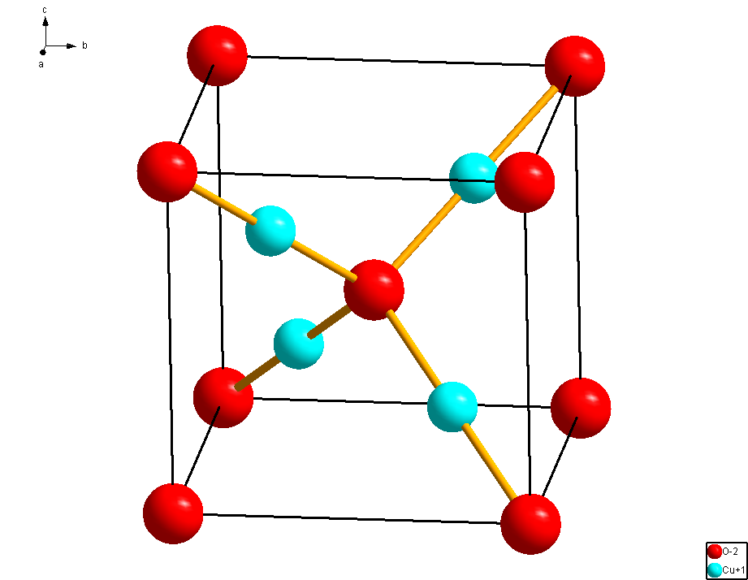
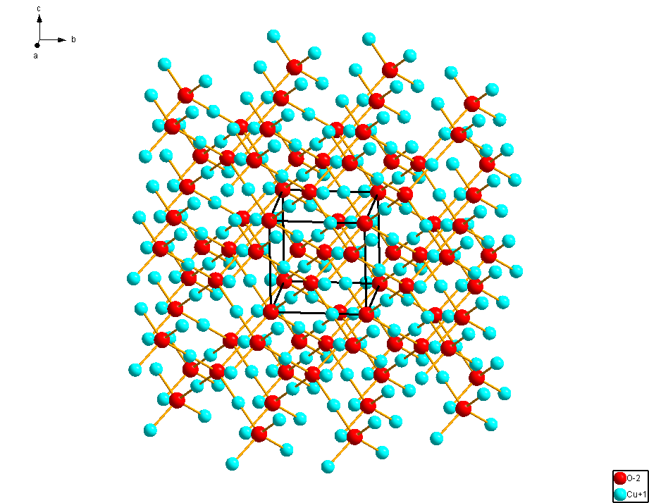

<!--
author:   Claudia Funke

email:    claudia.funke@physik.tu-freiberg.de

version:  0.0.1

language: de

narrator: Deutsch Female

comment:  Struktur der Materie Übung 7

@style
.lia-toc__bottom {
    display: none;
}
@end


import: https://raw.githubusercontent.com/liaTemplates/KekuleJS/master/README.md

-->


# Übung 7: 

## Strukturfaktor?

<details>

<summary>**Welleninterferenz: **</summary>

Wenn Röntgen-, Elektronen- oder Neutronenstrahlen auf einen Kristall treffen, verhalten sie sich wie Wellen. Diese Strahlen werden von den Atomen im Kristall gestreut, und die gestreuten Wellen überlagern sich. Die Wechselwirkung zwischen den Wellen, die von den verschiedenen Atomen ausgehen, führt zu konstruktiver Interferenz, wenn die Wellen in Phase sind, und destruktiver Interferenz, wenn sie außer Phase sind.

</details>

<details>

<summary>**Atomare Positionen im Kristallgitter:**</summary>

Der Strukturfaktor hängt von den Positionen der Atome im Kristallgitter ab. Die genaue räumliche Anordnung und Verteilung der Elektronen (bzw. Atome) beeinflusst die Interferenz der gestreuten Wellen.

</details>

<details>

<summary>**Mathematische Darstellung:**</summary>

Der Strukturfaktor wird mathematisch durch eine Gleichung dargestellt. Für eine Kristallgitter hängt der Strukturfaktor von der Position der Atome in der sich wiederholenden Einheitszelle und damit auch von der Position der Atome in der Basis ab, ebenso wie von der Art und Anzahl der Atome in der Basis.

</details>

<details>

<summary>**Beziehung zu Beugungsmustern:**</summary>

Die Intensität der gestreuten Strahlen, gemessen als Beugungsmuster, ist direkt mit dem Strukturfaktor verbunden. Die Positionen der Intensitätsmaxima und -minima im Beugungsmuster sind durch die Wechselwirkungen der gestreuten Wellen festgelegt, die wiederum vom Strukturfaktor abhängen.

</details>

<details>

<summary>**Zusammenfassung:**</summary>

Der Strukturfaktor bietet eine mathematische Darstellung der Wechselwirkungen zwischen einfallender Strahlung und den Atomen in einem Kristall. Dieses Konzept ist entscheidend, um Informationen über die Kristallstruktur zu gewinnen, indem man die gemessenen Beugungsmuster interpretiert.

</details>

## Berechnung Strukturfaktor


$r\cdot \mathrm{sin}(\varphi)$ ist der Wegunterschied zwischen dem abgebildten oberen und unteren Weg der (linken) einfallenden Welle. Der dazugehörige Phasenunterschied zwischen oberem und unterem Weg ist 
$$2\pi\cdot\frac{r\cdot \mathrm{sin}(\varphi)}{\lambda}=\frac{2\pi}{\lambda}\cdot r\cdot \mathrm{sin}(\varphi)=\vec{k}\cdot\vec{r}$$

Mit der gleichen Begründung ist die Phasendifferenz für den oberen Weg bei der gestreuten Welle $-\vec{k}'\cdot\vec{r}$.
Bei der einfallenden Welle ist die Phase vom oberen Weg bei $\mathrm{d}V$ schon weiter fortgeschritten im Vergleich zum unteren Weg (über O). Achtung, beim gestreuten Röntgenstrahl ist die Phasse des oberen Weges vor dem Bilden der gemeinsamen Wellenfront schon vone weg gelaufen, deshalb hier das Minuszeichen. 
Damit hat die Welle, die im Volumenelement $\mathrm{d}V$ gestreut wird, gegenüber der im Ursprung O gestreueten einen Phasenfaktor von $e^{i(\vec{k}-\vec{k}')\cdot \vec{r}}$

Die gesamte Amplitude $F_{\vec{k}'-\vec{k}}$ der aus $\vec{k}$ in die Richtung $\vec{k}'$ gestreute Welle ist proportional zu 
$$F_{\vec{k}'-\vec{k}}=\int_{V} n(r)\cdot e^{i(\vec{k}-\vec{k}')\cdot \vec{r}}\cdot \mathrm{d}V $$

## Aufgabe 1
                                      {{0}}

> __1.__  Betrachten Sie die Streuamplitude der am Gitter gebeugten Röntgenstrahlung. Wie sind der Strukturfaktor und der Atomformfaktor definiert? Wie sind deren Zusammenhänge?


                                      {{1}}
**Lösung Aufgabe 1:**

                                      {{2}}
Die Streuamplitude $F_G$ der am Gitter gebeugten (Röntgen)-Strahlung ist:
$$F_G=N \int_\mathrm{Zelle} n(r) \exp \left\{-i\vec{G} \cdot \vec{r}\right\} \cdot dV=N\cdot S_G$$
mit $N=$ Anzahl der Zellen im Kristall; $S_G=$ Strukturfaktor

                                      {{3}}
Damit ist also der Strukturfaktor $S_G$:
$$S_G = \sum_ j \int  n_j (\vec{r}-\vec{r}_j) \cdot \exp \left\{-i\vec{G} \cdot \vec{r}\right\}\cdot  dV$$
mit $j=$ alle Atome in der Einheitszelle,  $\vec{r}_j =$  Ortsvektor des Atoms $j$, $n_j(\vec{r}-\vec{r_j})=$ Elektronendichte des $j$-Atoms am Ort $\vec{r}$  und $\vec{\rho}=\vec{r}-\vec{r}_j$. Der Strukturfaktor ist also  die Fouriertransformierte der Elektronenverteilung innerhalb einer Elementarzelle. Das kann umgeschrieben werden zu

                                      {{4}}
$$\Rightarrow S_G = \sum_ j \exp \left\{-i\vec{G} \cdot \vec{r}_j\right\}\int  n_j (\vec{\rho}) \cdot \exp \left\{-i\vec{G} \cdot \vec{\rho}\right\} dV$$
$$\Rightarrow S_G = \sum_ j \exp \left\{-i\vec{G} \cdot \vec{r}_j\right\}\cdot f_j$$
$f_j$ ist der Atomformfaktor:


                                      {{5}}
$$f_j =\int  n_j (\vec{\rho}) \cdot \exp \left\{-i\vec{G} \cdot \vec{\rho}\right\} dV$$
Das Integral wird über den gesamten Raum durchgeführt.
Für die Streuamplitude gilt also

                                      {{6}}
$$F_G=N\cdot S_G=N\cdot \sum_ j  f_j \cdot \exp \left\{-i\vec{G} \cdot \vec{r}_j \right\} $$

                                      {{7}}
Die Atompositionen der Atome in der Einheitszelle seien $\vec{r}_j=x_j\cdot \vec{a}_1+y_j\cdot \vec{a}_2+z_j\cdot \vec{a}_3$ wobei die $\vec{a}_{1,2,3}$ die Basisvektoren des realen Gitters sind.

                                      {{8}}
Für den $(h,k,l)$-Reflex gilt dann:
$$\vec{G}_{hkl}\cdot \vec{r}_j= (h\cdot \vec{b}_1+k\cdot \vec{b}_2+l\cdot \vec{b}_3)\cdot(x_j \cdot \vec{a}_1+y_j\cdot \vec{a}_2+z_j\cdot \vec{a}_3)$$

                                      {{9}}
$$\Rightarrow \vec{G}_{hkl}\cdot \vec{r}_j=2\pi  (h\cdot x_j+k\cdot y_j+l\cdot z_j)$$

                                      {{10}}
Damit gilt für den zum Reflex $G_{hkl}$ gehörigen Strukturfaktor $S_G$  eines Gitters:
$$ S_{G_{hkl}}=\sum_j f_j\cdot \exp \left\{ -2\pi i (h\cdot x_j+k\cdot y_j+l\cdot z_j )\right\} $$


## Aufgabe 2

                                      {{0}}
> __2.__ Was gilt für den Strukturfaktor des raumzentrierten Gitters?

                                      {{1}}
**Lösung Aufgabe 2:**

                                      {{2}}
Das kubisch raumzentriertes Gitter (krz oder bcc) lässt sich durch eine kubische Einheitszelle mit identischen Atomen auf den Plätzen $(x_1,y_1,z_1)=(0,0,0)$ und $(x_2,y_2,z_2)=(\frac{1}{2}, \frac{1}{2},\frac{1}{2})$ beschreiben.

                                      {{3}}
Für den Strukturfaktor gilt dann:
$$ S_{G_{hkl}}=\sum_j f_j\cdot \exp \left\{ -2\pi i (h\cdot x_j+k\cdot y_j+l\cdot z_j )\right\} $$

                                      {{4}}
$$\Rightarrow  S_{G_{hkl}}= f_j\cdot( \exp \left\{ -2\pi i (h\cdot 0+k\cdot 0+l\cdot 0 )\right\} +\exp \left\{ -2\pi i (h\cdot \frac{1}{2}+k\cdot \frac{1}{2}+l\cdot \frac{1}{2} )\right\})$$

                                      {{5}}
$$\Rightarrow  S_{G_{hkl}}=f_j\cdot(  \exp \left\{\ 0\right\} +\exp \left\{ \frac{-2\pi i}{2} (h+k+l )\right\})= f_j\cdot(  1 +\exp \left\{ -\pi i (h+k+l )\right\})$$

                                      {{6}}
$\Rightarrow  S_{G_{hkl}}=0$ für $h+k+l$ ungerade und $S_{G_{hkl}}=2f_j$ für $h+k+l$  gerade.


## Aufgabe 3
                                      {{0}}
> __3.__ Was gilt für den Strukturfaktor des kubisch flächenzentrierten Gitters?
                                      {{1}}
**Lösung Aufgabe 3:**

                                      {{2}}
Das kubisch flächenzentrierte Gitter (kfz oder fcc) lässt sich durch eine kubische Einheitszelle mit identischen vier Atomen auf den Plätzen 
$$(x_1,y_1,z_1)=(0,0,0)$$
$$(x_2,y_2,z_2)=(0, \frac{1}{2},\frac{1}{2})$$
$$(x_3,y_3,z_3)=( \frac{1}{2},0,\frac{1}{2})$$
$$(x_4,y_4,z_4)=( \frac{1}{2},\frac{1}{2},0)$$
beschreiben.

                                      {{3}}
Für den Strukturfaktor gilt dann:
$$ S_{G_{hkl}}=\sum_j f_j\cdot \exp \left\{ -2\pi i (h\cdot x_j+k\cdot y_j+l\cdot z_j )\right\} $$

                                      {{4}}
$$\Rightarrow  S_{G_{hkl}}= f_j\cdot(1+\exp \left\{ -\pi i (k+l )\right\}+\exp \left\{ -\pi i (h+l )\right\}+\exp \left\{ -\pi i (h+k )\right\})$$

                                      {{5}}
 <!-- data-type="none" --> 
| Indizes $h,k,l$    |             |  $S_{hkl}$ |
| ------------- |:----------------:| :-----|
| alle $h,k,l$ gerade  | $\Rightarrow$    |$S_{hkl}=4\cdot f_j$ |
| alle $h,k,l$ ungerade  | $\Rightarrow$         |  $S_{hkl}=4\cdot f_j$  |
| Indizes gemischt gerade und ungerade |$\Rightarrow$ |    $S_{hkl}=0$  |


## Aufgabe 4

                                      {{1}}
> __4.__ Die Kristallstruktur des Diamants lässt sich durch ein kfz-Gitter mit der Basis $(0,0,0)$ und $(\frac{1}{4},\frac{1}{4},\frac{1}{4})$ beschreiben. Der übliche Würfel als Einheitszelle hat also 8 Atome.

                                      {{2}}
> __a.__ Bestimmen Sie den Strukturfaktor $S$ für die Kombination des fcc-Gitters mit der oben beschriebenen 2-atomigen Basis. 

                                      {{3}}
**Lösung Aufgabe 4a:**

                                      {{4}}
Das Diamantgitter ist ein fcc-Gitter mit der zweiatomigen (Atom A, Atom B)  Basis $(x_A,y_A,z_A)=(0,0,0)$ und $(x_B,y_B,z_B)=(\frac{1}{4}, \frac{1}{4},\frac{1}{4})$
Damit sitzen also die (gleichen) Atome auf den Positionen 

                                      {{4}}
|   A |    B         |      
|:---| :---        |
|$(x_{A1},y_{A1},z_{A1})=(0,0,0)$ | $(x_{B1},y_{B1},z_{B1})=(\frac{1}{4}, \frac{1}{4},\frac{1}{4})$|
|$(x_{A2},y_{A2},z_{A2})=(0,\frac{1}{2},\frac{1}{2})$ | $(x_{B2},y_{B2},z_{B2})=(\frac{1}{4}, \frac{3}{4},\frac{3}{4})$|
|$(x_{A3},y_{A3},z_{A3})=(\frac{1}{2},0,\frac{1}{2})$ | $(x_{B3},y_{B3},z_{B3})=(\frac{3}{4}, \frac{1}{4},\frac{3}{4})$|
|$(x_{A4},y_{A4},z_{A4})=(\frac{1}{2},\frac{1}{2},0)$ | $(x_{B4},y_{B4},z_{B4})=(\frac{3}{4}, \frac{3}{4},\frac{1}{4})$|

                                      {{5}}
Der Strukturfaktor berechnet sich damit zu 
$$ S_{G_{hkl}}=\sum_j f_j\cdot \exp \left\{ -2\pi i (h\cdot x_j+k\cdot y_j+l\cdot z_j )\right\} $$

                                      {{6}}

Alle Atome sind gleich, es gilt also $f_j=f$. Damit ergibt sich:
 

                                      {{6}}
$$\begin{align*}
   \Rightarrow S_{G_{hkl}} &=f\cdot \bigg( 1+ \exp(-i\pi(k+l))+\exp(-i\pi(h+l))+\exp(-i\pi(h+k) ) \\
   &+\exp(\frac{-i\pi}{2}(h+k+l)) +\exp(\frac{-i\pi}{2}(h+3k+3l)) \\
   &+\exp(\frac{-i\pi}{2}(3h+k+3l)) +\exp(\frac{-i\pi}{2}(3h+3k+l)) \bigg)
\end{align*}$$

                                      {{7}}
$$\begin{align*}
   \Rightarrow S_{G_{hkl}} &={S_{G_{hkl}}(\mathrm{fcc})}+ f\cdot  \bigg( \exp(\frac{-i\pi}{2}(h+k+l)) +\exp(\frac{-i\pi}{2}(h+3k+3l)) 
  +\exp(\frac{-i\pi}{2}(3h+k+3l)) +\exp(\frac{-i\pi}{2}(3h+3k+l)) \bigg) \\
  &=S_{G_{hkl}}(\mathrm{fcc})+ \bigg(\exp(\frac{-i\pi}{2}(h+k+l)) \bigg) \cdot f\cdot  \bigg(1+ \exp(-i\pi(k+l))+\exp(-i\pi(h+l))+\exp(-i\pi(h+k) ) \bigg) \\
  &=S_{G_{hkl}}(\mathrm{fcc})+ \exp(\frac{-i\pi}{2}(h+k+l)) \cdot S_{G_{hkl}}(\mathrm{fcc}) \\
  &=S_{G_{hkl}}(\mathrm{fcc})\cdot\left ( 1+\exp\left (\frac{-i\pi}{2}(h+k+l) \right )  \right ) \\
  &=S_{G_{hkl}}(\mathrm{fcc})\cdot S_{G_{hkl}}(\mathrm{Basis})
\end{align*}$$


                                      {{8}}
> __b.__ Welches sind die Nullstellen von Strukturfaktors S für Diamant?

                                      {{9}}
**Lösung Aufgabe 4b:**

                                      {{10}}
 <!-- data-type="none" --> 
| Indizes $h,k,l$    | $h+k+l$           |  $S_{hkl}$(Basis) | $S_{hkl}$(fcc)|$S_{G_{hkl}} $ |
| ------------------- |:----------------:| :-----| :----- | :------ |
| alle $h,k,l$ gerade  | $4n+2$    |0 | $4f$ | 0 |
| alle $h,k,l$ gerade   | $4n$        |  2 |$4f$   |$8f$|
| alle $h,k,l$ ungerade |$2n+1$, $n$ gerade|    $1-i$  |$4f$  |$4f\cdot(1-i)$|
| alle $h,k,l$ ungerade |$2n+1$, $n$ ungerade|    $1+i$  |$4f$  |$4f\cdot(1+i)$|
| 1 grade, 2 ungerade |gerade|    $0$  |$0$  |$0$|
| 2 grade, 1 ungerade |ungerade|    $0$  |$0$  |$0$|

                                      {{11}}
Kleine Zusammenfassung: Keine Reflexe bei gemischten Indizes und keine Reflexe, wenn alle Indizes gerade sind und zusätzlich die Summe der Indizes nicht durch 4 teilbar ist. 

## Aufgabe 5

                                      {{1}}
> __5.__ Betrachten Sie ein lineares Gitter mit der Atomfolge ABAB….AB und einem Bindungsabstand A-B gleich $\frac{1}{2}a$. Die Atomformfaktoren sind $f_A$ und  $f_B$ entsprechend der Atome A, B. Der einfallende Röntgenstrahl stehe senkrecht auf der Atomkette. 

                                      {{2}}
>__a.__ Zeigen Sie, dass die Intensität des gebeugten Strahls für ungerade $h$ proportional zu $|f_A-f_B|^2$ ist und für gerade $h$ proportional zu $|f_A+f_B|^2$.

                                      {{3}}
**Lösung Aufgabe 5a:**

                                      {{4}}
Das lineare Gitter lässt sich durch eine lineare Einheitszelle mit Atom A auf $x_A=0$ und Atom B auf $x_B=\frac{1}{2}$ beschreiben

                                      {{5}}
Für den Strukturfaktor gilt dann:
$$\begin{align*} 
S_{G_{h}}&=\sum_j f_j\cdot \exp \bigg(-2\pi i (h\cdot x_j )\bigg)\\
&=f_A\cdot 1+f_B \cdot \exp\bigg(-2\pi i \big(h\cdot \frac{1}{2} \big)\bigg) \\
&=f_A\cdot 1+f_B \cdot \exp \bigg(-\pi i h\bigg)
\end{align*}$$

                                      {{6}}
| Indize $h$    | $S_{h}$ | 
| ------------- |:-------|
|$h$ ungerade | $f_A-f_B$|
|$h$ gerade | $f_A+f_B$|

                                      {{7}}
>__b.__ Was passiert, wenn $f_A=f_B$ ist?

                                      {{8}}
Für $f_A = f_B$ wäre die Gitterkonstante $\frac{a}{2}$. Mit dieser Gitterkonstanten gibt es keine Auswahlregeln.

## Aufgabe 6 (Reflexe an Mischkristallen)

                                      {{0}}
> __6.__ Bestrahlt man bei Strukturuntersuchungen Kristalle aus mehreren Atom- oder Ionensorten mit Röntgenstrahlen, so kann man auf die auftretenden Reflexe vorhersagen. Die Überlegungen werden vereinfacht, wenn  beide Atomsorten getrennt betrachtet werden. Kupferoxid ($\mathrm{Cu_2O}$, Cuprit) bildet ein kubisch raumzentriertes Gitter mit einem $O$-Atom im Ursprung und ein $O$-Atom in der Mitte der kubischen Zelle. Die Kupferatome sitzen tetraedrisch um jedes Sauerstoffatom und haben in der Basis die Koordinaten  $(\frac{a}{4}, \frac{a}{4}, \frac{a}{4})$;  $(\frac{a}{4}, \frac{3a}{4}, \frac{3a}{4})$; $(\frac{3a}{4}, \frac{a}{4}, \frac{3a}{4})$; $(\frac{3a}{4}, \frac{a}{4}, \frac{3a}{4})$. Für welche Millerschen Indizes (in Bezug auf die kubischen Einheitsvektoren ) treten Reflexe an Cuprit auf?



*Quelle:  Claudia Funke, licensed under [CC BY-NC-SA ](https://creativecommons.org/licenses/by-nc-sa/4.0/), erstellt mit [Diamond](https://www.crystalimpact.com/diamond/) *

                                      {{1}}
**Lösung Aufgabe 6:**

                                      {{2}}
``` @Kekule.load3d(mol)
Picture 1                                                                       
  PPPPPPPP          3D                              

 13  8  0  0  0  0  0  0  0  0  0     
    0.0000    0.0000    0.0000 O   0  6  0  1
    4.2520    0.0000    0.0000 O   0  6  0  1
    0.0000    4.2520    0.0000 O   0  6  0  1
    4.2520    4.2520    0.0000 O   0  6  0  1
    0.0000    0.0000    4.2520 O   0  6  0  1
    4.2520    0.0000    4.2520 O   0  6  0  1
    0.0000    4.2520    4.2520 O   0  6  0  1
    4.2520    4.2520    4.2520 O   0  6  0  1
    2.1260    2.1260    2.1260 O   0  6  0  1
    1.0630    1.0630    1.0630 Cu  0  3  0  1
    1.0630    3.1890    3.1890 Cu  0  3  0  1
    3.1890    3.1890    1.0630 Cu  0  3  0  1
    3.1890    1.0630    3.1890 Cu  0  3  0  1
  1 10  1  0  0  0  0
  4 12  1  0  0  0  0
  6 13  1  0  0  0  0
  7 11  1  0  0  0  0
  9 10  1  0  0  0  0
  9 11  1  0  0  0  0
  9 12  1  0  0  0  0
  9 13  1  0  0  0  0
M  END
```

                                      {{2}}
*Quelle:  Claudia Funke, licensed under [CC BY-NC-SA ](https://creativecommons.org/licenses/by-nc-sa/4.0/), erstellt mit [Diamond](https://www.crystalimpact.com/diamond/)  dargestellt in Liascript über Kekule.load3d(mol) von Andre Dietrich*

                                      {{3}}
Zuerst muss überlegt werden, auf welchen Koordinaten welche Atome sitzen. 


                                      {{4}}
***Sauerstoff:*** 
 $$\begin{align*} 
 &\bigg(0,0,0 \bigg) \\
 &\bigg(\frac{1}{2},\frac{1}{2},\frac{1}{2}\bigg)
\end{align*}$$

                                       {{4}} 
Also:  $$S_{hkl}(O)=f_O(1+\exp(-i\pi(h+k+l)))$$


                                      {{5}}
***Kupfer:***
$$\begin{align*} 
 &\bigg(\frac{1}{4},\frac{1}{4},\frac{1}{4} \bigg) \\
 &\bigg(\frac{1}{4},\frac{3}{4},\frac{3}{4}\bigg)\\
 &\bigg(\frac{3}{4},\frac{3}{4},\frac{1}{4}\bigg)\\
 &\bigg(\frac{3}{4},\frac{1}{4},\frac{3}{4}\bigg)\\
\end{align*}$$


                                      {{6}}
Also:
$$\begin{align*} 
S_{hkl}(Cu)&=f_{Cu} \bigg(\exp  \bigg(\frac{-i\pi}{2}(h+k+l)  \bigg) + \exp \left ( \frac{-i\pi}{2}(h+3k+3l) \right ) \\
&+ \exp \left ( \frac{-i\pi}{2}(3h+3k+l) \right )+ \exp \left ( \frac{-i\pi}{2}(3h+k+3l) \right )  \bigg)  \\
&=f_{Cu}\cdot\exp \bigg( \frac{-i\pi}{2}(h+k+l)\bigg) \cdot \bigg( 1+ \exp \left ( -i\pi(k+l) \right ) + \exp \left ( -i\pi(h+k) \right )+ \exp \left ( -i\pi(h+l) \right )  \bigg)
\end{align*}$$

                                      {{8}}
Für das Cuprit als Ganzes lässt sich die gesamte Streuamplitude wegen der Summenbildung über alle Atome aus den einzelnen Komponenten zusammensetzen:
$$S_{hkl}​(Cu_2O)=S_{hkl}(Cu)+S_{hkl}(O)$$

                                      {{9}}
<!-- data-type="none" --> 
|Indizes $h,k,l$    | $S_{hkl}(O)$           |  $S_{hkl}(Cu)$ | Bemerkung|
| ------------------- |:----------------:| :-----| :----- | 
| alle $h,k,l$ gerade  | $f_O(1+1)=2f_O$    |$f_{Cu}\cdot 4(\pm 1)$ | Reflexe von beiden Atomsorten|
| alle $h,k,l$ ungerade   | $f_O(1-1)=0$      |  $f_{Cu}\cdot 4(\pm i)$ |nur Reflexe vom Cu|
| 1 grade, 2 ungerade |$f_O(1+1)=2f_O$|   $f_{Cu}\cdot (1-1+1-1)\cdot  \exp(\frac{-i\pi}{2}(h+k+l))=0$  |nur Reflexe von O  |$0$|
| 2 grade, 1 ungerade |$f_O(1-1)=0$|    $f_{Cu}\cdot (1-1+1-1)\cdot  \exp(\frac{-i\pi}{2}(h+k+l))=0$   |keine Reflexe von Cu oder O |$0$|