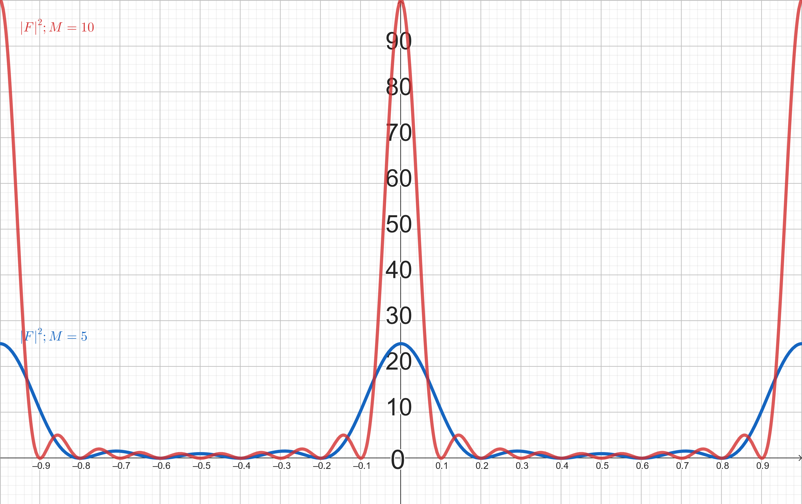
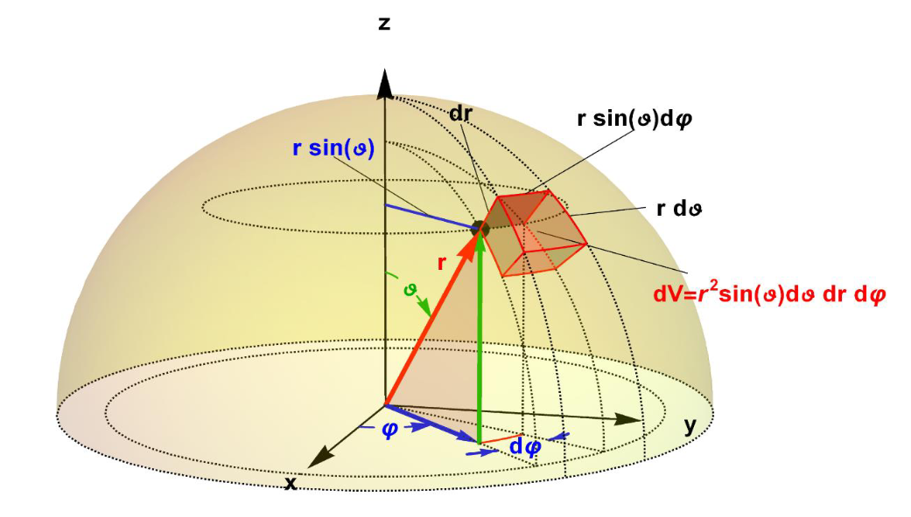

<!--
author:   Claudia Funke

email:    claudia.funke@physik.tu-freiberg.de

version:  0.0.1

language: de

narrator: Deutsch Female

comment:  Struktur der Materie Übung 6

import: https://raw.githubusercontent.com/liaTemplates/KekuleJS/master/README.md

-->

# Übung 8: 

## Aufgabe 1

> __1.__  Eine für die Auswertung der Röntgenreflexe kubischer Substanzen benötigte Größe ist die Quatratsumme  $ h^2+ k^2 +l^2$. Stellen Sie eine Tabelle zusammen, in der Sie für $1\le h^2+ k^2 +l^2 \le 15$ die zugehörigen $hkl$- Werte für die drei verschiedenen kubischen Gitter (sc, bcc, fcc) eintragen. Für welche Werte von $ h^2+ k^2 +l^2$ sind jeweils Reflexe zu erwarten. Wieso kann man aus der Auftragung eines Beugungsspektrums über $\sin ^2\theta$ erkennen, welches der drei Gitter vorliegt?

**Lösung Aufgabe 1:**

***kubisch primitiv (sc):***

$S_{hkl}= f_j$ mit $f_j=$ Atomformfaktor

***kubisch raumzentriert (bcc):***

 $S_{hkl}=2f_j$ für $h+k+l$  gerade; $S_{hkl}=0$ für $h+k+l$ ungerade

***kubisch flächenzentriert (fcc):***

$S_{hkl}=4\cdot f_j$ für alle $ h,k,l$ gerade oder alle $h,k,l$ ungerade. Sonst Null

|$ h^2+ k^2 +l^2$| sc $(hkl)$| bcc $(hkl)$ |fcc $(hkl)$|
|:---|:---|:---|:---|
|1|(1,0,0)|-|-|
|2|(1,1,0)|(1,1,0)|-|
|3|(1,1,1)|-|(1,1,1)|
|4|(2,0,0)|(2,0,0)|(2,0,0)|
|5|(2,1,0)|-|-|
|6|(2,1,1)|(2,1,1)|-|
|7|-|-|-|
|8|(2,2,0)|(2,2,0)|(2,2,0)|
|9|(3,0,0); (2,2,1)|-|-|
|10|(3,1,0)|(3,1,0)|-|
|11|(3,1,1)|-|(3,1,1,)|
|12|(2,2,2)|(2,2,2)|(2,2,2)|
|13|(3,2,0)|-|-|
|14|(3,2,1)|(3,2,1)|-|
|15|-|-|-|

Für kubische Gitter gilt:

$$d_{hkl}=\frac{a}{\sqrt{h^2+k^2+l^2}}$$

Eingesetzt in die  Bragg-Bedingung für Beugung (in die erste Ordnung) $\lambda=2\cdot d_{hkl}\cdot \sin(\theta)$ ergibt sich 

$$ \sin^2(\theta)=\left (\frac{\lambda}{2a} \right )^2(h^2+k^2+l^2)$$

Eine Auftragung des Beugungsspektrums über $\sin ^2\theta$ und ein Vergleich mit den vorhandenen Reflexen bei den $h^2+k^2+l^2$-Werten ermöglicht eine Unterscheidung von sc-, bcc- und fcc-Gittern.

## Aufgabe 2 (Breite des Beugungsmaximums)
> __2.__  Betrachten Sie einen linearen (eindimensionalen)  Kristall mit den  Gitterpunkten $r=m\cdot a$ mit  $m \in \mathbb{Z}$ und $a=$ Gitterkonstante. Auf jedem der Gitterpunkte sitzt ein identisches, punktförmiges Streuzentrum. In Analogie zur Streuamplitude in einem realen Kristall $F=\sum_G \int n_G \cdot \exp(i(\vec{G}-\vec{\Delta k})\cdot\vec{r})\cdot dV$  ist die Gesamtstreuamplitude der Streustrahlung proportional zu  $F=\sum_{m=0}^M  \exp(-i m a \Delta k)$. Atome werden von einer kohärenten Welle $\Psi_Q=\Psi_{Q,0}e^{i(k_oy-\omega t)}$ angeregt. Die Summe über $M$ Gitterpunkte hat den Wert 

$$F=\frac{1-\exp(-iM(a\cdot \Delta k))}{1-\exp(-i(a\cdot \Delta k))}$$
>unter Verwendung der Reihenentwicklung 
$$ \sum_{M=0}^{M-1}x^m=\frac{1-x^M}{1-x}$$
>Die gestreute Intensität ist proportional zu $|F|^2$. 

> __a)__ Zeigen Sie, dass gilt:
$$|F|^2 \equiv F\cdot \overline{F}=\frac{\sin^2\left( \frac{1}{2}M(a\cdot\Delta k)\right )}{\sin^2\left( \frac{1}{2}(a\cdot\Delta k)\right )}$$

**Lösung Aufgabe 2a:**

$|F|^2 \equiv F\cdot \bar{F}$ muss berechnet werden. Dazu benötigen wir das konjugiert Komplexe von $F$. Mit $ \overline{\left(\frac{z_1}{z_2}\right)} = \frac{\overline z_1}{\overline z_2}$ für $ z_2 \ne 0 $ folgt:

$$\overline{F}=\frac{1-\exp(+iM(a\cdot \Delta k))}{1-\exp(+i(a\cdot \Delta k))}$$

Und damit :

$$|F|^2 \equiv F\cdot \bar{F}=\frac{1-\exp(-iM(a\cdot \Delta k))}{1-\exp(-i(a\cdot \Delta k))}\cdot \frac{1-\exp(+iM(a\cdot \Delta k))}{1-\exp(+i(a\cdot \Delta k))}$$

$$\Rightarrow |F|^2=\frac{1-\exp(+iM(a\cdot \Delta k))-\exp(-iM(a\cdot \Delta k))+1}{1-\exp(+i(a\cdot \Delta k))-\exp(-i(a\cdot \Delta k))+1}$$ 

Da $e^{ix}=\cos(x)+i\sin(x)$ folgt mit $e^{ix}+e^{-ix}=2\cos(x)$

$$\Rightarrow |F|^2=\frac{2-2\cos(Ma\Delta k)}{2-2\cos(a \Delta k)}=\frac{1-\cos(Ma\Delta k)}{1-\cos(a \Delta k)}$$

Mit $\cos(2x)=1-\sin^2(2x)$ folgt:

$$\Rightarrow |F|^2=\frac{1-(1-2\sin^2(\frac{1}{2}Ma\Delta k))}{1-(1-2\sin^2(\frac{1}{2}a \Delta k))}=\frac{\sin^2(\frac{1}{²}Ma\Delta k)}{\sin^2(\frac{1}{2}a \Delta k)}$$

*$|F|^2$ als Funktion von $\Delta k $ in Einheiten von $\frac{2 \pi}{a}$;  Quelle:  Claudia Funke, erstellt in GeoGebra, licensed under [CC BY-NC-SA ](https://creativecommons.org/licenses/by-nc-sa/4.0/)*

$|F|^2$ hat damit Hauptmaxima bei $a\cdot \Delta k=2\pi h$, ($h \in \mathbb{Z}$)

> __b.__ Für $a\Delta k=2\pi h$ mit $h \in \mathbb{Z} $ erscheint ein Beugungsmaximum. Ändern wir $\Delta k$ geringfügig und definieren uns ein $\epsilon$ in $a \Delta k=2\pi h+\epsilon$ so, dass $\epsilon$ den Ort des ersten Nulldurchgangs der Funktion $\sin(\frac{1}{²}Ma\Delta k)$ angibt. Zeigen Sie, dass gilt $\epsilon=\frac{2\pi}{M}$, so dass die Breite des Beugungsmaximums proportional zu $\frac{1}{M} $ ist und dadurch für große Werte von $M$ extrem schmal werden kann. 

**Lösung Aufgabe 2b:**

$|F|^2$ hat  Hauptmaxima bei $a\cdot \Delta k=2\pi h$, ($h \in \mathbb{Z}$)
Für die Umgebung der Maxima $a\Delta k=2\pi h + \epsilon $ folgt mit der Läsung von a):

$$|F|^2=\frac{\sin^2(\frac{1}{2}Ma\Delta k)}{\sin^2(\frac{1}{2}a \Delta k)}=\frac{\sin^2(\frac{1}{2}M(2\pi h+\epsilon))}{\sin^2(\frac{1}{2}a \Delta k)}$$

Betrachten wir den Term im Zähler genauer. Mit den Additionstheoremen für den Sinus einer Summe $\sin(x_1​+x_2​)=\sin(x_1)\cdot  \mathrm{​cos}(x_2)​+\sin(x_2)\cdot \mathrm{​cos}(x_1)$ folgt​
$$\sin(\frac{1}{2}M(2\pi h+\epsilon))=\sin(M \pi h+\frac{M\epsilon}{2})=\sin(M \pi h)\cdot \cos(\frac{M\epsilon}{2})+\sin(\frac{M\epsilon}{2})\cdot \cos(M\pi h)$$

Es gilt $\sin(M \pi h)=0$ und $\cos(M\pi h)=\pm 1$ , deshalb folgt:

$$\sin(\frac{1}{2}M(2\pi h+\epsilon))=\pm \sin(\frac{M\epsilon}{2}) $$

Die erste Nullstelle von $\sin(\frac{M\epsilon}{2})$ ist bei $ \epsilon=\frac{2\pi}{M}$. Die "Breite des Maximums" $\epsilon$ wird also kleiner, wenn $M$ größer wird. 

## Aufgabe 3 (Formfaktor H-Atom)

> __3.__  Für das Wasserstoffatom ist im Grundzustand die Elektronendichte gleich

$$n(r)=\frac{1}{\pi a_0^3}\exp\left ( \frac{-2r}{a_0}\right)$$
> Dabei ist $a_0$ der Bohrsche Radius. Zeigen Sie, dass der Atomformfaktor gleich 
$$f_{\Delta k}=\frac{16}{4+\Delta k^2\cdot a_0^2}$$
> ist, wobei $\Delta k=k-k'$ der Streuvektor ist.

**Lösung Aufgabe 3:**

Für das radialsymmetrische H-Atomist es sinvoll, Kugelkordinaten $(r, \varphi, \theta)$ zu nutzen:

*Kugelkoordinaten $(r ,\varphi ,\theta ,)$ eines Punktes P und kartesisches Koordinatensystem mit den Achsen x , y , z. Quelle: wikipedia, Author Ag2gaeh, [CC BY-SA 4.0 Deed](https://creativecommons.org/licenses/by-sa/4.0/)*

$$x = r \cdot \cos \varphi \sin \theta$$
$$y =r \cdot \sin \varphi \sin \theta$$
$$z = r \cdot  \cos \varphi$$

$\varphi$ ist der Azimutwinkel, $\theta$ der Höhenwinkel vom Pol aus gemessen und $r$ der Abstand zum Ursprung. Es gilt für das Volumenelemt $dV$:

*[Volumenelement in Kugelkoordinaten](https://mediathek.htw-berlin.de/getMedium/50f14be8a5d003c8a5d2daa9f5f6fc79.pdf)*

$$V = dV=\int dx \cdot dy \cdot dz= (r d\theta)\cdot(dr)\cdot(r \sin \theta d \varphi)=r^2\sin \theta \cdot dr \cdot  d\varphi \cdot d\theta=-r^2 dr \cdot  d\varphi \cdot d(\cos \theta)$$

Damit folgt für eine allgemeine Funktion $f(x,y,z)$
$$\Rightarrow f(x,y,z)=\int_V f(x,y,z) dx \cdot dy \cdot dz =\int_{0}^{R}\int_{0}^{2\pi}\int_{0}^{\pi}{f(r,\varphi, \theta)\cdot r^2\sin{\theta\ d\theta\ d\varphi\ dr}}$$
Für den Atomformfaktor vom H-Atom gilt damit:

$$f_H=\int_V dV \cdot n_H(r) \exp (-i \Delta \vec{ k} \cdot \vec{r}) = \int_{0}^{R}\int_{0}^{2\pi}\int_{0}^{\pi}{r^2\sin{\theta\ d\theta\ d\varphi\ dr}}$$

f_H\ =\ nrexp-i∆krdV    mit ∆k r= ∆k r cos θ

f_H=nrexp-i∆krcos θdVr2sinθ dθ dφ dr
mit -dcos  = sin  d

 f_H\ =\ \ 0R02π-11nrexp-i∆krcos θr2dcosθ dφ dr

mit \int{\exp{\left(ax\right)}=\exp{\left(ax\right)}/a}
f_H=2\pi\int_{0}^{R}{n\left(r\right)r^2}exp-i∆krcos θ-i∆kr-11dr
mit exp(ix) – exp(-ix) = 2i sin x

f_H=2\pi0Rnr∆krr22sin∆krdr
Elektronendichteverteilung für H-Atom:

n(r) = \frac{1}{\pi a^3}exp \left(-\frac{2r}{a}\right)      a = Bohr-Radius

f_H=4\pi0∞1πa3exp-2rar2sin∆kr∆kr dr

Substitution: ∆kr = x,\ ∆kdr =dx

f_H=4∆k3a30∞x exp-2x∆kasin x dx
Unbestimmtes Integral siehe Bronstein Nr. 463

\intxexp\left(\alpha x\right)sin\left(\beta x\right) = J1 + J2 = J
                                   = \frac{x\ exp\left(\alpha x\right)}{\alpha^2+\beta^2}\left(\alpha\ sin\left(\beta x\right)-\beta\ cos\left(\alpha x\right)\right)-
                                      expαx(α2+β2)²α2-β2sinβx-2αβcosβx

Mit \alpha\ =\ -2∆ka<0 und \beta=1 ergibt sich 
für x = \infty\ : J1 = 0 und J2 = 0
und für x = 0 : J1 = 0 und J2 = J = \frac{2\alpha\beta}{\left(\alpha^2+\beta^2\right)^2}   
 J(\infty) – J(0) = -J2                        

f_H=4∆k3a3-2-2∆ka-2∆ka2+12  = 16∆k4a41-2∆ka2+12    

\ f_{H\ }=\ 164+∆k2a22

für ∆k=0     Vorwärtsstreuung ist\ f_{H\ }=1 Ladung H-Atom

für ∆ka≫ 1 (Rutherford Streuung) ist  f_{H\ }~\ 1∆k4~ 1sin4θ

