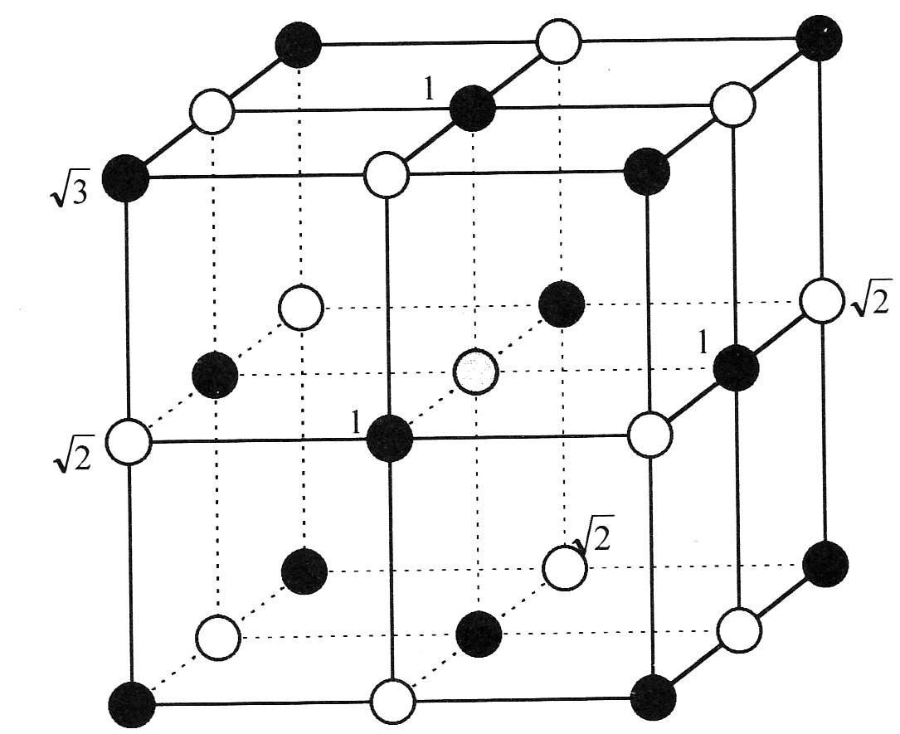

<!--
author:   Claudia Funke

email:    claudia.funke@physik.tu-freiberg.de

version:  0.0.1

language: de

narrator: Deutsch Female

comment:  Struktur der Materie Übung 9
@style
.lia-toc__bottom {
    display: none;
}
@end

import: https://raw.githubusercontent.com/liaTemplates/KekuleJS/master/README.md

-->

# Übung 9: 

## Aufgabe 1
                                      {{0}}
> __1.__ Edelgaskristalle werden durch das Lennard - Jones Potential beschrieben. Wie lautet die Gleichung für dieses Potential und welche Anteile sind darin wo enthalten? Welcher Anteil ist abstoßend, welcher anziehend?

                                      {{1}}
**Lösung Aufgabe 1:**

Lennard- Jones Potential:
$$ U(r)=4 \varepsilon \left [ \left ( \frac{\sigma}{R} \right)^{12}-\left(\frac{\sigma}{R}\right)^6\right]$$
Der positive  hoch-12-Term ist abstoßend (Pauli Prinzip)  
Der negative hoch 6-Term ist anziehend (van der Waals-Wechselwirkung)  

, [CC BY-NC-SA 4.0 Deed](https://creativecommons.org/licenses/by-nc-sa/4.0/)")

## Aufgabe 2
> __2.__ Beschreiben Sie mit Hilfe des Lennard - Jones Potentials die Kraft zwischen zwei Edelgas-Atomen!

**Lösung Aufgabe 2:**

$$\begin{align*}
F&=\ -\frac{dU(r)}{dr} \\
\Rightarrow F&=\ -4\varepsilon\left(\frac{-12\sigma^{12}}{R^{13}}-\ \frac{-6\sigma^6}{R^7}\right)\\
&=\ \frac{24\varepsilon}{R}\ \left[2\left(\frac{\sigma}{R}\right)^{12}-\left(\frac{\sigma}{R}\right)^6\right] 
\end{align*}$$

## Aufgabe 3 
> __3.__ Wie groß ist ungefähr der van der Waals Beitrag zur anziehenden Wechselwirkung in Ionenkristallen und wie wird der Hauptbeitrag der Bindungsenergie in Ionenkristallen noch genannt?

**Lösung Aufgabe 3:**

Der Beitrag der  van der Waals-Wechselwirkung zur anziehenden Wechselwirkung beträgt ca. 1 – 2%  
Der Hauptbeitrag der anziehenden Wechselwirkung ist die elektrostatische Anziehung, die auch **Madelung-Energie** genannt wird.

## Aufgabe 4 
> __4.__ Wie groß ist die gesamte Gitterenergie (elektrostatische Energie) in Ionenkristallen mit 2N Atomen (Formel)?

**Lösung Aufgabe 4:**

Die gesamte Gitterenergie ist die Summe über alle Wechselwirkungsenergien zwischen allen $2N$ Atomen:

$$U_i=\ \sum_{j\ \neq i}\ U_{ij}$$

Dabei ist die Wechselwirkungsenergie 

$$U_{ij}\ = \begin{cases}
\lambda \cdot  \exp\bigg(\frac{-R}{\rho}\bigg)\ -\frac{q^2}{4 \pi \varepsilon_0 R}  &\text{für nächste Nachbarn}\\
\pm\frac{1}{p_{ij}}\frac{q^2}{4\pi\varepsilon_0 \cdot R}  &\text{alle anderen geometrischen Fälle}  
\end{cases} $$

Dabei sind $\lambda$ und $\rho$  materialabhängige Parameter und $p_{ij}=\frac{r_{ij}}{R}$ der relative Abstand .

Mit der **Madelung-Konstanten**

$$\alpha =\ \sum_{j}\pm\frac{1}{p_{ij}} $$

und der Anzahl der nächsten Nachbarn $z$ ergibt sich

$$U_G=\ N\cdot U_i=N\bigg(z \cdot \lambda\cdot \exp\left(\frac{-R}{\rho}\right)-\frac{\alpha \cdot  q^2}{4\pi\varepsilon_0 \cdot R}\bigg)$$

Der Gleichgewichtsabstand ergibt sich aus $\frac{dU_G}{dR} = 0$ 

$$-\frac{N}{\rho}z\ \lambda \exp \left(\frac{-R_{0}}{\rho}\right)+\frac{N\ \alpha \cdot  q^2}{4\pi\varepsilon_0 \cdot R_0^2}\ = 0$$

$$\Rightarrow z\ \lambda \exp \left(\frac{-R_0}{\rho}\right)= \frac{ \rho \cdot \alpha \cdot  q^2}{4\pi\varepsilon_0 \cdot R_0^2} $$

Damit ergibt sich für den Gleichgewichtsabstand $R_0$ die gesamte Gitterenergie

$$U_G=-N\frac{\alpha \cdot  q^2}{4\pi\varepsilon_0 \cdot R_0}\bigg(1-\frac{\rho}{R_0}\bigg)$$

## Aufgabe 5 
>__5.__ Auf welche energetische Erniedrigung ist die Metallbindung zurückzuführen?

**Lösung Aufgabe 5:**

Bei der metallischen Bindung sind die Valenzelektronen gleichmäßig über das ganze Metall "verschmiert" und sind nicht an einem oder zwei Atomen lokalisiert (im Gegensatz zur kovalenten Bindung). Diese Valenzelktronen bilden einen "See" von ungebundenen, delokalisierten Elektronen, in dem die verbleibenden positiven Ionenrümpfe eingebettet sind. Die Bindungsenergie der metallischen Bindung kommt durch die Reduktion der kinetischen Energie der Valenzelektronen zustande.

Zusatzinfos:
Da die metallische Bindung ungerichtet ist, kristallisieren Metalle hauptsächlich in dicht gepackten Strukturen. Die Bindungsenergie ist mit ca. 1 eV eher klein. Die Bindungsenergie von Alkalimetallen (Li, Na, K, Rb, Cs, Fr) ist wesentlich kleiner als die von Alkali-Halogenid-Kristallen (LiF, NaCl), da bei ersteren die interatomaren Abstände größer sind, was zu einer Verringerung der kinetischen Energie der Valenzeleektronen führt. Bei Übergangsmetallen gibt es wegen der Wechselwirkung zwischen inneren Elektronenschalen (d-Elektronen) höhrere Bindungsenergien.

## Aufgabe 6 

>__6.__ Nennen Sie Charakteristika der kovalenten Bindung!

**Lösung Aufgabe 6:**

- stark gerichtete Bindung
- Überlappung von Ladungsverteilungen von Elektronen mit antiparallelem Spin (Elektronenpaar-Bindung)
- Die überlappenden Elektronen binden ihre zugehörigen Ionenrümpfe durch die spinabhängige Coulombenergie (elektrostatische Anziehung, Austauschwechselwirkung)
- hohe Bindungsenergie
- Beispiele: $\mathrm{H_2}$-Molekül, Diamant, Silizium

## Aufgabe 7 

>__7.__ Beschreiben Sie die Wasserstoffbrückenbindung!

**Lösung Aufgabe 7:**

- ein Wasserstoff-Atom oder Proton (H+) wird von zwei Atomen mit starken Kräften angezogen. An dem einem Atom ist es kovalent gebunden, das andere elektronegativere Atom hat ein freies Elektronenpaar.
- weitgehend ionische Bindung (Bindungsenergie ~ 0.1 eV)
- Brücke zwischen **maximal 2 Atomen**
- besonders zwischen F–H...F, O-H...O, N-H...F, C-H...N 
- Wechselwirkung zwischen Wassermolekühlen

## Aufgabe 8 
>__8.__ Berechnen Sie zunächst die Madelungkonstante eines ebenen quadratischen Kristallgitters, berücksichtigen sie dabei Nachbarn, die in einem Quadrat mit der Kantenlänge von drei mal nächster-Nachbar-Abstand um ein Zentralatom liegen (siehe Abbildung unten). Nachbaratome auf dieser „Grenze“ werden nur anteilsmäßig miterfasst. 

> Berechnen Sie dann die Näherung der Madelung-Konstanten für ein 3-dimensionalses Gitter für den in der Abbildung gezeigten Ausschnitt:

**Lösung Aufgabe 8:**

Die Madelung Konstante $\alpha$ ist definiert als 

$$\alpha\ =\ \sum_{j}\frac{\pm}{p_{ij}}$$

wobei $R\cdot p_{ij}$ der Abstand  der Atome zueinander ist.

Für das ebene Gitter gilt: 

$$\begin{align*} 
\alpha_{3\ }&=\ 4\frac{+1}{1}\ +\ 4\frac{-1}{\sqrt2} &\text{erstes Quadrat}\\
 &+\ 4\frac{-1}{2}+8\frac{+1}{\sqrt5}+4\frac{-1}{2\sqrt2} &\text{zweites Quadrat}\\
&+4\frac{+1}{3}\frac{1}{2}+8\frac{-1}{\sqrt{10}}\frac{1}{2}
+8\frac{+1}{\sqrt{13}}\frac{1}{2}+4\frac{-1}{3\sqrt2}\frac{1}{4}  &\text{drittes Quadrat}\\
&=\ 1,611..
\end{align*}$$

Für das gezeigte 3D-Gitter gilt:

$$\begin{align*} 
\alpha_1 &=\ 6\frac{+1}{1}\frac{1}{2}\ +12\frac{-1}{\sqrt2}\frac{1}{4}+8\frac{+1}{\sqrt3}\frac{1}{8}\\
 &=\ 1,456..
\end{align*}$$
## Aufgabe 9

>__9__ Berechnen Sie das Verhältnis der Bindungsenergien und die Gleichgewichtsabstände von Neonkristallen jeweils mit einer bcc-, hcp-, und fcc- Struktur mit Hilfe des Lennard – Jones – Potentials als Funktion von $\sigma$, $\varepsilon$, $N$. Die Gittersummen sind mit $\alpha_{ij}=\frac{r_{ij}}{R}$ gegeben durch 

|Gitter| $A_{6}=\sum\limits_{i,j\ne i}\alpha_{ij}^{-6}$ | $A_{12}=\sum\limits_{i,j\ne i} \alpha_{ij}^{-12} $|
|:---:|:---:|:----:|
|bcc|12,253|9,114|
|hcp|14,4549|12,1323|
|fcc|14,4539|12,1319|

>Welche Struktur erwartet man theoretisch für den Neonkristall? Experimentell stellt man fest, dass Neon in der fcc - Struktur kristallisiert. Welche Gründe könnte es für die Abweichung geben?

**Lösung Aufgabe 9:**

Mit dem Lennard- Jones Potential 
$ U(r)=4 \varepsilon \left [ \left ( \frac{\sigma}{R} \right)^{12}-\left(\frac{\sigma}{R}\right)^6\right]$ ergibt sich für die Gesamtenergie $U_\mathrm{G}$ bei insgesamt $N$ Atomen und damit $\frac{N}{2}$ Atompaaren

$$U_G=4\frac{N}{2}\varepsilon\left[A_{12}\left(\frac{\sigma}{R}\right)^{12}-A_6\left(\frac{\sigma}{R}\right)^6\right]$$

Für den Gleichgewichtsabstand $R_0$ muss die Gesamtenergie ein Minimum haben, also $\frac{dU_G}{dr}=0$ gelten:  

## Aufgabe 10

>__10__ Fester molekularer Wasserstoff: Aus Messungen in der Gasphase findet man für $H_2$, dass für die Parameter des Lennard-Jones-Potentials gilt:

$\varepsilon=50\cdot 10^{-16} \,\mathrm{erg= 50 \cdot 10^{-16} \,\frac{g \cdot cm^2}{s^2}= 50\cdot 10^{-16} \cdot 10^{-7} \, J}$

 $\sigma =2,96 \, \AA$
 
 >Wie hoch (in $\mathrm{\frac{kJ}{mol_{H_2}}})$ ist die Bindungsenergie? Führen Sie die Rechnung für eine fcc - Struktur durch. Behandeln sie jedes $H_2$-Molekül als eine Kugel. 

**Lösung Aufgabe 4:**

