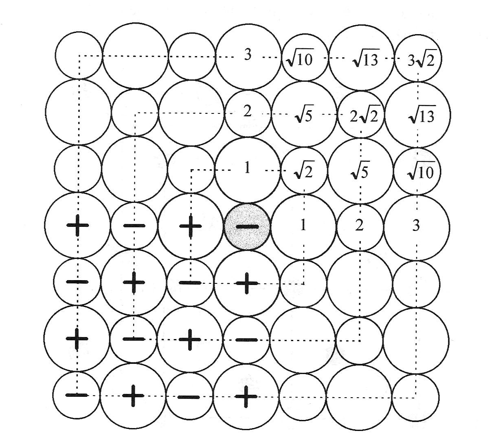

<!--
author:   Claudia Funke

email:    claudia.funke@physik.tu-freiberg.de

version:  0.0.1

language: de

narrator: Deutsch Female

comment:  Struktur der Materie Übung 9
@style
.lia-toc__bottom {
    display: none;
}
@end

import: https://raw.githubusercontent.com/liaTemplates/KekuleJS/master/README.md

-->

# Übung 9: 

## Aufgabe 1

> __1.__ Edelgaskristalle werden durch das Lennard - Jones Potential beschrieben. Wie lautet die Gleichung für dieses Potential und welche Anteile sind darin wo enthalten? Welcher Anteil ist abstoßend, welcher anziehend?

**Lösung Aufgabe 1:**

## Aufgabe 2 (Breite des Beugungsmaximums)
> __2.__ Beschreiben Sie mit Hilfe des Lennard - Jones Potentials die Kraft zwischen zwei Edelgas-Atomen!

**Lösung Aufgabe 2:**

## Aufgabe 3 
> __3.__ Wie groß ist ungefähr der van der Waals  Beitrag zur anziehenden Wechselwirkung in Ionenkristallen und wie wird der Hauptbeitrag der Bindungsenergie in Ionenkristallen noch genannt?

**Lösung Aufgabe 3:**

## Aufgabe 4 
> __4.__ Wie groß ist die gesamte Gitterenergie (elektrostatische Energie) in Ionenkristallen mit 2N Atomen (Formel)?

**Lösung Aufgabe 4:**

## Aufgabe 5 
>__5.__ Auf welche energetische Erniedrigung ist die Metallbindung zurückzuführen?

**Lösung Aufgabe 5:**

## Aufgabe 6 

>__6.__ Nennen Sie Charakteristika der kovalenten Bindung!

**Lösung Aufgabe 6:**

## Aufgabe 7 

>__7.__ Beschreiben Sie die Wasserstoffbrückenbindung!

**Lösung Aufgabe 7:**

## Aufgabe 8 
>__8.__ Berechnen Sie zunächst die Madelungkonstante eines ebenen quadratischen Kristallgitters, berücksichtigen sie dabei Nachbarn, die in einem Quadrat mit der Kantenlänge von drei mal nächster-Nachbar-Abstand um ein Zentralatom liegen (siehe Abbildung unten). Nachbaratome auf dieser „Grenze“ werden nur anteilsmäßig miterfasst. 

Berechnen Sie dann die Näherung der Madelung- Konstante für ein 3-dimensionalses Gitter wie in der folgenden Abbildung (diesen Ausschnitt):

**Lösung Aufgabe 8:**

## Aufgabe 9

>__9__ Berechnen Sie das Verhältnis der Bindungsenergien und die Gleichgewichtsabstände von Neonkristallen mit einer bcc-, hcp-, und fcc- Struktur mit Hilfe des Lennard – Jones – Potentials als Funktion von , , N. Die Gittersummen sind mit ij=rij/R gegeben durch 

Welche Struktur erwartet man theoretisch für den Neonkristall? Experimentell stellt man fest, dass Neon in der fcc - Struktur kristallisiert. Welche Gründe könnte es für die Abweichung geben?

**Lösung Aufgabe 9:**

## Aufgabe 4 

**Lösung Aufgabe 4:**

