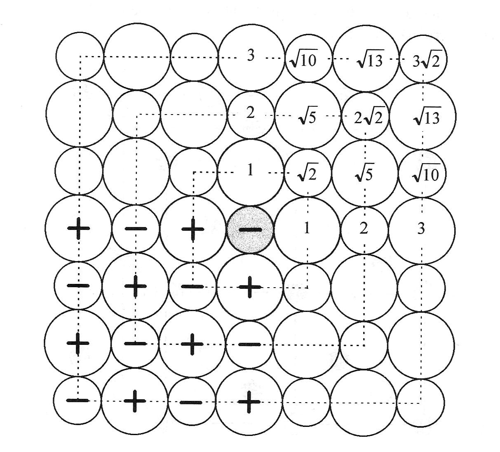

<!--
author:   Claudia Funke

email:    claudia.funke@physik.tu-freiberg.de

version:  0.0.1

language: de

narrator: Deutsch Female

comment:  Struktur der Materie Übung 10
@style
.lia-toc__bottom {
    display: none;
}
@end

import: https://raw.githubusercontent.com/liaTemplates/KekuleJS/master/README.md

import: https://github.com/liascript/CodeRunner

import: https://raw.githubusercontent.com/LiaTemplates/Pyodide/master/README.md
-->

# Übung 10: 

## Aufgabe 1
                                      {{0}}
> __1.__ Beschreiben Sie folgende Quasiteilchen beziehungsweise  Elementaranregungen im Festkörper: Photon, Phonon, Plasmon, Magnon, Polaron, Exiton. Welche Felder oder Wellen gehören zu diesen Elementaranregungen?

                                      {{1}}
**Lösung Aufgabe 1:**

{{2}}

|Quasiteilchen      |       Wechselwirkung, Welle    |  
| :------------- |:----------------| 
| Photon  | elektromagnetische Welle     | 
| Phonon  | elastische (mechanische) Welle        |   
| Plasmon | kollektive Elektronenschwingung (Dichteschwankung von Ladungsträgern)|   
|Magnon|magnetische Spin-Welle, Magnetisierungswelle | 
|Polaron| Elektron-Phonon WW (Elektron und elastische Deformation)|
|Exiton| Elektron- Loch- Paar (Polarisationswelle)|
|Polariton| Phonon- Photon WW, starke Kopplung von Photon + Phonon|

## Aufgabe 2
                                      {{0}}
> __2.__ Welcher Bereich vom Wellenvektor $\vec{K}$ hat für elastische Wellen eine sinnvolle physikalische Bedeutung und warum?

                                      {{1}}
**Lösung Aufgabe 2:**

                                      {{2}}
Wellenlängen, die kleiner sind als der (halbe) Abstand zwischen den Atomen, gibt es auch nicht. Das ist etwas schwierig zu sehen, aber folgendes Bild  hilft:

                                      {{3}}
, Uni Kiel](https://www.tf.uni-kiel.de/matwis/amat/mw2_ge/kap_2/advanced/t2_1_1.html)*")

                                      {{4}}
Also: $\frac{\lambda}{2} \ge a$, wobei $a$ die Gitterkonstante ist.

                                      {{5}}
Es gilt allgemein: 
$$ K=\frac{2 \pi}{\lambda}$$

                                      {{6}}
Für elastische Wellen, die ja von real existierenden Atomen getragen werden, folgt für den  Wellenvektor $\vec{k}$ sinvollerweise also
$$
\begin{align*}
-\pi &\le K\cdot a \le\pi  \\
-\frac{\pi}{a} &\le K \le \frac{\pi}{a}

\end{align*}$$
Größere Wellenvektoren können über $K'=K-\frac{n\cdot 2\pi}{a}$ immer auf Wellenvektoren innerhalb der 1. Brillouinzone zurückgeführt werden.

                                      {{7}}
Damit kann der Wellenvektor von Phononen nur in der ersten Brillouinzone liegen.

                                      {{8}}
Ganz genau betrachtet müssten wegen der endlichen Ausdehnung des Kristalls $b$ noch $K$-Werte in der Nähe des Ursprungs ausgeklammert werden:

                                      {{9}}
Es gibt keine Wellenlängen, die größer sind als die Abmessungen des Kristalls. "Lange" Wellen passen genauso wenig in einen kurzen Kristall wie tiefe Töne in eine Piccoloflöte.
Also: $\lambda \le b$, wobei $b$ die Abmessung des Kristalls sein soll.

{{9}}

{{10}}
Also:
$$\begin{align*}
\lambda &\le b \\
 |\frac{2\pi}{\lambda}| &\ge 2\pi b \\
 |K| &\ge 2\pi b 
 \end{align*}$$

## Aufgabe 3 
                                      {{0}}
> __3.__ Welche Bedeutung kommt einer elastischen Welle zu, wenn deren Wellenvektor $k$ auf den Grenzen der 1. Brillouin-Zone liegt?

                                      {{1}}
**Lösung Aufgabe 3:**

                                      {{2}}
Wenn der Wellenvektor $k$ auf den Grenze der 1. Brillouin-Zone liegt, dann gilt 
$$K=\frac{\pi}{a}$$

                                      {{3}}
Damit folgt für die Auslenkung $u$ der Kristallebene $s$ der elastischen Welle:
$$\begin{align*}
u_s&=u\cdot \exp(iska)\\
&=u\cdot \exp(\pm is\pi)\\
&=u\cdot(-1)^s
\end{align*} $$

                                      {{4}}
Benachbarte Netzebenen haben also engegengesetzte Auslenkungen (entgegengesetzte Phase), da $U_s=\pm \cdot u$, je nachdem , ob $s$ gerade oder ungerade ist. Damit handelt es sich um eine stehende Welle.

## Aufgabe 4 

                                      {{0}}
> __4.__ Wie ist die Gruppengeschwindigkeit eines Wellenpaketes definiert? Welche Bedeutung hat die Gruppengeschwindigkeit?

                                      {{1}}
**Lösung Aufgabe 4:**

                                      {{2}}
Die Gruppengeschwindigkeit $v_{\mathrm {g}}$ eines Wellenpaketes ist die Geschwindigkeit, mit der sich die Hüllkurve eines Wellenpakets fortbewegt. Es gilt: 

$$v_\mathrm{g}=\frac{\partial \omega}{\partial K}$$
Oder, wenn die Richtung mit berücksichtigt wird:
$$\vec{v}_\mathrm{g}=\mathrm{grad}_K(\omega (K))=\begin{pmatrix}
   \frac{\partial \omega}{\partial K_a} \\
   \frac{\partial \omega}{\partial K_b} \\
   \frac{\partial \omega}{\partial K_c} \\
\end{pmatrix}$$
Dabei sind $a,b,c$ die drei Koordinatenrichtungen. Die Gruppengeschwindigkeit it die Geschwindigkeit des Energietransportes.

                                      {{3}}
, [CC BY-NC-SA 4.0 Deed](https://creativecommons.org/licenses/by-nc-sa/4.0/)*")

                                      
{{4}}
Ergänzung: Die Phasengeschwindigkeit $v_\mathrm{p}$ ist
$$v_\mathrm{p}=\frac{\omega}{K}$$

## Aufgabe 5 
                                      {{0}}
>__5.__ Betrachten Sie eine lineare monoatomare Kette aus äquidistanten Atomen der Masse $M$ im Abstand $a$, die um ihre Gleichgewichtslage kleine Schwingungen ausführen können (longitudinale Polarisation, harmonische Näherung). Eine Wechselwirkung bestehe ausschließlich zwischen nächsten Nachbarn und sei durch die Federkonstante C charakterisiert. Die Position des n–ten Atoms sei durch $x_n(t) = n\cdot a + u_n(t)$ beschrieben.

>__a)__ Zeigen Sie, dass die Auslenkung $u_n(t)$ des n–ten Atoms der Differentialgleichung 

$$M\cdot \frac{\partial u_n(t)}{\partial t^2}=-C \left[2u_n(t)-u_{n+1}(t)-u_{n-1}(t)\right]$$
> genügt.

>__b)__ Lösen Sie obige Gleichung mit dem Ansatz $u_n(t) = u_0(t) e^{iKna}$ und leiten Sie eine Dispersionsrelation zwischen Frequenz $\omega$ und der Wellenzahl $K$  ab. 

>__c)__ Diskutieren Sie den langwelligen Grenzfall $Ka \ll 1$ und zeigen Sie insbesondere, dass sich aus obiger Gleichung die (Schall–) Wellengeichung  $ \frac{\partial^2 u(x,t)}{\partial t^2}-v_s^2\frac{\partial^2 u(x,t)}{\partial x^2}=0$   ergibt, wenn man zur Kontinuumsbeschreibung $u_{n±1}(t) = u(x ± a, t)$ übergeht.

                                      {{1}}
**Lösung Aufgabe 5a:**

                                      {{2}}
Die Position des $n$-ten Atoms in der lineraren Kette aus gleichen Atomen mit äquidistanten mittlerem Abstand $a$ und Federkonstante $C$ ist bei longitudinaler Polarisation für das $n$-te Atom : 

$$x_n(t) = n\cdot a + u_n(t)$$

Dabei ist $u_n(t)$ die Auslenkung aus der Ruhelage. 

Sei $M$ die Masse eines Atoms, $C_p$ die Kraftkonstante zum $p$-ten Nachbarn und $F_n$ die Kraft auf das Atom $n$. Dann gilt:

$$\sum_{p\ne 0}C_p[u_n(t)-u_{n+p}(t)]$$

$$F_n = C(u_{n+1} – u_n) + C(u_{n-1} – u_n )$$
Bewegungsgleichung: Md²undt² = C(un+1 + un-1  –2un) 
Lösungsansatz: un(t) = u(t) * exp(iKna) mit u(t) = exp(-iωt)

                                      {{3}}

## Aufgabe 6 

                                      {{0}}
>__6.__ Gegeben sei eine lineare, monoatomare, quasi-elastische Kette aus Atomen der Masse M = 200amu. Der Abstand zwischen benachbarten Atomen sei a = 4Å. Beachten Sie nur Wechselwirkungen zwischen nächsten Nachbarn. 
a) Die Schallgeschwindigkeit sei 4000m/s. Wie groß ist die Koppelungskonstante C zwischen benachbarten Atomen?
b) Wie groß ist die maximale Frequenz der (ungedämpften) Welle?

                                      {{1}}
**Lösung Aufgabe 6:**

                                      {{2}}

## Aufgabe 7 

                                      {{0}}
>__7.__ Wie kann man sich anschaulich optische und akustische Zustände elastischer Wellen vorstellen? 

                                      {{1}}
**Lösung Aufgabe 7:**

                                      {{2}}

## Aufgabe 8 
                                      {{0}}
>__8.__ Wie viele „Äste“ liefert die Dispersionsrelation für elastische Wellen, wenn die Elementarzelle p Atome besitzt. Wie viele davon sind akustische und optische Äste?

                                      {{0}}

                                      {{1}}
**Lösung Aufgabe 8:**

                                      {{2}}

## Aufgabe 9
                                      {{0}}
>__9.__ 9.	Wie heißt der Energiequant einer elastischen Welle?

**Lösung Aufgabe 9:**

                                      {{2}}

## Aufgabe 10
                                      {{0}}
>__10.__ Wie groß ist die Energie eines elastischen Schwingungszustandes mit der Kreisfrequenz wenn der Zustand zu Quantenzahl n angeregt ist?

                                      {{1}}
**Lösung Aufgabe 10:**

                                      {{2}}

## Aufgabe 11
                                      {{0}}
>__11.__ Was ist ein weiches Phonon?

                                      {{1}}
**Lösung Aufgabe 11:**

                                      {{2}}

## Aufgabe 12
                                      {{0}}
>__12.__ Für ein Gitter mit zwei Atomen in der primitiven Einheitszelle sollen die Amplitudenverhältnisse u/v für beide Äste der elastischen Welle bei Kmax=/a bestimmt werden! Zeigen Sie, dass bei diesem K-Wert die beiden Gitter entkoppelt erscheinen: Ein Gitter bleibt in Ruhe, während das andere schwingt.

                                      {{1}}
**Lösung Aufgabe 12:**

                                      {{2}}