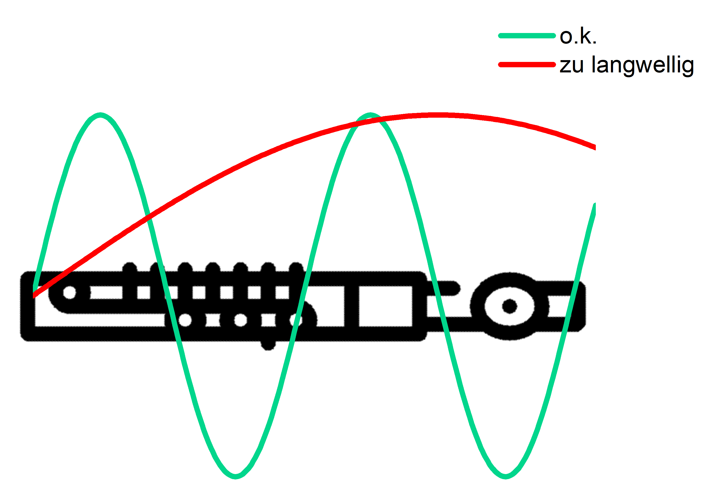

<!--
author:   Claudia Funke

email:    claudia.funke@physik.tu-freiberg.de

version:  0.0.1

language: de

narrator: Deutsch Female

comment:  Struktur der Materie Übung 10
@style
.lia-toc__bottom {
    display: none;
}
@end

import: https://raw.githubusercontent.com/liaTemplates/KekuleJS/master/README.md

import: https://github.com/liascript/CodeRunner

import: https://raw.githubusercontent.com/LiaTemplates/Pyodide/master/README.md
-->

# Übung 10: 

## Aufgabe 1
                                      {{0}}
> __1.__ Beschreiben Sie folgende Quasiteilchen beziehungsweise Elementaranregungen im Festkörper: Photon, Phonon, Plasmon, Magnon, Polaron, Exiton. Welche Felder oder Wellen gehören zu diesen Elementaranregungen?

                                      {{1}}
**Lösung Aufgabe 1:**

{{2}}

|Quasiteilchen      |       Wechselwirkung, Welle    |  
| :------------- |:----------------| 
| Photon  | elektromagnetische Welle     | 
| Phonon  | elastische (mechanische) Welle        |   
| Plasmon | kollektive Elektronenschwingung (Dichteschwankung von Ladungsträgern)|   
|Magnon|magnetische Spin-Welle, Magnetisierungswelle | 
|Polaron| Elektron-Phonon WW (Elektron und elastische Deformation)|
|Exiton| Elektron- Loch- Paar (Polarisationswelle)|
|Polariton| Phonon- Photon WW, starke Kopplung von Photon + Phonon|

## Aufgabe 2
                                      {{0}}
> __2.__ Welcher Bereich vom Wellenvektor $\vec{K}$ hat für elastische Wellen eine sinnvolle physikalische Bedeutung und warum?

                                      {{1}}
**Lösung Aufgabe 2:**

                                      {{2}}
Wellenlängen, die kleiner sind als der (halbe) Abstand zwischen den Atomen, gibt es auch nicht. Das ist etwas schwierig zu sehen, aber folgendes Bild  hilft:

                                      {{3}}
, Uni Kiel](https://www.tf.uni-kiel.de/matwis/amat/mw2_ge/kap_2/advanced/t2_1_1.html)*")

                                      {{4}}
Also: $\frac{\lambda}{2} \ge a$, wobei $a$ die Gitterkonstante ist.

                                      {{5}}
Es gilt allgemein: 
$$ |K|=\frac{2 \pi}{\lambda} \Rightarrow \lambda=\frac{2\pi}{|K|}$$

                                      {{6}}
Für elastische Wellen, die ja von real existierenden Atomen getragen werden, folgt für den  Wellenvektor $\vec{k}$ sinvollerweise also
$$
\begin{align*}
-\frac{2\pi}{2|K|} &\ge a \Rightarrow  \\
-\pi &\le K\cdot a \le\pi  \\
-\frac{\pi}{a} &\le K \le \frac{\pi}{a}

\end{align*}$$
Anmerkung: Größere Wellenvektoren können über $K'=K-\frac{n\cdot 2\pi}{a}$ immer auf Wellenvektoren innerhalb der 1. Brillouinzone zurückgeführt werden.

                                      {{7}}
Damit kann der Wellenvektor von Phononen nur in der ersten Brillouinzone liegen.

                                      {{8}}
Ganz genau betrachtet müssten wegen der endlichen Ausdehnung des Kristalls $b$ noch $K$-Werte in der Nähe des Ursprungs ausgeklammert werden:

                                      {{9}}
Es gibt keine Wellenlängen, die größer sind als die Abmessungen des Kristalls. "Lange" Wellen passen genauso wenig in einen kurzen Kristall wie tiefe Töne in eine Piccoloflöte.
Also: $\lambda \le b$, wobei $b$ die Abmessung des Kristalls sein soll.

{{9}}

{{10}}
Also:
$$\begin{align*}
\lambda &\le b \\
 |\frac{2\pi}{\lambda}| &\ge \frac{2\pi}{b}  \\
 |K| &\ge \frac{2\pi}{b} 
 \end{align*}$$

{{11}}
Hinweis: Aus den endlichen Abmessungen eines Kristalls folgen Randbedingungen für die Schwingungsgleichungen. Lösungen sind nur möglich, wenn an den Rändern des Kristalls Knoten der Wellen liegen. Daraus folgt dann eine Quantisierung des Wellenvektors $K$

## Aufgabe 3 
                                      {{0}}
> __3.__ Welche Bedeutung kommt einer elastischen Welle zu, wenn deren Wellenvektor $K$ auf den Grenzen der 1. Brillouin-Zone liegt?

                                      {{1}}
**Lösung Aufgabe 3:**

                                      {{2}}
Wenn der Wellenvektor $K$ auf den Grenze der 1. Brillouin-Zone liegt, dann gilt 
$$K=\frac{\pi}{a}$$

                                      {{3}}
Damit folgt für die Auslenkung $u$ der Kristallebene $s$ der elastischen Welle:
$$\begin{align*}
u_s&=u\cdot \exp(isKa)\\
&=u\cdot \exp(\pm is\pi)\\
&=u\cdot(-1)^s
\end{align*} $$

                                      {{4}}
Benachbarte Netzebenen haben also engegengesetzte Auslenkungen (entgegengesetzte Phase), da $U_s=\pm \cdot u$, je nachdem , ob $s$ gerade oder ungerade ist. Damit handelt es sich um eine stehende Welle.

## Aufgabe 4 

                                      {{0}}
> __4.__ Wie ist die Gruppengeschwindigkeit eines Wellenpaketes definiert? Welche Bedeutung hat die Gruppengeschwindigkeit?

                                      {{1}}
**Lösung Aufgabe 4:**

                                      {{2}}
Die Gruppengeschwindigkeit $v_{\mathrm {g}}$ eines Wellenpaketes ist die Geschwindigkeit, mit der sich die Hüllkurve eines Wellenpakets fortbewegt. Es gilt: 

                                      {{3}}
$$v_\mathrm{g}=\frac{\partial \omega}{\partial K}$$
Oder, wenn die Richtung mit berücksichtigt wird:
$$\vec{v}_\mathrm{g}=\mathrm{grad}_K(\omega (K))=\begin{pmatrix}
   \frac{\partial \omega}{\partial K_a} \\
   \frac{\partial \omega}{\partial K_b} \\
   \frac{\partial \omega}{\partial K_c} \\
\end{pmatrix}$$
Dabei sind $a,b,c$ die drei Koordinatenrichtungen. Die Gruppengeschwindigkeit ist die Geschwindigkeit des Energietransportes.

                                      {{4}}
, [CC BY-NC-SA 4.0 Deed](https://creativecommons.org/licenses/by-nc-sa/4.0/)*")

                                      
{{5}}
Ergänzung: Die Phasengeschwindigkeit $v_\mathrm{p}$ ist
$$v_\mathrm{p}=\frac{\omega}{K}$$

## Aufgabe 5 
                                      {{0}}
>__5.__ Betrachten Sie eine lineare monoatomare Kette aus äquidistanten Atomen der Masse $M$ im Abstand $a$, die um ihre Gleichgewichtslage kleine Schwingungen ausführen können (longitudinale Polarisation, harmonische Näherung). Eine Wechselwirkung bestehe ausschließlich zwischen nächsten Nachbarn und sei durch die Federkonstante $C$ charakterisiert. Die Position des n–ten Atoms sei durch $x_n(t) = n\cdot a + u_n(t)$ beschrieben.

                                      {{0}}
>__a)__ Zeigen Sie, dass die Auslenkung $u_n(t)$ des n–ten Atoms folgender Differentialgleichung genügt:

                                      {{0}}
$$ M\cdot \frac{\partial u_n(t)}{\partial t^2}=-C \left[2u_n(t)-u_{n+1}(t)-u_{n-1}(t)\right]$$

                                      {{0}}
>__b)__ Lösen Sie obige Gleichung mit dem Ansatz $u_n(t) = u_0(t) e^{iKna}$ und leiten Sie eine Dispersionsrelation zwischen Frequenz $\omega$ und der Wellenzahl $K$  ab. 

                                      {{0}}
>__c)__ Diskutieren Sie den langwelligen Grenzfall $Ka \ll 1$ und zeigen Sie insbesondere, dass sich aus obiger Gleichung die (Schall–) Wellengeichung  $ \frac{\partial^2 u(x,t)}{\partial t^2}-v_s^2\frac{\partial^2 u(x,t)}{\partial x^2}=0$   ergibt, wenn man zur Kontinuumsbeschreibung $u_{n±1}(t) = u(x ± a, t)$ übergeht.

                                      {{1}}
**Lösung Aufgabe 5a:**

                                      {{2}}
Die Position des $n$-ten Atoms in der lineraren Kette aus gleichen Atomen mit äquidistanten mittlerem Abstand $a$ und Federkonstante $C$ ist bei longitudinaler Polarisation für das $n$-te Atom : 

                                      {{3}}
$$x_n(t) = n\cdot a + u_n(t)$$
Dabei ist $u_n(t)$ die Auslenkung aus der Ruhelage. 

                                      {{4}}
Wir leiten einfach mal eine Lösung für unter Berücksichtigung aller Wechselwirkungen her und beschränken uns dann auf die nächsten Nachbar. (Natürlich könnte das auch gleich an dieser Stelle passieren;))

                                      {{4}}
Sei $M$ die Masse eines Atoms, $C_p$ die Kraftkonstante zum $p$-ten Nachbarn und $F_n$ die Kraft auf das Atom $n$. Dann gilt:

                                      {{5}}
$$F_n=\sum_{p\ne 0}C_p[u_{n+p}(t)-u_{n}(t)]$$

                                      {{6}}
Mit dem 2. Newtonschen Gesetz $F=m\cdot \ddot{x}$ folgt:

                                      {{7}}
$$M\cdot\frac{\partial^2 u_n(t)}{\partial t^2}=F_n=\sum_{p\ne 0}C_p[u_{n+p}(t)-u_{n}(t)]$$

                                      {{8}}
Unter der Annahme $C_p=C_{-p}$ lässt sich die Summe umschreiben:

                                      {{9}}
$$ \begin{align*}
M\cdot \ddot{u}_n(t)&= \sum_{p> 0}C_p[u_{n+p}(t)-u_{n}(t)]+\underbrace{ \sum_{p< 0}C_p[u_{n+p}(t)-u_{n}(t)]}_{\sum_{p> 0}C_{-p}[u_{n-p}(t)-u_{n}(t)]}\\
&=-\sum_{p>0}C_p[2u_n-u_{n+p}-u_{n-p}]
\end{align*}$$

                                      {{10}}
Betrachten wir nur die Wechselwirkungen zwischen nächsten Nachbarn, d.h. $C_1=C=C_{-1}$. Dann erhalten wir

                                      {{11}}
$$ \begin{align*}
M\cdot \ddot{u}_n(t)&=C[u_{n+p}(t)-u_{n}(t)]+C[u_{n-1}(t)-u_{n}(t)]\\
&=-C \left[2u_n(t)-u_{n+1}(t)-u_{n-1}(t)\right]
\end{align*}$$
was zu zeigen war.

                                      {{12}}
**Lösung Aufgabe 5b:**

                                      {{13}}
Bei der Lösung von Aufgabenteil b) beschränken wir uns zur Abwechselung gleich auf die Wechselwirkungen der nächsten Nachbarn.

                                      {{14}}
Wir wählen für die Auslenkung den Ansatz

                                      {{15}}
$$u_n(t)=u_0(t)\cdot e^{iKna}$$

                                      {{16}}
Damit folgt: 
$$M\cdot \ddot{u}_0(t)\cdot e^{iKna}=C \cdot  [e^{i(n+1)Ka}-e^{i(n)Ka}+e^{i(n-1)Ka}-e^{i(n)Ka}]\cdot u_0(t)$$

                                      {{17}}
$$
\begin{align*}
\Rightarrow M\cdot \ddot{u}_0(t)\cdot e^{iKna}&=C \cdot  [e^{i(n+1)Ka}-e^{i(n)Ka}+e^{i(n-1)Ka}-e^{i(n)Ka}]\cdot u_0(t)\\
&=C \cdot  [e^{i(n+1)Ka}+e^{i(n-1)Ka}-2e^{i(n)Ka}]\cdot u_0(t)\\

\Rightarrow M\cdot \ddot{u}_0(t)&=C\cdot  [\underbrace{ e^{i(+1)Ka}+e^{i(-1)Ka}}_{2\cos(Ka)}-2]\cdot u_0(t)\\
\Rightarrow -M\cdot \omega^2{u}_0(t)&=C\cdot[2\cdot\cos(Ka)-2]\cdot u_0(t)
\end{align*}$$

                                      {{18}}
Damit folgt dann:
$$\omega^2=\frac{2C}{M}(1-\cos(Ka))$$

                                      {{19}}
Jetzt wird noch die Gleichheit $1-\cos(x)=2\sin^2(\frac{x}{2})$ eingesetzt:

                                      {{20}}
$$\begin{align*}\omega^2&=\frac{2C}{M}\bigg(2\sin^2\bigg(\frac{Ka}{2}\bigg)\bigg)\\
\Rightarrow \omega&=2\sqrt{\frac{C}{M}}\bigg|\sin\bigg(\frac{Ka}{2}\bigg)\bigg|
\end{align*}$$

{{20}}

                                      {{21}}
**Ergänzung: Eigenschaften von $\omega(K)$**

{{22}}
|Formel|Eigenschaft|
|:-----|-----|
|$\omega(K)=\omega(K+n\cdot\frac{2\pi}{a})$ mit $n=0, \pm1,\pm2,...$|Periodizität|
|$\omega(K)=\omega(-K)$|Parität|
|$\omega_\mathrm{max}=2\sqrt{\frac{C}{M}}$|Maximum|

                                      {{23}}
**Lösung Aufgabe 5c:**

                                      {{24}}
Für die Phasengeschwindigkeit im langwelligen Grenzfall, d.h. $K\cdot a \rightarrow 0$, gilt mit $\sin(x)\approx x$:

                                      {{25}}
$$
\omega=2\sqrt{\frac{C}{M}}\frac{Ka}{2}=\sqrt{\frac{C}{M}}Ka
$$

                                      {{26}}
Damit wird die Phasengeschwindigkeit $v_p$
$$v_p=\frac{\omega}{K}=a\sqrt{\frac{C}{M}}$$
und die Gruppengeschwindigkeit $v_g$
$$v_g=\frac{\partial \omega}{\partial K}=a\sqrt{\frac{C}{M}}$$

                                      {{27}}
Für den langwelligen Grenzfall gilt für die monoatomare lineare Kette:

                                      {{28}}
$$v_g=v_p=v_s$$

                                      {{29}}
Für die Schall-Wellengleichung kann $u_n(t)$ als kontinuierliche Funktion der reellen Variablen $x$ aufgefasst werden:

                                      {{30}}
$$\begin{align*}
u_n(t) &\rightarrow u(x,t)\\
u_{n\pm p}(t) &\rightarrow u(x+pa,t)
\end{align*}
$$

                                      {{31}}
Nun wird eine Taylorreihenentwicklung für die Position der Nachbaratome $u_{n\pm 1}$ vorgenommen, Terme ab 3. Ordnung in $a$ werden vernachlässigt.

                                      {{32}}
$$u_{n \pm 1 }(t) = u(x \pm a, t) = u(x, t)\pm\ a\frac{\partial u}{\partial x}\ + a^2 \frac{\partial ^2 u}{\partial x^2}\pm...$$

                                      {{33}}
Also:
$$\begin{align*}
F&=-C [u_{n+1}-u_n(t) +u_{n-1}-u_{n}(t)]\\
&=C [2u_n(t)-u_{n+1}-u_{n-1}]\\
&=C[2u(x,t)-u(x+a,t)-u(x-a,t)]\\
&=C[a^2 \frac{\partial ^2 u}{\partial x^2}]
\end{align*}
$$

                                      {{34}}
Mit dem 2. Newtonschen Gesetz $F=M\cdot \ddot{x}$ folgt:

                                      {{35}}
$$M\cdot \frac{\partial ^2 u}{\partial t^2}=Ca^2 \frac{\partial ^2 u}{\partial x^2}$$

                                      {{36}}
$$\Rightarrow \frac{\partial ^2 u}{\partial t^2}=\underbrace{a^2\frac{C}{M}}_{v_s^2}\frac{\partial ^2 u}{\partial x^2}$$

                                      {{37}}
$$\Rightarrow \frac{\partial ^2 u}{\partial t^2}=v_s^2\frac{\partial ^2 u}{\partial x^2}$$

## Aufgabe 6 

                                      {{0}}
>__6.__ Gegeben sei eine lineare, monoatomare, quasi-elastische Kette aus Atomen der Masse $M = 200 \,\mathrm{u}=200 \cdot 1,66054\cdot 10^{-24} \mathrm{g}$. Der Abstand zwischen benachbarten Atomen sei $a = 4 \, \mathrm{\AA}$. Beachten Sie nur Wechselwirkungen zwischen nächsten Nachbarn.

                                      {{0}}
>__a)__ Die Schallgeschwindigkeit sei $4000\, \mathrm{\frac{m}{s}}$. Wie groß ist die Koppelungskonstante $C$ zwischen benachbarten Atomen?

                                      {{0}}
>__b)__ Wie groß ist die maximale Frequenz der (ungedämpften) Welle?

                                      {{1}}
**Lösung Aufgabe 6a):**

                                      {{2}}
**Gegeben:**

 $$M = 200 \,\mathrm{u}=200 \cdot 1,66054\cdot 10^{-27} \mathrm{kg}$$
$$a = 4 \, \mathrm{\AA}= 4 \cdot 10^{-10} \mathrm{m}$$
 $$v_s = 4000 \, \mathrm{\frac{m}{s}}$$

                                      {{3}}
Aus $v_s=\frac{\omega}{K}=a\sqrt{\frac{C}{M}}$ folgt:
$$\begin{align*} C=&\frac{v_s^2\cdot M}{a^2}\\
&=\frac{(4000 \, \mathrm{\frac{m}{s}})^2\cdot 200 \cdot 1,66054\cdot 10^{-27} \mathrm{kg}}{( 4 \cdot 10^{-10} \mathrm{m})^2}\\
&=33.2 \, \mathrm{\frac{kg\cdot m}{s^2}\frac{ m}{m^2}}=33.2 \,\mathrm{\frac{ N}{m}}
\end{align*}$$

                                      {{4}}
**Lösung Aufgabe 6b):**

                                      {{4}}
$$\omega=2\sqrt{\frac{C}{M}}\sin\bigg(\frac{Ka}{2}\bigg)$$

                                      {{5}}
$$\begin{align*}\Rightarrow \omega_\mathrm{max}&=2\sqrt{\frac{C}{M}}\cdot 1\\
&=2\sqrt{\frac{33,2\,\mathrm{\frac{ N}{m}}}{1,66054\cdot 10^{-27} \mathrm{kg}}} \\
&=2\cdot 10^{12}\,\mathrm{\frac{kg \cdot m}{s^2 \cdot m \cdot kg}}\\
&=2\cdot 10^{12}\,\mathrm{\frac{1}{s}}
\end{align*}$$

## Aufgabe 7 

                                      {{0}}
>__7.__ Wie kann man sich anschaulich optische und akustische Zustände elastischer Wellen vorstellen? 

                                      {{1}}
**Lösung Aufgabe 7:**

                                      {{2}}
Optische Moden können nur bei einer mehratomigen Basis auftreten.

                                      {{3}}
**optische Mode**: Auslenkung gegenphasig, Atome/Ionen schwingen gegeneinander. Lassen sich bei Ionen durch Lichtwellen anregen, daher der Name

                                      {{3}}
**akustische Mode**: Auslenkung gleichphasig, Atome/Ionen schwingen miteinander.

{{4}}
; [CC BY 3.0](https://creativecommons.org/licenses/by/3.0/))*")

## Aufgabe 8 
                                      {{0}}
>__8.__ Wie viele „Äste“ liefert die Dispersionsrelation für elastische Wellen, wenn die Elementarzelle p Atome besitzt. Wie viele davon sind akustische und optische Äste?

                                      {{1}}
**Lösung Aufgabe 8:**

                                      {{2}}
Es gibt insgesamt $3p$ -Äste. Davon sind  $3$ akustische und $(3p-3)$ optische Äste.

{{3}}
<!-- data-type="none" --> 
|p|akustische Moden|optische Moden|Bezeichnung|
|:---|:---|:---|:---|
|1| 3 |- |LA, TA1, TA2|
|2|3| 3| LA, TA1, TA2, LO, TO1, TO2|

## Aufgabe 9
                                      {{0}}
>__9.__ Wie heißt der Energiequant einer elastischen Welle?

**Lösung Aufgabe 9:**

                                      {{2}}

**Phonon**

## Aufgabe 10
                                      {{0}}
>__10.__ Wie groß ist die Energie eines elastischen Schwingungszustandes mit der Kreisfrequenz $\omega$, wenn der Zustand zu Quantenzahl $n$ angeregt ist?

                                      {{1}}
**Lösung Aufgabe 10:**

                                      {{2}}
$$\varepsilon=\bigg(n+\frac{1}{2}\bigg) \hslash\cdot  \omega$$

                                      {{2}}
wobei $ \hslash=\frac{h}{2\pi}=\mathrm{\frac{6.626\cdot 10^{-34} Js}{2\pi}}=\mathrm{1.055\cdot 10^{-34} \,Js} $

                                      {{3}}
Der Summand $\frac{1}{2} \hbar \omega$ ist die Nullpunktsenergie des Schwingungszustandes.

## Aufgabe 11
                                      {{0}}

>__11.__ Für ein Gitter mit zwei Atomen in der primitiven Einheitszelle sollen die Amplitudenverhältnisse $\frac{u}{v}$ für beide Äste der elastischen Welle bei $K_\mathrm{max}=\frac{\pi}{a}$ bestimmt werden! Zeigen Sie, dass bei diesem $K$-Wert die beiden Gitter entkoppelt erscheinen: Ein Gitter bleibt in Ruhe, während das andere schwingt.

                                      {{1}}
**Lösung Aufgabe 11:**

                                      {{2}}
Wir betrachten eine unendlich lange  Kette aus der regelmäßigen Abfolge von den sich abwechselten Atomen der Massen $M_1$ und $M_2$ ($M_2 < M_1$) mit der Gitterkonstanten $a$ und der Federkonstanten $C$.

                                      {{3}}
Die Auslenkung des Atoms "$s$" mit der Masse $M_1$ sei $u_s$
Die Auslenkung des Atome "$s$" mit der Masse $M_2$ sei $v_s$

                                      {{4}}
Analog zur obigen Aufgabe 5 gelten die Bewegungsgleichungen:

                                      {{5}}
$$\begin{align*}
M_1\frac{\partial^2 u_s}{\partial t^2} &= C(v_s + v_{s-1}  –2u_s)\\
M_2\frac{\partial^2 v_s}{\partial t^2} &= C(u_{s+1} + u_s  –2v_s)
\end{align*}$$

                                      {{6}}
Lösungsansatz:
$$\begin{align*}
u_s &= u\cdot e^{isKa} \cdot e^{-iωt}\\
v_s &= v \cdot e^{isKa} \cdot e^{-iωt}
\end{align*}$$

                                      {{7}}
Das Einsetzen des Lösusngsansatz in die obigen Bewegungsgleichungen ergibt zwei gekoppelte Differentailgleichungen:

                                      {{8}}
$$\begin{align*}
-M_1 \omega^2 u &= C\cdot v [1+e^{-iKa}]-2C\cdot u\\
-M_2 \omega^2 v &= C\cdot u [e^{-iKa}+1]-2C\cdot v\\
\end{align*}$$

                                      {{9}}
Betrachtet werden sollen die Amplitudenverhältnisse $\frac{u}{v}$ für beide Äste der elastischen Welle bei $K_\mathrm{max}=\frac{\pi}{a}$. Also setzen wir $K=K_\mathrm{max}=\frac{\pi}{a}$, d.h. $K$ liegt auf der Zonengrenze. 

                                      {{10}}
$$\begin{align*}
\Rightarrow -M_1 \omega^2 u &= C\cdot v [1+e^{-i\frac{\pi}{a}a}]-2C\cdot u\\
-M_2 \omega^2 v &= C\cdot u [e^{-i\frac{\pi}{a}a}+1]-2C\cdot v\\
\end{align*}$$

                                      {{11}}
$$\begin{align*}
\Rightarrow -M_1 \omega^2 u &= C\cdot v [1+e^{-i\frac{\pi}{a}a}]-2C\cdot u\\
-M_2 \omega^2 v &= C\cdot u [e^{-i\frac{\pi}{a}a}+1]-2C\cdot v\\
\end{align*}$$

                                      {{12}}
$$\begin{align*}
\Rightarrow -M_1 \omega^2 u &= -2C\cdot u\\
-M_2 \omega^2 v &= -2C\cdot v\\
\end{align*}$$

                                      {{13}}
Für diesen Spezialfall sind die Gleichungen entkoppelt, damit bewegen sich die Untergitter unabhängig. Wir erhalten als Lösung:

                                      {{14}}
$$\begin{align*}
\omega &= \sqrt{\frac{2C}{M_1}}\, \text{für das u-Gitter, akkustischer Zweig}\\
\omega &= \sqrt{\frac{2C}{M_2}}\, \text{für das v-Gitter, optischer Zweig}\\
\end{align*}$$

                                      {{15}}
Zwischen diesen beiden Frequenzen gibt es für $K_\mathrm{max}=\frac{\pi}{a}$ keine Lösung. 

                                      {{16}}
Ergänzung:

                                      {{17}}
Die allgemeine Lösung für beliebige Wellenvektoren ist 
$$\omega^2=C\left(\frac{1}{M_1}+\frac{1}{M_{2\ }}\right)\pm C\sqrt{ \bigg(\frac{1}{M_1}+\frac{1}{M_2}\bigg)^2-\frac{4}{M_1M_2} \sin^2\bigg(\frac{Ka}{2}\bigg)}$$

                                      {{18}}
Für den langwelligen Grenzfall ($K \cdot a \approx 0$) gilt:

                                      {{19}}
$$\begin {align*}\omega^2&=C\left(\frac{1}{M_1}+\frac{1}{M_{2\ }}\right)\pm C\sqrt{ \bigg(\frac{1}{M_1}+\frac{1}{M_2}\bigg)^2}\\
&=\begin{cases}
   2C\left(\frac{1}{M_1}+\frac{1}{M_{2\ }}\right) &\text{und } \frac{u}{v}\ =\ -\frac{M_2}{M_1},  &\text{optischer Zweig, gegenphasig }  \\
   0 &\text{und }  &\text{akustischer Zweig, gleichphasig}
\end{cases}
\end{align*}$$

{{20}}
* " )

{{20}}
In der Abbildung sieht man den Verlauf der Dispersionsrelation. Für die eindimensionale Anordnung mit zwei Atomen in der primitiven Basis gibt es genau einen akustischen und einen optischen Zweig. zwischen denen eine Frequenzlücke existiert.
