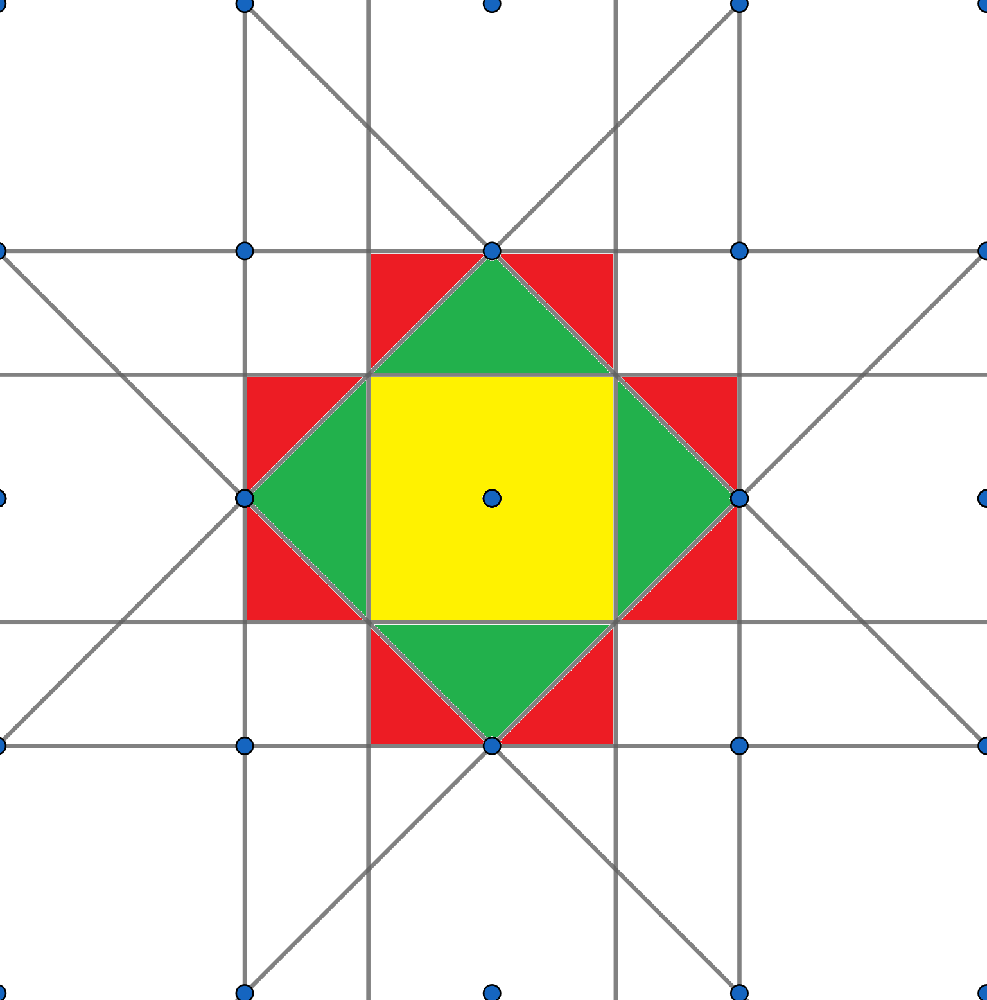

<!--
author:   Claudia Funke

email:    claudia.funke@physik.tu-freiberg.de

version:  0.0.1

language: de

narrator: Deutsch Female

comment:  Struktur der Materie Übung 13
@style
.lia-toc__bottom {
    display: none;
}
@end

import: https://raw.githubusercontent.com/liaTemplates/KekuleJS/master/README.md

import: https://github.com/liascript/CodeRunner

import: https://raw.githubusercontent.com/LiaTemplates/Pyodide/master/README.md
-->

# Übung 13: 

## Aufgabe 1
                                      {{0}}
> __1.__ Warum ist kondensierte Materie für Leitungselektronen so durchlässig?

                                      {{1}}
**Lösung Aufgabe 1:**

                                      {{2}}
Kondensierte Materie ist für Elektronen aus zwei Günden "durchässig". 
- Erstens wird ein Leitungselektron von den Ionenrümpfen eines periodischen Gitters nicht abgelenkt, da seine Ausbreitung auf einer Wellenbewegung beruht, die an das periodische Potential der Ionenrümpfe im Kristallgitter angepaßt ist. 
- Zweitens wird ein Elektron nur selten an einem anderen gestreut, da zwei Elektronen aufgrund des Pauli
Prinzips nie auf dem selben Elektronenniveau sind.

## Aufgabe 2 

                                      {{0}}
> __2.__ Berechnen Sie unter Annahme eines freien Elektronengases die Fermi-Energie, die Fermi-Wellenzahl, die Fermi-Temperatur und die Fermi- Geschwindigkeit für Silber. Silber hat eine Dichte von $10,5\,\mathrm{\frac{g}{cm^3}}$ und liefert ein Elektron pro Atom.

                                      {{1}}
**Lösung Aufgabe 2:**

                                      {{2}}
Für die Elektronenkonzentration $n$ in Ag gilt:                                            
$$\begin{align*}n &=\frac{\text{Anzahl}}{\text{Volumen}}\\
&=1\cdot N_\mathrm{A} \cdot \frac{ \rho}{M_\text{mol}} \\
&=\mathrm{1\cdot 6,022 \cdot 10^{23}\frac{1}{mol} \cdot \frac{ 10,5 \frac{10^{-3}\,kg}{(10^{-2} \, m)^3}}{107,8682 \frac{10^{-3}kg}{mol}}}\\
&= 5,86 \cdot 10^{28}\, \mathrm{m^{-3}}\\
&=5,86 \cdot 10^{22}\, \mathrm{cm^{-3}}\end{align*}$$

Damit folgt für den Fermi-Wellenvektor

$$k_F=\sqrt[3]{3\pi^2n} = \sqrt[3]{3\pi^2 \cdot 5,86 \cdot 10^{22}\, \mathrm{cm^{-3}}} =1,20 \cdot  10^8 \,\mathrm{cm^{-1}}\$$

und die Fermi-Energie

$$\begin{align*}
E_F&=\frac{\hbar^2}{2m_\mathrm{e}} k_\mathrm{F}^2  \\ 
&=\frac{(1,05457\cdot 10^{-34} \mathrm{Js})^2}{2\cdot 9,109382 \cdot 10^{-31} \mathrm {kg}}\cdot  (1,20 \cdot  10^8 \,\mathrm{\frac{1}{10^{-2} m}})^2\\
&= 8,82 \cdot 10^{-19} \mathrm{J} \\
&= 8,82 \cdot 10^{-19} \mathrm{\frac{eV}{1,60218\cdot 10^{-19}}}= 5,5 \,\mathrm{eV}\end{align*}$$

Die Fermi-Temperatur ist:

$$T_\mathrm{F} = \frac{E_\mathrm{F}}{k_\mathrm{B}} = \frac{8,82 \cdot 10^{-19} \mathrm{J}}{1,380665 \cdot 10^{-23}\frac{J}{K}}= 63913\, \mathrm{K}\approx 63,9 \cdot 10^3\, \mathrm{K}$$

Die Fermi-Geschwindigkeit ist:

$$v_\mathrm{F} = \frac{\hbar}{m_\mathrm{e}} k_\mathrm{F}= \frac{1,05457\cdot 10^{-34} \mathrm{Js}}{9,109382 \cdot 10^{-31} \mathrm {kg}} \cdot 1,20 \cdot  10^8 \cdot  10^2\,\mathrm{m^{-1}}=1,39 \cdot10^8 \mathrm{\frac{m}{s}}$$

## Aufgabe 3
                                      {{0}}
> __3.__ Wie groß ist die Zustandsdichte eines dreidimensionalen freien Elektronengases $D(k)$ im reziproken Raum und $D(E)$ im realen Raum?

                                      {{1}}

**Lösung Aufgabe 3:**

                                      {{2}}
Es gilt wieder:

$$\int_{k(E)}^{k(E+\Delta E)} D(k)dk^3=\int_{E}^{E+\Delta E}D(E)dE$$

Die periodischen Randbedingungen für die ebenen Wellen (Knotenpunkte am Kristallrand) bedingen wieder (wie bei den Phononen) eine Quantelung der erlaubten Zustände (Wellenvektoren). Das Volumen pro Zustand im 3D-Impulsraum ist $\frac{(2\pi)^3}{V}$. Da jeder $k$-Wellenvektor von 2 Elektronen mit entgegengesetztem Spin besetzt werden kann, ist die Zustandsdichte damit 

$$D(k)=2\cdot \frac{V}{(2\pi)^3}$$

Damit kann die linke Seite der obigen Gleichung umgestellt werden:
$$\int_{k(E)}^{k(E+\Delta E)} D(k)dk^3=\int_{k(E)}^{k(E+\Delta E)} 2\cdot \frac{V}{(2\pi)^3}d^3k=2\cdot \frac{V}{(2\pi)^3}\int_{k(E)}^{k(E+\Delta E)} d^3k$$

Die Flächen konstanter Energie im k-Raum sind wegen der Dispersionsrelation $E(k)=\frac{\hbar^2 k^2}{2m}$ Kugeloberflächen. $\Delta k$ sei die zu $\Delta E$ gehörige Änderung des Wellenvektors.  
Für einen dreidimensionalen Festkörper erhalten wir für den Ausruck auf der rechten Seite: 

$$2\cdot \frac{V}{(2\pi)^3}\int_{k(E)}^{k(E+\Delta E)} d^3k=2\cdot \frac{V}{(2\pi)^3} \cdot \overbrace{4\pi k^2 \Delta k}^\text{Volumen von Kugelschale im k-Raum}$$

Damit ergibt sich mit für $\Delta k$ insgesamt: 

$$2\cdot \frac{V}{(2\pi)^3} \cdot 4\pi k^2 \Delta k=D(E)\Delta E$$

Und damit 
$$D(E)=2\cdot \frac{V}{(2\pi)^3} \cdot 4\pi k^2\frac{ \Delta k}{\Delta E}$$
Aus der bekannten Dispersionsrelation $E=\frac{\hbar^2 k^2}{2m}$ für freie Elektonen ergibt sich:

$$k=\sqrt{\frac{2mE}{\hbar^2}}$$

Für die Ableitung gilt damit:

$$\frac{dk}{dE}=\sqrt{\frac{2m}{\hbar^2}}\cdot \frac{1}{2}\cdot E^{-\frac{1}{2}}$$

Damit gilt für $D(E)$:

$$\begin{align*}D(E)&=2\cdot \frac{V}{(2\pi)^3} \cdot 4\pi k^2\sqrt{\frac{2m}{\hbar^2}}\cdot \frac{1}{2}\cdot E^{-\frac{1}{2}}\\
&=2\cdot \frac{V}{(2\pi)^3} \cdot 4\pi \frac{2mE}{\hbar^2}\sqrt{\frac{2m}{\hbar^2}}\cdot \frac{1}{2}\cdot E^{-\frac{1}{2}}\\
&=\frac{V}{2\pi^2} \bigg(\frac{2m}{\hbar^2}\bigg)^{\frac{3}{2}}E^{\frac{1}{2}}\end{align*}$$

## Aufgabe 4 
                                      {{0}}
> __4.__ Zeigen Sie, dass die mittlere kinetische Energie von Elektronen in einem dreidimensionalen freien Elektronengases aus $N$ Elektronen bei $T=0\,\mathrm{K}$ gleich $\overline{E}=\frac{3}{5}E_\mathrm{F}$ ist.

                                      {{1}}
**Lösung Aufgabe 4:**

                                      {{2}}

Die Elektronen befolgen auf Grund ihres halbzahligen Spins die Fermi-Dirac-Statistic mit der Verteilungsfunktion

$$f(E,T)=\frac{1}{e^{(E-E_F)/k_BT}+1}$$

Für $T=0\,\mathrm{K}$ ist das eine Stufenfunktion mit Sprung bei $E_F$, unterhalb von $E_F$ ist der Wert 1, oberhalb Null.

Die Gesamtenergie der Elektronen ist gegeben durch

$$E_\mathrm{ges}=\int_0^{E_F}E\cdot D(E)\cdot f(E,T)\cdot dE $$

Die mittlere Energie pro Elekron läßt sich berechnen zu:

$$\begin{align*}\overline{E}&=\frac{E_\mathrm{ges}}{N}\\
&=\frac{\int_0^{E_F}E\cdot D(E)\cdot f(E,T)\cdot dE}{\int_0^{E_F} D(E)\cdot f(E,T)\cdot dE}\\
\end{align*}$$

Jetzt können die Zustandsdichte $D(E)$ (siehe Aufgabe 3) und die Verteilungsfunktion $f(E,T)$ eingesetzt werden:

$$\begin{align*}\overline{E}
&=\frac{\int_0^{E_F}E\cdot \frac{V}{2\pi^2} \bigg(\frac{2m}{\hbar^2}\bigg)^{\frac{3}{2}}E^{\frac{1}{2}}\cdot \frac{1}{e^{(E-E_F)/k_BT}+1}\cdot dE}{\int_0^{E_F} \frac{V}{2\pi^2} \bigg(\frac{2m}{\hbar^2}\bigg)^{\frac{3}{2}}E^{\frac{1}{2}}\cdot \frac{1}{e^{(E-E_F)/k_BT}+1}\cdot dE}\\
\end{align*}$$

Für $T=0\,\mathrm{K}$ ist die Verteilungsfunktion eine Stufenfunktion mit Sprung bei $E_F$, unterhalb von $E_F$ ist der Wert 1, oberhalb Null.
$$\begin{align*}
\overline{E}
&=\frac{\int_0^{E_F}E^{\frac{3}{2}}dE}{\int_0^{E_F}E^{\frac{1}{2}}dE}\\
&=\frac{\frac{2}{5}E_F^{\frac{5}{2}}}{\frac{2}{3}E_F^{\frac{3}{2}}}\\
&=\frac{3}{5}E_F
\end{align*}$$

## Aufgabe 5 

                                      {{0}}
> __5.__ Zeigen Sie, dass ein Fermi-Gas mit der Fermi-Energie $E_F$ auch am Temperaturnullpunkt einen Fermi-Druck besitzt. Vergleichen Sie das Ergebnis mit dem eines klassischen idealen Gases.

                                      {{1}}
**Lösung Aufgabe 5:**

                                      {{2}}
Die innere Energie $U$ eines Fermigases bei $T=0\, \mathrm{K}$ ist (siehe Aufgabe 4)
$$U=N\cdot \overline{E}=N\cdot \frac{3}{5}E_F$$
 
Mit der Fermienergie $E_F=\frac{\hbar^2}{2m_e}\big(3\pi^2\frac{N}{V}\big)^{\frac{2}{3}}$ ergibt sich:

$$U=N\cdot \frac{3}{5}E_F=N\cdot \frac{3}{5}\frac{\hbar^2}{2m_e}\bigg(3\pi^2 \frac{N}{V}\bigg)^{\frac{2}{3}}$$

Der Druck ist definiert als $p=-\frac{\partial U}{\partial V}$, also gilt

$$\begin{align*}
p&=-\frac{\partial U}{\partial V}\\
&=-\frac{\partial }{\partial V}\bigg(N\cdot \frac{3}{5}\frac{\hbar^2}{2m_e}\bigg(3\pi^2 \frac{N}{V}\bigg)^{\frac{2}{3}}\bigg)\\
&=N\cdot \frac{3}{5}\frac{\hbar^2(3\pi^2N)^{\frac{2}{3}}}{2m_e}\cdot (-\frac{2}{3})V^{-\frac{5}{3}}\\
&=N\cdot V^{-1}\cdot \frac{2}{5}\frac{\hbar^2}{2m_e}\cdot (\frac{3\pi^2N}{V})^{\frac{2}{3}}\\
&=\frac{2}{5}\frac{N}{V}\cdot E_F
\end{align*}$$

Der Fermi-Druck ist nicht von der Temperatur abhängig und auch bei $T=0\, \mathrm{K}$ vorhanden. Ein klassisches ideales Gas mit $N$ Teilchen hat den Druck 

$$p_\mathrm{Gas}=N\cdot k_B \frac{T}{V}$$
## Aufgabe 6 

                                      {{0}}
> __6.__ Konstruieren Sie die ersten drei Brillouin-Zonen eines ebenen quadratischen Gitters.

                                      {{1}}
**Lösung Aufgabe 6:**

## Aufgabe 7

                                      {{0}}
>__7.__ Betrachten Sie ein einfaches ebenes quadratisches Gitter in zwei Dimensionen. Zeigen Sie, dass die kinetische Energie eines freien Elektrons an einer Ecke der ersten Brillouin - Zone doppelt so groß ist wie die eines Elektrons im Mittelpunkt einer Seitenfläche der Zone.

                                      {{1}}
**Lösung Aufgabe 7:**

                                      {{2}}

## Aufgabe 8

                                      {{0}}
>__8.__ Wie groß ist dieses Verhältnis für ein einfaches kubisches Gitter in drei Dimensionen?

                                      {{1}}
**Lösung Aufgabe 8**

                                      {{2}}
$